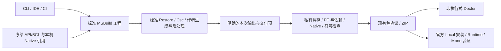

# SDK 标准构建与交付架构

- Lifecycle: `implemented`；标准 MSBuild 单后端已切换，首次公开 SDK 的技术验收归 [0012](../updates/2026/20260910-0012-sdk-msbuild-first-release.md)，发布选择与未测范围归 [候选页](../planning/platform-next/release-candidate.md)。
- Owner: 普通工程构建、工具链、引用接入、交付边界和后端迁移的目标契约；替代 AD-01/11/12 中继续扩充专用工程子集的方向。
- Decision: [本次设计审查](../reviews/code/2026/20260910-0004-sdk-msbuild-architecture.md)。[作者交付架构](platform-author-delivery.md)继续拥有会话、调试、安装和长期兼容；[包契约](platform-package-contracts.md)继续拥有玩家包格式。
- Execution: [PN-041 完整执行包](../planning/platform-next/execution-sdk-msbuild.md)；状态只查 [status](../planning/platform-next/status.md)。本页不是当前 SDK 使用说明。

**发布事实更正：** 用户确认旧 SDK 从未公开发布，0.7.0 将是首次公开 SDK。既有版本、schema、ZIP 是内部开发/验收证据，不产生对历史 SDK 客户端或任意旧工程的长期支持承诺。已发布 Runtime 和实际 Mod 的二进制/来源契约独立保留。最新决定见 [0011](../updates/2026/20260910-0011-sdk-first-release-plan-correction.md)。

## AB-01：一个正式后端，替换工程解释层

DTMAPI SDK 定位为 Doloc Town 的开发与交付工具。普通 C# 工程由标准 .NET SDK / MSBuild / NuGet / Roslyn 解释和编译；DTMAPI 提供游戏引用、诊断、交付与排错能力。Strict 与 Advanced 共用工程能力，区别仍是 PROJECT 定义的引用、原生归属与运行责任。

CLI build/pack、IDE 和 CI 调用同一个标准工程。不得先求值 MSBuild，再手工组织第二次 Roslyn Compilation；不得继续用 JSON 或 XML 白名单模拟属性、条件、glob、ProjectReference、生成器或工程继承。内部过渡分支用于开发比较，正式切换后移除旧编译执行器；历史 SDK 原包保留，不在新 SDK 中永久维护两个默认后端。

SDK 的 MSBuild 集成不覆盖 Build、Rebuild、Restore、Clean，不回调 `dtmapi-author build`。内部引用准备、输出捕获、校验和封包操作均不得发起编译。ContentPack 没有 C# 工程时仍直接走原声明式打包路径，不为它强制安装编译工具链。

## AB-02：每种输入只声明一次

| 事实 | 唯一输入与规则 |
| --- | --- |
| Compile、ProjectReference、PackageReference、资源、常量、语言、分析器、生成器、条件、版本属性 | 普通 csproj、Directory.Build/Packages、标准 imports/targets；MSBuild 求值。支持作者自定义配置，不再只有 Debug/Release 的私有条件语法 |
| NuGet 源、凭据、包版本解析、锁 | 标准 NuGet.Config、PackageReference、packages.lock.json 与 project.assets.json。凭据和本机缓存路径不进入 Mod 包 |
| Mod ID、Mod 版本、Mod 依赖、入口、最低 Runtime | 现有 manifest；程序集文件名与实际 TargetPath 必须匹配。Mod 版本与 library AssemblyVersion 不是同一坐标 |
| API target、manifest/入口项目定位、Native 意图/显式 requiredMembers、现有发布元数据 | `dtmapi.author.json` 新 schema 4；沿用专用字段语义，移除普通编译清单。PN-041.a 确定首发格式和实际内部输入转换 |
| 引用库 private/shared、分发/许可证 | 已求值 Reference/ProjectReference 的 DTMAPI 命名 metadata；外部包许可可保留独立交付映射。一个字段只能选一处权威，不能要求 csproj 与 JSON 重复一致 |
| 内容是否发布及包内路径 | 已求值 Content/None 上显式 `DtmApiPackagePath`，或只用于非工程 ContentPack 的原配置；CopyToOutputDirectory 本身不表示应公开分发 |
| 编译引用、运行依赖、最终文件与摘要 | 从实际构建及最终暂存自动生成；作者不手填 DLL hash、准入 receipt 或运行资产闭包 |

schema 4 沿用内部版本序号，是首发作者格式，不是新玩家包格式；保留序号不表示 1–3 已发布。新 SDK 只支持这一个标准构建输入，不建设面向任意旧 schema 的迁移/兼容层。实际仍使用旧输入的内部工程在本批转换，未知旧字段不得被悄悄忽略。包 writer 仍按 API target/manifest 生成适用的现有 marker、DependencyContractVersion、Native 或 receipt；author 4 不投影成 marker 4，不隐含抬高旧 API target 的最低 Runtime。

普通库不需要 UniqueID、manifest、DTMAPI API target 或 dtmapi.library.json。使用 DTMAPI API 的库可显式导入引用集成；不使用者保持普通 C# 工程。开发机执行的测试、生成器、资源工具可采用其所需 TFM；只有最终进入游戏的程序集执行现行 netstandard2.0/PE/闭包契约。不能把 TargetFramework 或 Mod 编译默认值作为全图 global property 强加给工具项目。普通多目标库由标准 ProjectReference 选择相容目标，pack 只选择一个明确的 Mod 游戏目标；不得混装不同 target/config 输出。

## AB-03：薄集成与最终引用

新集成位于 SDK `build/`，采用 DTMAPI 自有 props/targets。Microsoft.NET.Sdk 只导入一次：新模板可显式导入标准 Sdk.props/targets，已有普通 `Project Sdk="Microsoft.NET.Sdk"` 工程也能追加薄集成；薄集成本身不再次导入标准 SDK。0.7.0 随独立 SDK ZIP 提供，暂不另建公开 NuGet 发布链；未来把同一集成打成 NuGet 包是分发变化，不换后端。

1. props 给新模板提供 netstandard2.0、确定语言默认、nullable/overflow、Portable PDB 等可解释默认值；普通作者属性按标准规则生效。语言版本由所选编译器解析，不维护 7.3/12.0 等字符串白名单。语言可编译不等于所有特性可在当前 Mono 执行。
2. 通过 `CompatibilityAssets` 校验选定 target 的完整冻结载荷，取 API/BCL 文件集合；**不导入历史 DTMAPI.Author.props**。原 props、DLL、contract 和 catalog bytes 保留，新恢复策略放在冻结载荷外。
3. 在标准 ResolveReferences 前加入经验证的 API/BCL 和 Native 编译视图；在 Csc 前确认实际已解析引用身份，防止晚期 import 替换冻结引用。NoStdLib/禁隐式框架引用仅用于保证主 Mod 的准确编译集合，不能再次关闭整个 Restore 或误作用于构建工具。
4. Native 引用继续从作者明确的本机宿主元数据生成；设计时使用匹配缓存或有界只读准备，缺失时给可执行准备命令。编辑器求值不能启动游戏、安装、封包或再次完整 build。
5. 主程序集属性使用标准 GenerateAssemblyInfo。manifest 衍生的默认版本先显式投影，作者库保留自身身份/版本；迁移保留以前的真实有效设置，避免重复 Attribute 或无意改成 1.0.0。

实现采用薄 MSBuild adapter 与现有 CLI 的进程边界：adapter 只序列化标准 item/property、调用不编译的内部操作、回填结果；引用生成/PE/Native/pack 共用现有实现。若需要自定义 task，使用可被 dotnet MSBuild 和受测 Visual Studio MSBuild 加载的 netstandard2.0 adapter，Microsoft.Build 由宿主提供；net8 CLI 不直接作为 VS task 加载。adapter 没有工程解释、依赖解析或编译器。准确项目拆分由实现按此边界完成，不为这些操作各建一套服务。

PN-041.a 先按 [V-Build](../planning/platform-next/method-validation.md#v-build)证明 CLI、标准 Csc 与一个实际 IDE 的薄接缝，再扩大实现。优先现有 props/targets＋子进程；只有宿主确有需要才添加 task adapter，避免先造新的桥接框架。完整 generator/pack/Mono 验收仍在后续步骤。

## AB-04：便携工具链与入口一致性

0.7.0 默认 Windows x64 作者 ZIP 携带**完整标准 .NET SDK**、自包含 CLI、冻结引用和基础离线 NuGet 源，保留无管理员权限、无需系统预装 dotnet 的基础体验。不再把仅 Roslyn + Runtime 称为完整编译工具链。第一轮以仓库已验证的 .NET 8 SDK 8.0.421 为输入；准确版本/组件 hash/许可由现有 SDK release inventory 投影，不新增另一套手写来源凭证。

工具链按 SDK 发行修订，可在后续维护版验证升级，不把 8.0.421 冻成永久公共 ABI。仓库实施仍用 common.ps1 的 Get-DotNetExe。发行 SDK 的解析顺序为显式本机配置、随包工具链、经版本验证的已安装工具链；存在显式错误配置就报告，不偷偷换路径。记录实际 dotnet/MSBuild/Csc 身份，不用 PATH 上“某个 dotnet”或 major roll-forward 通过检查。

新工程生成 global.json 及 SDK 开发环境入口；已有 global.json 不被静默覆盖。CLI、IDE 和 CI 选择相同兼容 SDK 与项目配置。IDE 如果不能使用该编译 SDK，清楚报告并提供经验证的开发环境入口；不能在后台回到旧编译器。首次正式支持必须有一个实际 IDE 的 Build、DesignTimeBuild、诊断导航和工具链证明。

离线的准确承诺是：完整包内的基础 Strict 工程可在无游戏、无系统 SDK、空用户缓存且断网时 restore/build/pack；扩展工程在其所选包/工具已准备后可离线。完整包只包含明确必要的基础依赖，不收集维护者整个 NuGet 缓存。未来可提供精简下载，但它只少带工具链/缓存，仍使用相同后端和契约，不是 0.7.0 必做的第二种 SKU。

## AB-05：标准恢复，区分三种资产

标准 NuGet 决定依赖图、兼容资产选择及 build/analyzer 参与方式；DTMAPI 不维护另一个 resolver，不要求作者建立依赖专用工程再抄锁。直接/传递 PackageReference、Directory.Packages.props、IncludeAssets/ExcludeAssets/PrivateAssets 沿标准语义。

- 日常 restore/build 尊重 NuGet 的标准行为和作者配置；新模板生成锁文件。明确联网恢复可能访问配置的源，不继续声称所有 build 永不联网。
- 发布 pack 需要准确锁定的恢复结果；缺锁、锁与声明变化时给出显式 restore/更新锁操作，不能在 pack 中静默改版本。提供明确离线入口，DTMAPI 自身不在该模式下载；作者自定义 target 能做 I/O，因此这不是网络沙箱承诺。
- build-time 资产（generator/analyzer/task/工具）可在开发机执行，不进入游戏包。被排除的资产不因目录存在而导致整包拒绝。
- compile-time 资产（ref）供 Csc 使用；runtime 资产（lib/所选 runtime）供包使用。允许合法的不同字节 ref/lib，绑定同一恢复图和包来源，并检查实际使用的程序集/成员在实现闭包中可满足。不能只比较同名或全 DLL 字节相等；也不承诺任意两个 DLL 的全 API 等价证明。
- 本次不拓宽玩家托管 DLL 的 TFM、RID/native 或卫星程序集运行承诺。标准工具可以完成恢复/编译，若所选交付资产尚不能被现有 reader 解释，应准确拒绝该产物并指出路径/目标/替代方式，不将整个包判为恶意。较低 TFM/facade 由 PN-040.b 后续能力卡处理。

最终依赖检查仍涵盖 PE identity、缺失/冲突、包 hash、分发许可和宿主驻留。NuGet restore 成功不是 Mono 可运行证明；Strict 私带 Newtonsoft 与宿主同名冲突仍需诊断，Advanced 已支持的 HostJson 引用路径继续保留。

## AB-06：把标准构建结果变为准确交付物

Build 的输出事实由 MSBuild 的已求值项目、配置、目标、TargetPath、符号/XML、运行依赖和显式内容项产生，取代旧 BuildPlan 对普通编译的控制。该内部结果可演进，不成为作者手写文件或可信签名。复用当前构建报告、包清单与 hash 字段；旧 Native build-input hash 继续是其旧格式下的 opaque digest，不能把新求值模型假写成旧 BuildPlan 的重放证据。

pack 是显式交付操作，顺序固定：标准 Build 完成（含作者后处理）→ 收集该次准确输出与交付项 → 复制到 SDK 独占暂存 → 对暂存重新做 PE/闭包/符号/Native 检查 → 生成现有依赖清单、Native 描述、marker → 确定性 ZIP → 按现有同名冲突策略原子发布。保留同名不同字节需升版本或明确处理旧包的规则，不因引入暂存自动覆盖旧发布物。独立 `DtmApiCollect/Package` 目标依赖完整 Build 和 `DtmApiPreparePackageDependsOn`，再采集封存；不能仅用 AfterTargets=Build 的声明顺序猜测所有作者后处理已经完成。最终封存后不再运行修改暂存的作者 hook。

不得从 bin 递归捞 DLL 或直接相信 CopyLocal、deps.json、旧 build-report。输入路径在采集/复制期间变更时拒绝或重新取得一致快照；并发不同项目/配置使用不同 obj/暂存目录。同一输出目标并发发布串行化或明确冲突。失败/取消只清理本次 SDK 自有临时文件，旧成功包保持；普通 MSBuild 的 bin 不宣称具备 SDK 事务保证。

0.7.0 不新增 no-build（当前也没有此入口）。pack 始终执行标准 Build 后准确采集，MSBuild 自身的正常增量仍可使用。未来若需封装已识别产物，另行明确其不保证源码最新的语义；本轮不为任意自定义 target 设计旧输出有效性的万能证明。

自定义 target/生成器可能有未声明的环境、时间、网络输入。报告区分已知有效输入、最终产物和经过重复验证的确定性；不声称遍历 imports 就能得到任意构建的完整输入闭包。对受测 fixture 比较跨目录同配置 DLL/PDB/XML/ZIP；不要求旧后端、新后端或 Debug/Release 字节相同。

## AB-07：诊断与非执行检查

普通 C# 警告、EditorConfig、AnalyzerConfig 和作者 analyzer 由实际 Csc compilation 处理，保留编号、severity、项目、文件和行列。SDK 的游戏源码诊断转为标准 Roslyn analyzer，包含生成源码；不另外重建 Compilation。建议性规则可沿 EditorConfig 调整；不可满足的交付契约在最终 PE/包验证仍为硬错误，关闭 IDE 提示不产生可加载授权。

保留 SDK160 的真实直接/传递 native 边界，以及现有同步回调等语义检查的有效范围，不以迁移为由删掉。SDK203 已能证明的直接 async-void 场景继续是构建 Error，不作为可关闭的建议；普通 CS/作者规则仍按 EditorConfig。发布构建固定启用必需平台 analyzer；若关闭分析器/必需规则或陈旧输出不能证明该步骤执行，必须由标准编译重新执行或明确拒绝 pack，不能用 PE 检查冒充源码语义检查。实际 Csc/analyzer 输入进入原构建报告，不创造安全签名或任意数据流证明。无法静态证明的生命周期误用维持准确提示。

标准项目的 Restore、构建、设计时求值、生成器和 targets 都属于执行作者选择的构建过程。旧“不执行工程扩展”的表述退役。Doctor/package-check 仍只读 ZIP/JSON/PE，不启动 MSBuild、不运行生成器、不加载陌生 Mod 程序集；不能为检查一个下载包触发包内脚本。构建记录和 Native provenance 都不等于安全认证。

## AB-08：旧工程、旧包与回退

旧 SDK 未发布，取消通用 `migrate-build` 首发要求，不建立任意 schema1–3、旧 SDK CLI/session 或所有历史工程重建的支持矩阵。先清点当前构建/测试/样例和维护者实际使用的输入，只转换这些工程；可复用已有迁移代码完成一次性内部转换，转换后无消费者的迁移入口/reader 随旧编译链退出首发包。内部转换保留 Git/文件差异和原始输入，不改未知作者目录，不需要额外公共迁移产品。

对实际转换工程保留目标、版本、Compile/资源/包路径、库角色、Native 意图和有效编译设置；移除旧 Build/Restore 覆盖及 JSON 重复输入，保留标准 imports/targets。NETSTANDARD2_0、EditorConfig 和原先漏执行的逻辑变化需用代表行为对照解释。旧内部 SDK/原工程可以留档作为研究/回退证据，不要求在新工具链持续重建全部历史工程，不对未发布工具制造外部支持窗口。

已发布 Runtime 与现有 Mod 的 API/包/来源契约不因 SDK 未发布而失效；固定旧 DLL、Native reader、receipt、legacy、玩家恢复路径按 [PN-042](../planning/platform-next/execution-compatibility.md)验证。第一方临时 CSV 接口/DTO 的精确删除已获用户再次确认，保持删除，不恢复 stub/实现/UI，不构成首发阻塞；其他旧接口仍沿实际契约和 0.8 清退规则。内部 SDK 原字节/冻结引用留作准确证据，有具名 Runtime 回归才修正和生成新候选/两投影。

## AB-09：0.7.0 完成定义与之后的稳定面

首次公开 SDK 必须同时具备：标准工程语义、统一 CLI/实际 IDE/CI、生成器/普通库、准确 ref/runtime 与打包、实际内部工程转换、真实 Mono 作者闭环、完整 ZIP/离线工具链及现有 Mod 控制组。细目归执行包；旧 SDK 通用迁移不属于完成条件。不得以只完成 Strict 原型代替整条链，也不拆成多个公开版本逐属性开放。

断点 attach/命中/局部变量与源码行/符号匹配分别验收。若实际 shipping Mono 不提供可用 debugger，明确给出技术证据和受限支持说明；它阻塞断点承诺，不自动阻塞已有日志/符号完整的 SDK。不得为验收自动替换游戏可执行文件；独立 debugger 运行环境属于另一次产品决定。

0.7.X 后续增加 SaveData、ModContent/GameContent、Host/Pack、领域 API、依赖/宿主支持、IDE 适配与工具链维护，均接入上述同一构建和交付链。新增普通 C# 特性由标准工具链提供；不再添加专用 csproj 方言。公开后的 author schema、DTMAPI 命名 item metadata、CLI/报告和包格式按各自版本兼容；内部捕获/执行类型不冻成 API。

只有实际反证影响冻结引用、最终包完整性、长期 author/schema 或游戏运行承诺，才重开相应 AB 决策。无法保证永远零架构调整，但日常新增能力不再重做“谁解释工程”的设计。
