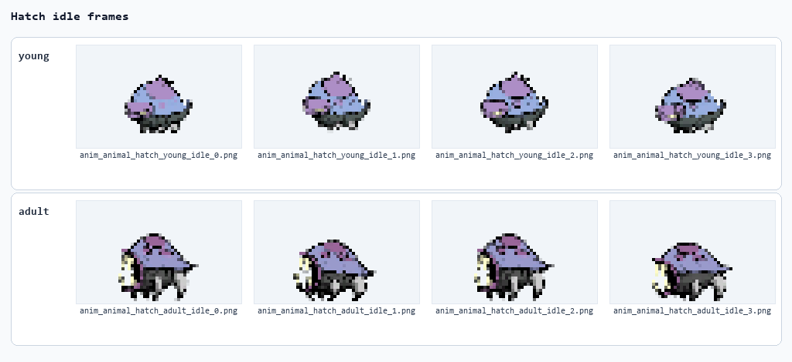
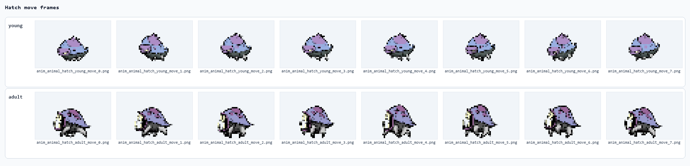
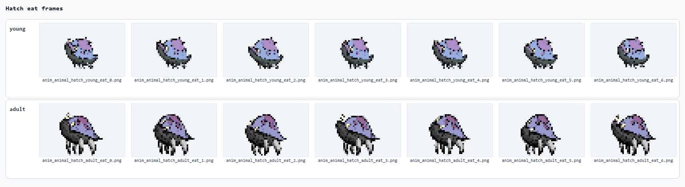
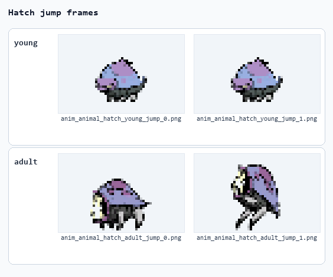
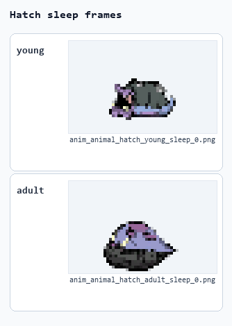

# 新增养殖动物

## 一、整体说明

- 本说明用于制作基于 DTMAPI 的 JSON + PNG + WAV 新增养殖动物内容包。
- 通过以下 10 个 JSON 文件的配合，实现新增动物、获取动物袋、购买动物袋、释放动物、显示图鉴、播放 WAV 声音和读取 PNG 动画帧的完整链路。
**JSON 文件配合关系**

| 配置文件 | 在新增动物链路中的作用 |
| --- | --- |
| 包展示信息：info.json | 提供官方本地 Mod 列表、创意工坊预览和启用界面显示的名称、作者、版本、标签与多语言简介。 |
| DTMAPI 内容包清单：Content/DTMAPI/manifest.json | 让 DTMAPI 识别这个文件夹是内容包，并提供 UniqueID、版本、最低 DTMAPI 版本和内容包类型。 |
| 自定义动物桥：Content/DTMAPI/custom-animals.json | 把新增物种、复用模板、AI 模板、动画键、PNG 前缀、动物袋和商店列表连接到 DTMAPI 的自定义动物桥。 |
| 动物声音替换：Content/DTMAPI/audio-replacements.json | 按物种和成长阶段把原版动物声音事件替换为本包 WAV 文件，避免影响原版动物。 |
| 动物基础数据：Content/animal_tbanimal.json | 定义游戏中的动物 ID、显示名、成长阶段、行为日程、动画资源、声音事件、价格和产物掉落入口。 |
| 动物袋道具：Content/item_tbitem.json | 定义可放入背包和商店出售的动物袋道具，并指定释放后生成的目标动物。 |
| 产物掉落库：Content/item_tbitemspawn.json | 定义动物产物掉落内容和数量范围，由动物基础数据中的产物入口引用。 |
| 动物商店扩展：Content/mod_tbmodstoreextension.json | 把动物袋追加到原版动物商店的出售列表，控制库存、刷新数量和季节配置。 |
| 动物图鉴信息：Content/animal_tbanimaldocument.json | 提供动物图鉴中的幼体/成年图片、标题、说明条目和显示开关。 |
| PNG 帧清单：Content/Sprites/hatch_frame_manifest.json | 记录 PNG 路线的阶段、动作、帧数和文件名映射，便于作者核对素材完整性。 |

其中，Content/DTMAPI/manifest.json、Content/DTMAPI/custom-animals.json、Content/DTMAPI/audio-replacements.json 由 DTMAPI 直接读取；其余 JSON 进入 Doloc Town 官方内容数据表，共同组成可购买、可释放、可显示、可产出的动物内容包。

- 配置示例中，标黄的字段为【需要修改的字段】。
说明：标黄内容表示从哈奇实包复制到自己的动物包时必须替换的包名、作者、物种 ID、动物袋 ID、动画键、PNG 前缀、WAV 路径或显示文本。未标黄的 chicken、原版声音事件、animal_shop、meat 是哈奇模板沿用的原版配置。

## 二、配置示例及数据结构说明

以下 JSON 均读取自当前本地哈奇实包。代码块使用 JSON 语言显示，但为了说明字段，保留官方示例风格的 // 中文注释。

### 1. info.json

- 名称：包展示信息。
- 作用：提供官方本地 Mod 列表、创意工坊预览和启用界面显示的名称、作者、版本、标签与多语言简介。
**info.json**

```json
{
  "name": "哈奇",    // 模组名；没有翻译文本时会显示这个默认名
  "author": "Yuuka",    // 作者名
  "version": "1.0.0",    // 版本号
  "description": "新增可养殖动物哈奇，包含动物数据、动物袋、商店、图鉴、PNG 动画帧和 WAV 声音配置。",    // 模组描述；没有翻译文本时会显示这个默认描述
  "tags": [    // 模组标签
    "Mod",
    "Gameplay",
    "Functional",
    "DTMAPI",
    "Developer"
  ],
  "localized_name": {    // 模组名翻译
    "schinese": "哈奇",    // 简体中文文本
    "tchinese": "哈奇",    // 繁体中文文本
    "english": "Hatch"    // 英文文本
  },
  "localized_description": {    // 模组简介翻译
    "schinese": "新增可养殖动物哈奇，包含动物数据、动物袋、商店、图鉴、PNG 动画帧和 WAV 声音配置。",    // 简体中文文本
    "tchinese": "新增可養殖動物哈奇，包含動物資料、動物袋、商店、圖鑑、PNG 動畫幀和 WAV 聲音配置。",    // 繁体中文文本
    "english": "Adds Hatch as a farm animal with animal data, animal package item, shop entry, document entry, PNG animation frames, and WAV voice configuration."    // 英文文本
  }
}
```

### 2. Content/DTMAPI/manifest.json

- 名称：DTMAPI 内容包清单。
- 作用：让 DTMAPI 识别这个文件夹是内容包，并提供 UniqueID、版本、最低 DTMAPI 版本和内容包类型。
**Content/DTMAPI/manifest.json**

```json
{
  "Name": "哈奇",    // DTMAPI 内容包名称
  "Author": "Yuuka",    // 作者名
  "Version": "1.0.0",    // 版本号
  "Description": "新增可养殖动物哈奇，包含动物数据、动物袋、商店、图鉴、PNG 动画帧和 WAV 声音配置。",    // 内容包描述
  "UniqueID": "DTMAPI.HatchAssets",    // DTMAPI 唯一包 ID，必须唯一
  "EntryDll": "",    // 纯 JSON/PNG/WAV 内容包保持空字符串
  "MinimumDTMApiVersion": "0.5.2-alpha",    // 最低 DTMAPI 版本
  "Type": "ContentPack",    // 内容包类型；这里固定为 ContentPack
  "Dependencies": []    // 依赖列表；本例为空
}
```

### 3. Content/DTMAPI/custom-animals.json

- 名称：自定义动物桥。
- 作用：把新增物种、复用模板、AI 模板、动画键、PNG 前缀、动物袋和商店列表连接到 DTMAPI 的自定义动物桥。
**Content/DTMAPI/custom-animals.json**

```json
[
  {
    "speciesId": "hatch",    // 新增动物 ID，必须和 animal_tbanimal.json 的 id 一致
    "templateSpeciesId": "chicken",    // 复用的原版动物模板；哈奇路线沿用 chicken
    "aiTemplate": "chicken",    // 复用的 AI 模板；哈奇路线沿用 chicken
    "animatorMode": "pngSpriteOverride",    // 动画模式；PNG 路线使用 pngSpriteOverride
    "adultAnimatorKey": "dtmapi_anim_animal_hatch",    // 成年动画键，需与 animal_tbanimal levels[*].animator.url 对齐
    "childAnimatorKey": "dtmapi_anim_animal_hatch_child",    // 幼体动画键，需与 animal_tbanimal levels[*].animator.url 对齐
    "frameManifest": "Content/Sprites/hatch_frame_manifest.json",    // PNG 帧清单路径
    "templateSpritePrefix": "anim_animal_chicken",    // 原版模板帧名前缀；哈奇路线可保持 chicken
    "customSpritePrefix": "anim_animal_hatch",    // 自定义 PNG 帧名前缀，需和所有 PNG 文件名对齐
    "movementMultiplier": 1.0,    // 移动倍率；哈奇模板使用 1.0
    "metabolismMultiplier": 1.0,    // 代谢倍率；哈奇模板使用 1.0
    "packageItemId": "sack_hatch",    // 动物袋道具 ID，需与 item_tbitem.json 对齐
    "shopItemListId": "animal_shop"    // 追加的商店列表 ID；哈奇路线先用 animal_shop
  }
]
```

### 4. Content/DTMAPI/audio-replacements.json

- 名称：动物声音替换。
- 作用：按物种和成长阶段把原版动物声音事件替换为本包 WAV 文件，避免影响原版动物。
**Content/DTMAPI/audio-replacements.json**

```json
[
  {
    "id": "hatch-pet-child",    // 声音替换规则 ID，使用动物和阶段命名
    "category": "AnimalVoice",    // 替换类型；动物叫声使用 AnimalVoice
    "speciesId": "hatch",    // 新增动物 ID，不能写模板 chicken，避免污染原版鸡
    "stage": "child",    // 声音阶段；音频使用 child/adult，PNG 阶段使用 young/adult
    "nativeSoundEvent": "PLAY_ANIMAL_PET_CHICKEN_CHILD",    // 原版声音事件，必须和 animal_tbanimal.json 的 sound_event 一致
    "file": "Content/Audio/hatch_pet_young.wav",    // WAV 路径，从包根目录起算
    "suppressNativeWhenReady": true,    // 自定义 WAV 就绪后是否抑制原版声音
    "cooldownMilliseconds": 80    // 短时间重复触发的冷却
  },
  {
    "id": "hatch-pet-adult",    // 声音替换规则 ID，使用动物和阶段命名
    "category": "AnimalVoice",    // 替换类型；动物叫声使用 AnimalVoice
    "speciesId": "hatch",    // 新增动物 ID，不能写模板 chicken，避免污染原版鸡
    "stage": "adult",    // 声音阶段；音频使用 child/adult，PNG 阶段使用 young/adult
    "nativeSoundEvent": "PLAY_ANIMAL_PET_CHICKEN",    // 原版声音事件，必须和 animal_tbanimal.json 的 sound_event 一致
    "file": "Content/Audio/hatch_pet_adult.wav",    // WAV 路径，从包根目录起算
    "suppressNativeWhenReady": true,    // 自定义 WAV 就绪后是否抑制原版声音
    "cooldownMilliseconds": 80    // 短时间重复触发的冷却
  }
]
```

### 5. Content/animal_tbanimal.json

- 名称：动物基础数据。
- 作用：定义游戏中的动物 ID、显示名、成长阶段、行为日程、动画资源、声音事件、价格和产物掉落入口。
**Content/animal_tbanimal.json**

```json
[
  {
    "id": "hatch",    // 唯一 ID，复制成自己的包时通常要替换
    "title": {    // 动物显示名
      "key": "animal_title_hatch",    // 本地化文本 key，复制成自己的包时同步替换
      "text": "哈奇"    // 显示文本，复制成自己的包时按新动物改写
    },
    "defaul_input_name": {    // 默认输入名；原字段名保持游戏原拼写
      "key": "animal_default_input_name_hatch",    // 本地化文本 key，复制成自己的包时同步替换
      "text": "哈奇"    // 显示文本，复制成自己的包时按新动物改写
    },
    "schedule_id": "chicken",    // 原版日程/行为路线；哈奇路线沿用 chicken
    "levels": [    // 幼体和成年阶段数据
      {
        "sound_event": "PLAY_ANIMAL_PET_CHICKEN_CHILD",    // 该阶段原版声音事件，需与 audio-replacements.json 对齐
        "animator": {    // 该阶段动画键
          "url": "dtmapi_anim_animal_hatch_child"    // 资源键或资源路径，复制成自己的包时检查是否同步替换
        },
        "sprite_size": {    // 交互/显示手感字段，不是 PNG 画布校验字段
          "x": 32,
          "y": 26
        },
        "icon": {    // 阶段图标资源键
          "url": "anim_animal_hatch_young_idle_0"    // 资源键或资源路径，复制成自己的包时检查是否同步替换
        },
        "description_in_sack": {    // 动物袋里的阶段描述
          "key": "animal_child_desc_hatch",    // 本地化文本 key，复制成自己的包时同步替换
          "text": "一只幼年哈奇正在动物袋里等待。"    // 显示文本，复制成自己的包时按新动物改写
        },
        "price": 640    // 该阶段价格
      },
      {
        "sound_event": "PLAY_ANIMAL_PET_CHICKEN",    // 该阶段原版声音事件，需与 audio-replacements.json 对齐
        "animator": {    // 该阶段动画键
          "url": "dtmapi_anim_animal_hatch"    // 资源键或资源路径，复制成自己的包时检查是否同步替换
        },
        "sprite_size": {    // 交互/显示手感字段，不是 PNG 画布校验字段
          "x": 36,
          "y": 34
        },
        "icon": {    // 阶段图标资源键
          "url": "anim_animal_hatch_adult_idle_0"    // 资源键或资源路径，复制成自己的包时检查是否同步替换
        },
        "description_in_sack": {    // 动物袋里的阶段描述
          "key": "animal_adult_desc_hatch",    // 本地化文本 key，复制成自己的包时同步替换
          "text": "一只成年哈奇正在动物袋里等待。"    // 显示文本，复制成自己的包时按新动物改写
        },
        "price": 900    // 该阶段价格
      }
    ],
    "size": 1,
    "space": 2,
    "move_speed": 1.8,
    "run_speed": 5.4,
    "run_threshold": 5,
    "default_energy": 50,
    "eat_interval": 12,
    "eat_count": 20,
    "grow_interval": 6,
    "grow_cost": 1.5,
    "grow_increase": 1.04167,
    "fertility_interval": 24,
    "fertility_cost": 0,
    "fertility_increase": 1.04167,
    "breed_duration": 864,
    "breed_energy_cost": 50,
    "metabolism_interval": 3,
    "metabolism_cost": 0.75,
    "metabolism_increase": 1.04167,
    "produce_spawn_entry": {    // 产物掉落配置
      "spawn_lut": "hatch_produce",    // 产物掉落库 ID，需与 item_tbitemspawn.json 对齐
      "count_range": {    // 本次产出数量范围
        "min_count": 1,
        "max_count": 1
      }
    },
    "produce_require_mood": 40,    // 产物所需心情
    "excrete_interval": 288,
    "excrete_cost": 10,
    "hungry_threshold": 80,
    "mood_decrease_threshold": 50,
    "max_nature_mood": 80,
    "mood_increase_fondle": 10,
    "mood_decrease_thunder": 10,
    "escape_probability_base": 0.05,
    "escape_probability_increase": 0.05,
    "mood_affected_distance": 5,
    "mood_range_horizontal": 3,
    "mood_range_vertical_bottom": 2,
    "mood_range_vertical_top": 2,
    "produce_tech_point": 5,
    "breed_tech_point": 20,
    "manual_metabolism": false,    // 是否手动代谢；哈奇沿用鸡路线
    "jump_height": 2    // 跳跃高度
  }
]
```

### 6. Content/item_tbitem.json

- 名称：动物袋道具。
- 作用：定义可放入背包和商店出售的动物袋道具，并指定释放后生成的目标动物。
**Content/item_tbitem.json**

```json
[
  {
    "id": "sack_hatch",    // 唯一 ID，复制成自己的包时通常要替换
    "sub_type": "husbandry_animal",    // 道具子类型；动物袋使用 husbandry_animal
    "salable": true,
    "disposable": false,
    "consumable": true,
    "cookable": false,
    "electric_energy": 0,
    "viewable": false,
    "source": [],
    "selling_price": 400,
    "buying_price": 800,
    "overlay": 1,
    "ui_sprite_asset": {    // 背包/商店显示图标
      "url": "anim_animal_hatch_adult_idle_0"    // 资源键或资源路径，复制成自己的包时检查是否同步替换
    },
    "title": {    // 动物袋标题
      "key": "item_sack_hatch",    // 本地化文本 key，复制成自己的包时同步替换
      "text": "哈奇动物袋"    // 显示文本，复制成自己的包时按新动物改写
    },
    "description_basic": {    // 动物袋描述
      "key": "item_sack_hatch_desc",    // 本地化文本 key，复制成自己的包时同步替换
      "text": "装着一只哈奇的动物袋。"    // 显示文本，复制成自己的包时按新动物改写
    },
    "function": {    // 道具功能配置
      "$type": "ItemFunctionAnimalPackage",    // 功能类型；动物袋使用 ItemFunctionAnimalPackage
      "ui_sprite_catch": {    // 袋子装满时的图标
        "url": "icon_item_sack_full"    // 资源键或资源路径，复制成自己的包时检查是否同步替换
      },
      "preset_animal": "hatch",    // 释放出的动物 ID，必须等于 speciesId
      "reusable": false,    // 是否可重复使用
      "type_when_full": "husbandry_animal"    // 装有动物时的类型
    }
  }
]
```

### 7. Content/item_tbitemspawn.json

- 名称：产物掉落库。
- 作用：定义动物产物掉落内容和数量范围，由动物基础数据中的产物入口引用。
**Content/item_tbitemspawn.json**

```json
[
  {
    "id": "hatch_produce",    // 唯一 ID，复制成自己的包时通常要替换
    "spawn_datas": [    // 掉落条目列表
      {
        "spawn_weight": 1000,    // 权重；1000 可视为本例固定产出
        "min_count": 1,    // 最小数量
        "max_count": 1,    // 最大数量
        "item_name": "meat"    // 产物道具 ID；哈奇模板使用原版 meat
      }
    ]
  }
]
```

### 8. Content/mod_tbmodstoreextension.json

- 名称：动物商店扩展。
- 作用：把动物袋追加到原版动物商店的出售列表，控制库存、刷新数量和季节配置。
**Content/mod_tbmodstoreextension.json**

```json
[
  {
    "id": "animal_shop",    // 唯一 ID，复制成自己的包时通常要替换
    "extra_items": [    // 追加到商店的道具列表
      {
        "item_name": "sack_hatch",    // 追加的动物袋道具 ID
        "storage": 0,    // 库存模式
        "default_unlock": true,    // 是否默认解锁
        "season_spawn_data": [    // 四季刷新数据
          {
            "count_range": {    // 商店刷出数量范围
              "min_count": 2,
              "max_count": 4
            },
            "spawn_weight": 0    // 刷新权重；本例沿用当前实包配置
          },
          {
            "count_range": {    // 商店刷出数量范围
              "min_count": 2,
              "max_count": 4
            },
            "spawn_weight": 0    // 刷新权重；本例沿用当前实包配置
          },
          {
            "count_range": {    // 商店刷出数量范围
              "min_count": 2,
              "max_count": 4
            },
            "spawn_weight": 0    // 刷新权重；本例沿用当前实包配置
          },
          {
            "count_range": {    // 商店刷出数量范围
              "min_count": 1,
              "max_count": 3
            },
            "spawn_weight": 0    // 刷新权重；本例沿用当前实包配置
          }
        ]
      }
    ]
  }
]
```

### 9. Content/animal_tbanimaldocument.json

- 名称：动物图鉴信息。
- 作用：提供动物图鉴中的幼体/成年图片、标题、说明条目和显示开关。
**Content/animal_tbanimaldocument.json**

```json
[
  {
    "id": "hatch",    // 唯一 ID，复制成自己的包时通常要替换
    "ui_sprite_asset": {    // 图鉴幼体展示图
      "url": "anim_animal_hatch_young_idle_0"    // 资源键或资源路径，复制成自己的包时检查是否同步替换
    },
    "ui_adult_sprite_asset": {    // 图鉴成年展示图
      "url": "anim_animal_hatch_adult_idle_0"    // 资源键或资源路径，复制成自己的包时检查是否同步替换
    },
    "infancy_asset": {    // 幼体资源
      "url": "anim_animal_hatch_young_idle_0"    // 资源键或资源路径，复制成自己的包时检查是否同步替换
    },
    "adult_asset": {    // 成年资源
      "url": "anim_animal_hatch_adult_idle_0"    // 资源键或资源路径，复制成自己的包时检查是否同步替换
    },
    "document_infos": [    // 图鉴描述条目
      {
        "id": "hatch_0",    // 唯一 ID，复制成自己的包时通常要替换
        "document_type": 1,    // 图鉴条目类型
        "value": 0,    // 图鉴条目数值
        "description_append": {    // 图鉴追加说明
          "key": "document_animal_hatch_0",    // 本地化文本 key，复制成自己的包时同步替换
          "text": "哈奇是通过 PNG 帧图片新增的养殖动物。"    // 显示文本，复制成自己的包时按新动物改写
        }
      },
      {
        "id": "hatch_1",    // 唯一 ID，复制成自己的包时通常要替换
        "document_type": 4,    // 图鉴条目类型
        "value": 1,    // 图鉴条目数值
        "description_append": {    // 图鉴追加说明
          "key": "document_animal_hatch_1",    // 本地化文本 key，复制成自己的包时同步替换
          "text": "哈奇沿用鸡的行为模板，外观由本包 PNG 帧图片提供。"    // 显示文本，复制成自己的包时按新动物改写
        }
      }
    ],
    "display": true    // 是否显示到图鉴
  }
]
```

### 10. Content/Sprites/hatch_frame_manifest.json

- 名称：PNG 帧清单。
- 作用：记录 PNG 路线的阶段、动作、帧数和文件名映射，便于作者核对素材完整性。
**Content/Sprites/hatch_frame_manifest.json**

```json
{
  "animal_id": "hatch",    // 动物 ID
  "display_name": "Hatch",    // 显示名
  "animator_mode": "pngSpriteOverride",    // 动画模式
  "template_sprite_prefix": "anim_animal_chicken",    // 模板帧名前缀
  "custom_sprite_prefix": "anim_animal_hatch",    // 自定义帧名前缀
  "canvas_by_stage": {    // 不同阶段的 PNG 画布尺寸
    "adult": {
      "width": 32,
      "height": 32
    },
    "young": {
      "width": 28,
      "height": 24
    }
  },
  "states": [    // 动作状态和帧文件
    {
      "stage": "adult",    // 阶段；PNG 使用 young/adult
      "state": "idle",    // 动作名
      "frame_count": 4,    // 该动作帧数
      "files": [    // 对应 PNG 文件
        "anim_animal_hatch_adult_idle_0.png",
        "anim_animal_hatch_adult_idle_1.png",
        "anim_animal_hatch_adult_idle_2.png",
        "anim_animal_hatch_adult_idle_3.png"
      ]
    },
    {
      "stage": "adult",    // 阶段；PNG 使用 young/adult
      "state": "move",    // 动作名
      "frame_count": 8,    // 该动作帧数
      "files": [    // 对应 PNG 文件
        "anim_animal_hatch_adult_move_0.png",
        "anim_animal_hatch_adult_move_1.png",
        "anim_animal_hatch_adult_move_2.png",
        "anim_animal_hatch_adult_move_3.png",
        "anim_animal_hatch_adult_move_4.png",
        "anim_animal_hatch_adult_move_5.png",
        "anim_animal_hatch_adult_move_6.png",
        "anim_animal_hatch_adult_move_7.png"
      ]
    },
    {
      "stage": "adult",    // 阶段；PNG 使用 young/adult
      "state": "eat",    // 动作名
      "frame_count": 7,    // 该动作帧数
      "files": [    // 对应 PNG 文件
        "anim_animal_hatch_adult_eat_0.png",
        "anim_animal_hatch_adult_eat_1.png",
        "anim_animal_hatch_adult_eat_2.png",
        "anim_animal_hatch_adult_eat_3.png",
        "anim_animal_hatch_adult_eat_4.png",
        "anim_animal_hatch_adult_eat_5.png",
        "anim_animal_hatch_adult_eat_6.png"
      ]
    },
    {
      "stage": "adult",    // 阶段；PNG 使用 young/adult
      "state": "sleep",    // 动作名
      "frame_count": 1,    // 该动作帧数
      "files": [    // 对应 PNG 文件
        "anim_animal_hatch_adult_sleep_0.png"
      ]
    },
    {
      "stage": "adult",    // 阶段；PNG 使用 young/adult
      "state": "jump",    // 动作名
      "frame_count": 2,    // 该动作帧数
      "files": [    // 对应 PNG 文件
        "anim_animal_hatch_adult_jump_0.png",
        "anim_animal_hatch_adult_jump_1.png"
      ]
    },
    {
      "stage": "adult",    // 阶段；PNG 使用 young/adult
      "state": "jump_ready",    // 动作名
      "alias_of": "jump",    // 别名动作；jump_ready 复用 jump_0
      "frame_count": 1,    // 该动作帧数
      "files": [    // 对应 PNG 文件
        "anim_animal_hatch_adult_jump_0.png"
      ]
    },
    {
      "stage": "young",    // 阶段；PNG 使用 young/adult
      "state": "idle",    // 动作名
      "frame_count": 4,    // 该动作帧数
      "files": [    // 对应 PNG 文件
        "anim_animal_hatch_young_idle_0.png",
        "anim_animal_hatch_young_idle_1.png",
        "anim_animal_hatch_young_idle_2.png",
        "anim_animal_hatch_young_idle_3.png"
      ]
    },
    {
      "stage": "young",    // 阶段；PNG 使用 young/adult
      "state": "move",    // 动作名
      "frame_count": 8,    // 该动作帧数
      "files": [    // 对应 PNG 文件
        "anim_animal_hatch_young_move_0.png",
        "anim_animal_hatch_young_move_1.png",
        "anim_animal_hatch_young_move_2.png",
        "anim_animal_hatch_young_move_3.png",
        "anim_animal_hatch_young_move_4.png",
        "anim_animal_hatch_young_move_5.png",
        "anim_animal_hatch_young_move_6.png",
        "anim_animal_hatch_young_move_7.png"
      ]
    },
    {
      "stage": "young",    // 阶段；PNG 使用 young/adult
      "state": "eat",    // 动作名
      "frame_count": 7,    // 该动作帧数
      "files": [    // 对应 PNG 文件
        "anim_animal_hatch_young_eat_0.png",
        "anim_animal_hatch_young_eat_1.png",
        "anim_animal_hatch_young_eat_2.png",
        "anim_animal_hatch_young_eat_3.png",
        "anim_animal_hatch_young_eat_4.png",
        "anim_animal_hatch_young_eat_5.png",
        "anim_animal_hatch_young_eat_6.png"
      ]
    },
    {
      "stage": "young",    // 阶段；PNG 使用 young/adult
      "state": "sleep",    // 动作名
      "frame_count": 1,    // 该动作帧数
      "files": [    // 对应 PNG 文件
        "anim_animal_hatch_young_sleep_0.png"
      ]
    },
    {
      "stage": "young",    // 阶段；PNG 使用 young/adult
      "state": "jump",    // 动作名
      "frame_count": 2,    // 该动作帧数
      "files": [    // 对应 PNG 文件
        "anim_animal_hatch_young_jump_0.png",
        "anim_animal_hatch_young_jump_1.png"
      ]
    },
    {
      "stage": "young",    // 阶段；PNG 使用 young/adult
      "state": "jump_ready",    // 动作名
      "alias_of": "jump",    // 别名动作；jump_ready 复用 jump_0
      "frame_count": 1,    // 该动作帧数
      "files": [    // 对应 PNG 文件
        "anim_animal_hatch_young_jump_0.png"
      ]
    }
  ],
  "notes": [    // 维护说明
    "The runtime maps chicken jump_ready frames to Hatch jump_0 because Hatch has no dedicated jump_ready PNG.",
    "Eat uses 7 frames to cover the chicken template eat_0..6 sequence."
  ]
}
```

## 三、动画帧图片格式要求

哈奇当前使用 chicken 模板路线，运行时通过 pngSpriteOverride 将鸡模板帧映射到哈奇 PNG。

**动作帧数量与画布尺寸**

| 阶段 | 画布尺寸 | idle | move | eat | jump | sleep | PNG 合计 |
| --- | --- | --- | --- | --- | --- | --- | --- |
| young | 28 x 24 | 4 | 8 | 7 | 2 | 1 | 22 |
| adult | 32 x 32 | 4 | 8 | 7 | 2 | 1 | 22 |

文件名规则：anim_animal_hatch_阶段_动作_编号.png。复制为新动物时，将 hatch 替换为自己的动物 ID，并保持 customSpritePrefix 与 PNG 文件名前缀一致。

**图片要求**

| 项目 | PNG 文件 | 命名 | 阶段 | 动作 | 方向 | sprite_size |
| --- | --- | --- | --- | --- | --- | --- |
| 要求 | 每一帧都是独立 PNG | anim_animal_hatch_阶段_动作_编号.png | PNG 使用 young/adult；音频使用 child/adult | idle、move、eat、jump、sleep；jump_ready 复用 jump_0 | 不准备 left/right 两套图，左右朝向由原版渲染器翻转 | 用于交互/显示手感，不参与 PNG 画布校验 |

**· 哈奇 idle 动作帧图**



**· 哈奇 move 动作帧图**



**· 哈奇 eat 动作帧图**



**· 哈奇 jump 动作帧图**



**· 哈奇 sleep 动作帧图**



## 四、参考示例

### 1. 哈奇实包文件结构

**哈奇实包文件结构**

| 层级 | 路径/文件 | 说明 |
| --- | --- | --- |
| 根目录 | info.json | 官方本地/创意工坊展示信息 |
| Content | animal_tbanimal.json | 动物本体数据 |
| Content | item_tbitem.json | 动物袋道具 |
| Content | item_tbitemspawn.json | 产物掉落库 |
| Content | mod_tbmodstoreextension.json | 动物商店扩展 |
| Content/DTMAPI | manifest.json | DTMAPI 内容包清单 |
| Content/DTMAPI | custom-animals.json | 自定义动物桥 |
| Content/DTMAPI | audio-replacements.json | WAV 声音替换 |
| Content/Sprites | anim_animal_hatch_*.png | 44 张独立帧 PNG |
| Content/Audio | hatch_pet_young.wav / hatch_pet_adult.wav | 幼体/成年 WAV |

### 2. 哈奇关键 ID 对照

**哈奇关键 ID 对照**

| 用途 | 哈奇实包值 | 说明 |
| --- | --- | --- |
| 包 UniqueID | DTMAPI.HatchAssets | 复制成自己的包时必须唯一 |
| 动物 speciesId / animal id | hatch | custom-animals.json、animal_tbanimal.json、动物袋 preset_animal 要一致 |
| 复用模板 | chicken | 哈奇路线使用鸡模板 |
| AI 模板 | chicken | 哈奇路线使用鸡 AI |
| 模板帧名前缀 | anim_animal_chicken | 哈奇路线复用鸡模板帧名 |
| 自定义帧名前缀 | anim_animal_hatch | 必须和所有 PNG 文件名一致 |
| 幼体 animator key | dtmapi_anim_animal_hatch_child | 需与幼体 levels[*].animator.url 一致 |
| 成年 animator key | dtmapi_anim_animal_hatch | 需与成年 levels[*].animator.url 一致 |
| 动物袋道具 | sack_hatch | custom-animals.packageItemId 和商店 extra_items 要引用它 |
| 产物掉落库 | hatch_produce | animal_tbanimal.produce_spawn_entry.spawn_lut 要引用它 |
| 商店列表 | animal_shop | 哈奇路线把动物袋追加到原版动物商店 |
| 幼体声音事件 | PLAY_ANIMAL_PET_CHICKEN_CHILD | 需与幼体 sound_event 一致 |
| 成年声音事件 | PLAY_ANIMAL_PET_CHICKEN | 需与成年 sound_event 一致 |

### 3. 从哈奇复制一只新动物的顺序

1. 复制 DTMAPI_HatchAssets 到新文件夹，不要直接修改哈奇本体。
1. 先改包 ID：DTMAPI.HatchAssets 改成自己的 UniqueID。
1. 再改动物 ID：把 hatch 统一改成自己的 speciesId。
1. 改动物袋：sack_hatch 改成自己的动物袋 ID，并同步 packageItemId 和 preset_animal。
1. 改 PNG 前缀：anim_animal_hatch 改成自己的 customSpritePrefix，并按同样前缀重命名所有 PNG。
1. 替换 WAV：保持 audio-replacements.json 的阶段和声音事件一致，只改 file 路径和文件。
1. 产物默认沿用原版 meat；如果新增自定义产物，需要同步扩展产物道具和掉落库。
1. 同步调整价格、商店数量、图鉴文本、产物和数值。
### 4. 启动前检查清单

- Content/DTMAPI/manifest.json 存在，Type 为 ContentPack，EntryDll 为空。
- speciesId、animal_tbanimal.id、preset_animal 三者一致。
- adultAnimatorKey / childAnimatorKey 和 levels[*].animator.url 一致。
- templateSpeciesId、aiTemplate、schedule_id 同步指向同一个模板。
- nativeSoundEvent 和 levels[*].sound_event 完全一致。
- PNG 数量和编号完整；同阶段画布尺寸一致。
- WAV 路径从包根目录可找到，例如 Content/Audio/hatch_pet_young.wav。
- 商店扩展追加的是动物袋 ID，不要覆盖整个原版商店列表。
### 5. 游戏内手测顺序

1. 启动游戏后确认日志里注册了内容包、custom-animals.json 和 audio-replacements.json。
1. 拿到动物袋，确认袋子图标和名称不是原版鸡。
1. 释放幼体，确认显示为新 PNG，不是原版鸡。
1. 抚摸幼体，确认播放幼体 WAV。
1. 等待成长或用测试流程进入成年，确认成年 PNG 正常。
1. 抚摸成年，确认播放成年 WAV。
1. 观察待机、移动、吃饭、睡觉、跳跃，不应缺帧或闪回原版图。
1. 收取产物，确认产物进入对应设备或掉落逻辑。
1. 同时放一只原版鸡，确认原版鸡贴图和声音没有被污染。
1. 保存、退出、重进，再看新动物仍能正常加载。