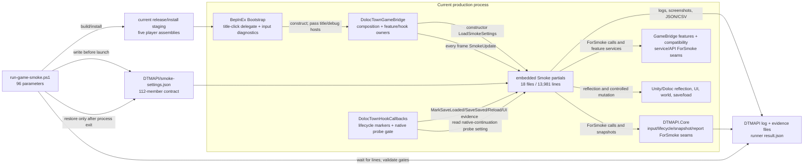

# 20260715-0011 Batch 4 QA Extraction Dependency Map

Status: recorded
Date: 2026-07-15
Scope: Batch 4 Checkpoint B read-only dependency map for extracting the embedded Smoke harness into an optional internal QA host
Related Update: `docs/updates/2026/20260715-0019-batch4-qa-host-extraction.md` (reserved; create only after the player Doctor closure)
Primary route: `docs/reviews/code/2026/20260712-0003-dtmapi-full-boundary-audit.md`
Entry review: `docs/reviews/code/2026/20260715-0009-batch2-batch3-route-and-batch4-entry-review.md`
Open debug boundaries: `docs/debug/issues/ISSUE-010-20260620-long-run-mono-gc-crash.md`, `docs/debug/issues/ISSUE-011-20260623-short-run-native-crash.md`

## Purpose And Decision

This is the permitted Batch 4 Checkpoint B analysis. It freezes the dependency and rollback map before code movement. It is not an implementation record, does not create the QA project, and does not claim that either open crash class is fixed.

Physical Batch 4 extraction may begin only after the narrow Batch 3 player-Doctor closure is committed and verified. The first Batch 4 regression group must then replay the exact eleven-public-product enabled and disabled matrices on that post-Doctor tree. The implementation owner is the reserved Update above; this Review remains the pre-implementation source of migration groups and acceptance gates.

## Counted Baseline

The counts below are from the tracked pre-extraction source at `780d343c89f3d826d4449dfa86339013dd345a0e`. Physical line counts use `File.ReadAllLines`; `ForSmoke` is reported both as matching source lines and literal occurrences so later audits do not silently change counting methods.

| Surface | Current count | Boundary consequence |
| --- | ---: | --- |
| Separate `DTMAPI.GameBridge.DolocTown.QA` projects | 0 | QA remains embedded in production. |
| `src/DTMAPI.GameBridge.DolocTown/Smoke/**/*.cs` | 18 files / 13,981 physical lines | Four top-level partials contain 8,071 lines; fourteen case files contain 5,910 lines. |
| `ForSmoke` in `src/**/*.cs` | 697 matching lines / 710 occurrences / 29 files | This is not a directory-only move. |
| `ForSmoke` outside the `Smoke` directory | 76 matching lines / 82 occurrences / 12 files | Core, Bootstrap, Hook, compatibility, and feature seams must migrate with their consumers or be proven production-owned. |
| `SmokeSettings` contract | 112 `[DataMember]` properties | Runner/settings compatibility is an atomic protocol concern. |
| `tools/scripts/run-game-smoke.ps1` | 4,884 physical lines / 96 parameters | Staging, activation, validation, recovery, and evidence parsing are one release surface. |
| Four QA/performance probe files outside `Smoke` | 4 files / 1,040 physical lines | Their types form one dependency-closed migration unit. |
| Player game-loaded Runtime assemblies | 5 | Abstractions, Core, GameBridge, ModConfigMenu, and Bootstrap must remain the player set; QA is not a sixth player DLL. |
| Production constructor/frame entries | 1 constructor read / 1 call every frame | The constructor calls `LoadSmokeSettings()` and `DolocTownGameBridge.Update()` calls `SmokeUpdate()` unconditionally. |

The `SmokeUpdate()` null path calls `LoadSmokeSettings()` again. With no `DTMAPI/smoke-settings.json`, that becomes a normal-player `File.Exists` check every frame. This is a proven inactive-cost defect and an extraction target; it is not a proven Fatal GC cause.

## Current Directed Dependency Graph



The dependency direction required after extraction is different:

```text
optional QA assembly -> narrow production-owned internal/friend seams -> production services
production assemblies -X-> QA assembly
runner -> explicitly staged QA payload + versioned activation receipt
player package -X-> QA DLL, QA settings, QA roots, QA listeners, QA polling
```

QA may depend inward on production. Production must not acquire a project or static assembly reference back to QA. Any host seam left in production must describe a real production responsibility or a neutral internal fixture boundary; it must not add a public Abstractions API or expose Unity, Harmony, or decompiled Doloc types.

## External Reverse Edges To Cut

These are the current production-to-harness edges that prevent moving `Smoke/` by itself.

| Production owner | Reverse edge into embedded QA state | Required cut |
| --- | --- | --- |
| `DolocTownGameBridge.cs` | Owns `SmokeSettings`, most scenario state, constructor `LoadSmokeSettings()`, root-isolation gates, and the native-continuation enable property. | Move scenario state to the QA instance. Keep only production-owned domain seams. Remove settings and isolation decisions from player composition at G7. |
| `DolocTownGameBridge.Update.cs` | Calls `SmokeUpdate()` on every production frame. | QA owns its update root only while explicitly activated; delete this call at G7. |
| `DolocTownGameBridge.Hooks.cs` | Installs and publishes Smoke native-load continuation hooks from the embedded setting. | Move the whole optional probe install/status lifecycle in G6; production Hook install must not consult QA settings afterward. |
| `DolocTownHookCallbacks.cs` | Calls `MarkSaveLoadedForSmoke`, `MarkSaveSavedForSmoke`, `MarkWorkshopReloadCompletedForSmoke`, two animal-UI evidence markers, and reads `SmokeNativeLoadContinuationProbeEnabled`. | Route equivalent observations to an active optional QA participant, then delete the direct methods/property. Preserve the production save/load, Workshop, animal, and Hook callbacks. |
| `BootstrapPlugin.cs` | Passes `ClickTitleButtonForSmoke`, samples `SmokeInputPollingDiagnosticsEnabled`, and owns a Smoke input-diagnostic state object. | Move test input observation and title UI driving to an explicitly active QA module in G4/G6; keep ordinary player input and UI owners unchanged. |
| `ReflectedTitleMenuSettingsUi.cs` | Exposes `ClickTitleButtonForSmoke()`. | Replace with a narrow internal UI-host operation consumed only by staged QA, or move the driver beside QA without changing the player UI behavior. |
| `DtmApiRuntime.cs` | Owns virtual input pressure, synthetic frame/tap, owner-lifetime, camera-owner cleanup, root isolation, save/load snapshot mode, and Smoke input diagnostic controls. | Migrate scenario orchestration to QA; retain only general owner/lifecycle operations with real production ownership. Delete orphan Smoke state in G7. |
| Feature and compatibility services | Expose action, animal, equipment, machine, fishing, and diagnostics helpers named `ForSmoke`. | Move test-only adapters with each case group; retain or rename any method that is actually required for production repair or an ordinary Mod contract. |
| `RuntimePaths.cs` | Publishes `SmokeSettingsPath` to production. | Replace the recurring player path with a once-only explicit QA activation input; remove the player path after G7. |

The exact twelve files with `ForSmoke` outside `Smoke/` are:

- `src/DTMAPI.BepInExBootstrap/BootstrapPlugin.cs`
- `src/DTMAPI.BepInExBootstrap/ReflectedTitleMenuSettingsUi.cs`
- `src/DTMAPI.Core/Runtime/DtmApiRuntime.cs`
- `src/DTMAPI.GameBridge.DolocTown/Compatibility/FishingAutomation/LegacyFishingAutomationService.cs`
- `src/DTMAPI.GameBridge.DolocTown/Diagnostics/DolocTownExperimentalBridgeApi.Diagnostics.cs`
- `src/DTMAPI.GameBridge.DolocTown/DolocTownExperimentalBridgeApi.cs`
- `src/DTMAPI.GameBridge.DolocTown/Features/ActionCompletion/ActionCompletionService.cs`
- `src/DTMAPI.GameBridge.DolocTown/Features/ActionSpeed/ActionSpeedService.cs`
- `src/DTMAPI.GameBridge.DolocTown/Features/AnimalViewer/AnimalViewerService.cs`
- `src/DTMAPI.GameBridge.DolocTown/Features/EquipmentSlots/DolocTownExperimentalBridgeApi.EquipmentSlots.cs`
- `src/DTMAPI.GameBridge.DolocTown/Features/MachineProduction/DolocTownExperimentalBridgeApi.MachineProduction.cs`
- `src/DTMAPI.GameBridge.DolocTown/Hooking/DolocTownHookCallbacks.cs`

This list is an audit queue, not a deletion list. A `ForSmoke` suffix is evidence of coupling, not proof that the underlying operation is QA-only. Equipment orphan recovery, save/load ownership cleanup, native UI repair, and real product behavior must survive extraction.

## Atomic Migration Groups G0-G7

Each group is one reviewable/revertible unit: production code, QA code, runner protocol, tests, package assertions, evidence identifiers, and rollback notes move together. Do not leave a group split across commits or allow embedded and extracted harnesses to drive the same scenario simultaneously.

### G0 - Post-Doctor Baseline Freeze

- Require the player Doctor closure commit and a clean exact tree.
- Run Release gates and the exact eleven-public-product enabled and disabled matrices on that tree, with Entry/Begin/Commit counts, enablement restoration, clean process exit, and no residual QA artifact.
- Preserve the existing settings keys, status IDs, log predicates, result fields, and evidence paths as the migration compatibility baseline.
- Record the five-player-assembly inventory and absence of a QA project/package payload.

Rollback: no source migration exists yet; failures return to the Doctor closure, packaging, or baseline matrix owner.

### G1 - Optional Host, Activation, Staging, And Close Protocol

- Add optional internal `DTMAPI.GameBridge.DolocTown.QA` targeting `netstandard2.0`.
- Define narrow production-owned internal/friend seams; QA references production, never the reverse.
- Make the runner explicitly stage the QA DLL plus an exact version/contract receipt and request activation once at startup.
- Read activation/settings once. Missing, damaged, or version-mismatched QA must fail fast and visibly; there is no silent fallback to a partially loaded host.
- Give the QA module an owned update/lifecycle root only after successful activation and deterministic close/removal at title and shutdown.
- Add release-package tests that prove the QA DLL, PDB, settings, roots, and authoring tools are absent from the player package.
- Keep the embedded harness selectable but inactive for the new QA lane until migrated groups pass; assert exactly one harness owner per run.

Rollback: revert the project, staging, activation receipt, and runner switch together; the prior embedded lane remains the known path.

### G2 - Settings/Result Contracts And Four-Probe Unit

- Move the 112-member settings contract, result/report DTOs, serializers, and protocol-version validation into the QA boundary.
- Preserve JSON property names and runner-visible result/log identifiers, or provide an explicit one-version translation in the runner and rollback record.
- Move all four performance probes, their result types, and the `AutoFishingSmokeCase` performance orchestrator as one dependency-closed unit; update their tests to reference QA.
- Repair the existing positive-target protocol break as part of that unit: the runner writes `AutoFishingPerformanceTargetFish` and `AutoFishingPerformanceWarmupFish`, but the current positive `100/500` path never passes them into a probe, observes a performance result, or writes one. G2 must bind settings to constructor/orchestration and prove a positive target in source/unit tests; a file-only move is not acceptance.
- Prove production Core and GameBridge no longer compile those QA-only probe/result types and the player package contains none of them.

Rollback: restore all four probe files, DTOs, tests, and serializer ownership together. A half-move would create either a production-to-QA edge or duplicate contract authority.

### G3 - Low-Coupling Read/Observe Cases

- Move CustomEntity validation, general diagnostics snapshot checks, FishRoe tooltip observation, and general save/saved/Workshop lifecycle evidence that does not own a UI driver.
- Replace direct save-loaded, save-saved, and Workshop-reload markers with an optional active-participant notification; no QA listener exists when the QA module is absent.
- Keep production save/load dispatch, report export, Workshop refresh, and feature behavior in their current owners.
- Move other truly read-only metadata/content observations only after their mutation paths are split out.

Rollback: revert each case set with its callback adapter and runner predicate. Production lifecycle dispatch must remain valid with QA absent before and after the revert.

### G4 - Bootstrap, UI, Content, Audio, Camera, And Observation Split

- Split production UI repair before moving UI observation; the exact boundary is defined below.
- Move title-settings/Manager/official-Mod UI driving, SaveSlots UI driving/evidence, screenshots, pause-menu observation, debug-console QA driving, player-input handshake observation, AnimalViewer evidence, audio/hatch-voice exercises, and camera/Zoom playable evidence behind the active QA host.
- Split `ContentSmoke.cs` by behavior: read-only content/UI evidence moves here; equipment, mine, inventory, or world mutation remains for G5.
- Split AnimalViewer observation from any progress seeding or save mutation; mutation belongs in G5 or a separately restored fixture.
- Preserve Bootstrap's real title UI, debug-console UI, input handling, EventSystem cleanup, camera lease, audio, and content behavior.

Rollback: the production repair service and ordinary UI/input behavior are never reverted with QA observation. Revert only the QA driver, host seam, runner switches, and evidence predicates for this group.

### G5 - World-Changing Action And Equipment Cases

- Move ActionSpeed, ActionCompletion, CropHarvesting, ChestLocator world/inventory mutation, Equipment/new-content mutation, StrongPlantingGun, Oil/coal-drop, and remaining experimental world-action scenarios.
- Every case must retain an explicit setup/commit/cleanup receipt and restore inventory, config, world objects, official Mod enablement, and save selection after process exit.
- Do not turn test-only reflection or native-object mutation into a public API. Production services remain native-owner based.
- Keep Equipment orphan recovery and other safety repair in production even if the scenario that verifies them moves to QA.

Rollback: revert the case, host actions, cleanup receipt, runner flags, and restoration checks together. A failed exit proof remains fail-closed and leaves recovery receipts instead of touching player files.

### G6 - Fishing, Owner Lifetime, Save/Load, Long Trend, And Native Crash Probes

- Move AutoFishing primitive/full/legacy/shared flows, fishing performance orchestration, owner-lifetime and camera-owner exercises, save/load cycles, long-title observation, root-isolation profiles, pending-pressure publication, pre-load forced-GC probe, and native-load continuation probe last.
- Preserve the continuous-observed-HomePage stability rule, request/native-enter/native-return/SaveLoaded counters, duplicate-request detection, snapshot modes, Hook breadcrumbs, title cleanup, and crash-dump/export evidence.
- Move the remaining Hook callback markers and optional native probe hooks without altering the production save/load call order.
- Preserve the independent AutoFishing and ActionSpeed release ladders as later GC evidence; QA extraction runs do not replace them.

Rollback: one revert restores the old hook markers, probe installation, runner settings, evidence parsing, and embedded flow. Do not mix old Hook callbacks with a new QA state owner.

### G7 - Sever Embedded Harness And Prove Player Absence

- Delete production `SmokeUpdate`, constructor settings load, embedded Smoke partials/state, direct Smoke Hook markers, root-isolation settings, native probe gates, and the production `SmokeSettingsPath` only after every replacement group passes.
- Audit all 29 `ForSmoke` files. Delete proven orphans; retain/rename production-owned operations with tests and ownership notes.
- Remove the four probes from production, eliminate any production project/static reference to QA, and assert no QA type name or payload is shipped to players.
- Rebuild the player/Workshop package and prove the same five game-loaded production assemblies, no QA artifact, no ordinary-player settings read/poll, no QA root/listener/update, and no process residue.
- Replay Release, runner missing/mismatch/close tests, exact eleven-product enabled/disabled matrices, normal Steam no-HookProbe player input, and the relevant migrated scenario groups.

Rollback: revert G7 as one unit to the fully passing G6 dual-protocol tree. Do not reconstruct deleted partials manually and do not restore player files until process exit is proven.

## Four-Probe Atomic Group

| Current file | Lines | Current dependency role | Migration rule |
| --- | ---: | --- | --- |
| `src/DTMAPI.Core/Diagnostics/RuntimeMemoryTrendProbe.cs` | 534 | Owns process/platform/domain samples, trend/result DTOs, bounded windows, and Gen2 low-water observations. | Move with all result DTO consumers; no production Core residue. |
| `src/DTMAPI.Core/Diagnostics/RuntimeThreadAllocationProbe.cs` | 139 | Resolves/calibrates the thread allocation counter and owns its result DTO. | Move with FishingPerformance; no independent production use exists. |
| `src/DTMAPI.GameBridge.DolocTown/Diagnostics/UnityRuntimeMemoryMetricsProvider.cs` | 79 | Reflects Unity profiler counters and returns the Core platform snapshot type. | Cannot move separately from RuntimeMemoryTrend types. |
| `src/DTMAPI.GameBridge.DolocTown/Features/FishingAutomation/FishingPerformanceProbe.cs` | 288 | Composes allocation and memory-trend probes and owns fishing performance results. | Despite its feature folder, it is QA measurement, not the production fishing service. |
| **Total** | **1,040** | `AutoFishingSmokeCase -> FishingPerformanceProbe -> allocation + memory trend`, with Unity/domain capture delegates feeding the trend. | Move in G2 as one commit and rebind UnitTests to QA. |

Moving only the two GameBridge files would leave QA depending on QA-only DTOs still compiled into Core. Moving only the Core files would make production GameBridge depend outward on QA. The four files, their DTOs, serializers, and tests are therefore indivisible.

The orchestrator edge is equally indivisible. Static audit after G0 confirmed that the runner's positive performance targets are currently protocol-only fields: only the zero-target path constructs `FishingPerformanceProbe`, with hard-coded `target=0` and `warmup=0`, while the positive FishLoop path follows the ordinary AutoFishing flow and never creates, observes, or serializes the probe. G2 owns this pre-existing gap and must not preserve it as a compatibility behavior.

## Native UI Repair Versus QA Observation

`NativeUiLayoutDiagnosticsService` currently combines mandatory behavior and optional evidence. The whole feature must not be extracted or demand-disabled as one block.

Production repair responsibility:

- normalize HomePage text-menu, MenuUI, and active GridLayout constraint counts;
- write the fixed-column constraint/count when needed;
- call `RebuildLayout`, `LayoutRebuilder.ForceRebuildLayoutImmediate`, and `Canvas.ForceUpdateCanvases` as the bounded repair path;
- retain the targeted prefix/postfix hooks required to prevent title/config/main-menu layout regression;
- remain active independently of QA and of any Smoke root-isolation profile.

QA observation responsibility:

- stack traces, the 80-key diagnostic de-dup set, two-column observations, sampling summaries, screenshots, and runner assertions;
- `UpdateActiveMainMenuLayout()`'s recurring 250 ms observation after repair has been separated;
- Smoke status IDs and layout evidence files that exist only to prove the repair.

G4 must first introduce a small production repair owner, then attach an optional QA observer. Hook callbacks may call repair unconditionally and observation only when QA is active. A passing screenshot alone is not proof that the repair owner survived; source tests must assert the write/refresh path remains in production and a player run must verify ordinary title/config/menu layout with QA absent.

## Runner, Player Package, And Rollback Gates

### Runner/activation

- `run-game-smoke.ps1` is the only staging authority for the optional QA payload. It verifies file presence, hash/assembly version, protocol version, and target Runtime compatibility before launch.
- Requested QA with a missing, damaged, stale, or mismatched DLL is a blocked run, not an embedded fallback and not a player Runtime failure.
- Activation is read once at startup. The QA assembly owns its own bounded update/lifecycle root after activation; there is no per-frame file existence probe.
- Exactly one harness instance and one result writer are allowed. Settings/result/log identifiers stay compatible or the runner carries an explicit version translation.
- Title/shutdown closes QA roots/listeners. Final cleanup waits for stable `DolocTown.exe` absence before restoring settings, save, `mod_infos.json`, configs, or staged payloads.

### Player package

- The player Workshop/subscription package contains the same five game-loaded production assemblies and the player Doctor tools, but no QA DLL/PDB, QA settings, QA DTOs, Smoke partials, QA-only probes, test roots, listeners, or updater.
- Production has no project/static reference to QA. A source/package test must inspect project references and actual artifacts; folder intent is insufficient.
- Ordinary Steam startup with no HookProbe and no QA activation must show no QA load attempt, no `smoke-settings.json` poll, no QA root/listener/update, and normal player input.

### Rollback

- G1-G6 retain a versioned, mutually exclusive old/new runner mode until their replacement evidence passes. Dual availability must never mean dual execution.
- Every group records its source/project/runner/package/evidence surface and can be reverted to the immediately preceding passing group with one Git revert.
- G7 is the only deletion wave. Its rollback target is the complete passing G6 tree, not ad hoc file recovery.
- If the game has not exited, restoration remains blocked and a manual recovery receipt is preserved. QA extraction does not weaken the Batch 2/3 transaction rules.

## ISSUE-010, ISSUE-011, And GC Boundary

- ISSUE-010 remains `open`. Removing the normal-player per-frame settings probe and QA-only roots is a valid inactive-cost reduction, but it does not identify or fix the long-run Mono/BDWGC crash. The save/load, root-isolation, native-continuation, and long-trend scenarios move only in G6 and must retain their evidence semantics.
- ISSUE-011 remains `open / evidence-improved / pending game validation`. QA extraction must preserve bounded Y-console/input breadcrumbs, EventSystem ownership cleanup, fresh/stale Unity crash classification, process-dump collection, and explicit missing-dump evidence. A clean extraction smoke does not close the native crash class.
- The four-probe move is architecture work, not GC evidence. Minute-scale Smoke runs, especially with AutoFishing or ActionSpeed disabled, cannot substitute for the two independent `1x -> enabled/no-speedup -> common multiplier -> high multiplier -> disabled restoration -> title cycle` ladders.
- Do not create a new Debug Issue merely because known missing-frame or recovered frame-driver-stall warnings recur without a new gameplay failure, Fatal GC, crash dump, or residual process. Preserve them as baseline evidence and reassess only if frequency, recovery, or outcome changes.
- Batch 5 recurring-work/demand activation is out of scope. Batch 4 must not claim demand-driven Hooks, general updater optimization, or package-size reduction as a GC fix.

## Checkpoint B Exit Criteria

This dependency map is complete enough to start the reserved Update after the Doctor closure because it identifies:

- all counted embedded surfaces and the current inactive-cost edge;
- the directed runner/Bootstrap/GameBridge/Hook/Core/feature dependencies;
- production reverse edges that prevent a folder-only move;
- eight atomic migration/rollback groups;
- the four-probe indivisible unit;
- the native UI repair/observation split;
- runner activation, player-package exclusion, and process-safe restoration gates;
- the unchanged ISSUE-010/011 and independent GC evidence boundaries.

No code, package, game Runtime, player state, Hook map, smoke matrix, or Debug issue state was changed by this Review.
