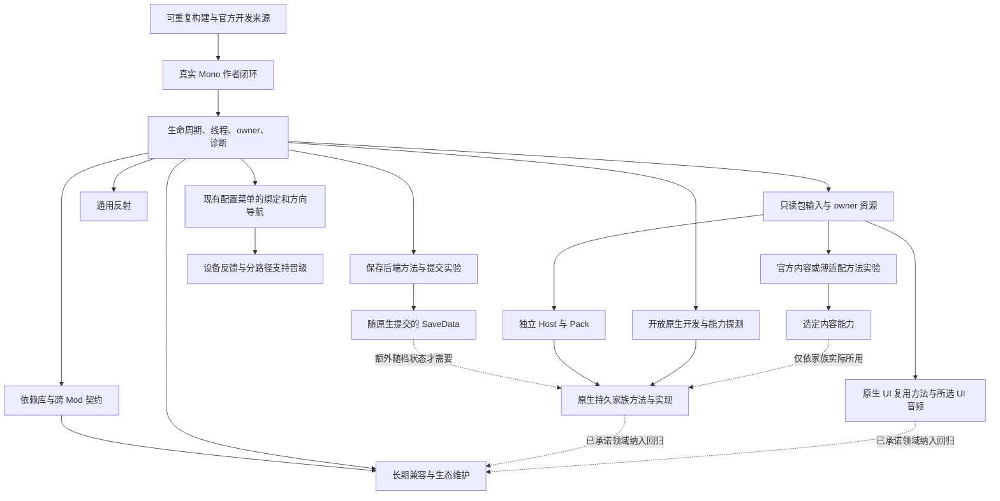

# DTMAPI 成熟平台能力地图

- Lifecycle: `accepted-design`
- Role: 长期能力范围与依赖的设计地图；不是完成台账。执行状态只查 [status](status.md)，阶段顺序查 [roadmap](roadmap.md)。
- Evidence: [2026-09-07 独立复核](../../reviews/code/2026/20260907-0005-platform-maturity-baseline.md)。下表“当前差距”是该次调查快照；实施后从任务 Update 和当前契约追踪变化，不在本表维护第二份进度。
- Contracts: [主架构](../../architecture/platform-next.md)、[作者交付](../../architecture/platform-author-delivery.md)、[Runtime](../../architecture/platform-runtime-contracts.md)、[数据与内容](../../architecture/platform-data-content.md)。

2026-09-08 [研究与基础设施校准](../../reviews/code/2026/20260908-0009-platform-plan-reconciliation.md)补充：C01 的 SDK160 文本误判、C08 的 JSON 格式化与备份失败覆盖纳入 M1 修复；C17 需分开原生磁盘结果与外层调用结果；C20 的失败隔离需深层变更及成本证明；C30 采用 AD-09 的无反馈弃用流程。C31 的选中测试图、SDK prepare 复用、公开源码 CI 和简化记录已经由工作区建设提供，后续建设剩余的第三方/Mono/升级/性能实验室，不重建这套基础设施。完整 C01–C33 范围不因流程精简而减少。

## 成熟的含义

版本分组见[路线](roadmap.md#可发布版本)。下表保留原调查快照，不能把已由 M1–M3 Update 解决的旧问题重新设为当前阻塞。[2026-09-10 SDK 审计采纳](../../reviews/code/2026/20260910-0002-sdk-author-path-plan.md)确认调度、context、owner、包内文件/global data、配置/翻译/反射、shared/private DLL、多工程和自助 Advanced 已有实现及有界证据；旧玩法执行器是按需加载组件。它们不是待推倒的空壳。

PN-038/039/040.a 已补正常委托、原生泛型、常量/XML/普通库与所选资产。最新 [r5 构建架构复核](../../reviews/code/2026/20260910-0004-sdk-msbuild-architecture.md)将 C01/C05/C12/C28 的剩余工程差距收口为 PN-041：标准 MSBuild、实际 IDE/CI、生成器、准确交付与旧工程迁移，一次在 0.7.0 切换正式后端。下表调查快照中的 BuildPlan 不是新架构权威。C19–C22 的资源生命周期、GameContent 和 Host/Pack、C17/C18 的 SaveData/身份仍是主要平台缺口；SDK 迁移之后继续，不等待所有 NuGet/设备兼容。C09 的绑定/导航与实体设备证明分开；C30 仍在 0.8 起逐族清退。完整 C01–C33 长期范围保持。

外部作者可以在仓库之外完成创建、编辑、构建、实际调试、与其他 Mod 共存、打包和升级，并能在半年后的游戏或框架变化中判断故障归属、修复和继续支持。维护者不必逐个为作者登记身份、手写原生 stub 或代做现场诊断。玩家能区分已安装、被选中、已启用、实际运行和需要重启。

成熟度由这些行为和持续维护能力定义，不由 API 数量定义。每个公开子能力可以分别成立；一套可维护的核心平台不需要把所有游戏领域都宣布 Stable。多人、跨游戏、在线商店等条件性方向不作为当前核心路线的隐藏前提。

## 完整能力面

| ID | 作者/玩家最终能力 | 当前差距与已有资产（调查快照） | 责任、前置与建设阶段 |
| --- | --- | --- | --- |
| C01 | 一个工程在 CLI、IDE 和 CI 中产生相同语义的 Mod | CLI 自行枚举源码、固定 Release/C#12；模板 MSBuild 不能代表同一构建模型 | SDK 内部 BuildPlan；M1 PN-015；标准依赖工程在 M3 PN-022 |
| C02 | 明确选择 API 目标，知道最低 Runtime 与迁移路径 | PN-003 已有冻结载荷/catalog；新能力载荷未交付，不能只换运行 DLL | SDK/Abstractions/Core/Doctor 共用目标事实；M1 证明旧目标，M2 PN-007 交付新目标 |
| C03 | 使用公开命令安装、更新和恢复开发包 | 旧事务代码存在，公开变更命令仍 SDK003 暂停 | SDK 事务和官方 Local 来源；C01 后 M1 PN-004 |
| C04 | 解释来源选择、启用状态、依赖与冲突 | 有发现/分类/加载计划，但仓库内部成功不能证明真实多来源作者流程 | Core/官方来源桥/Doctor；M1、M3 共存验收 |
| C05 | 从真实游戏错误定位源码，使用受支持调试方法 | build 输出 PDB，pack 未纳入；实际 Mono 行号/断点没有完整产品证明 | SDK 符号+游戏调试能力验证；M1 PN-017 |
| C06 | 知道何时可注册、访问世界、切档和释放对象 | Entry/owner 事务已有；日志状态与 SaveLoaded 不能代替作者可用的世界就绪契约 | Core 可选 context；GameBridge 核验原生时点；M1 PN-016→M2 PN-009 |
| C07 | 安全排队主线程工作、取消过期任务、注册命令 | 现有内部帧队列不是通用作者 scheduler；Y UI 不应是命令引擎 | Core，依赖 C06；M2 PN-009 |
| C08 | 配置可编辑、迁移、恢复并跨版本维护 | 原子 JSON/备份/迁移回调已存在；完整迁移链与 UI 作者故事仍需证明 | Core/配置 UI，配置不属 SaveData；M1 基线→M2 PN-019 |
| C09 | 正确处理焦点、按键、手柄和输入占用 | Suppress 只遮蔽 DTMAPI 当前帧；原 raw JoystickButton 注册不证明实际手柄/导航 | Core 输入快照；GameBridge 原生占用；M2 PN-019，0.7 系列 PN-037 绑定/导航/设备晋级，M5 PN-028 通用 UI |
| C10 | 参数化翻译、缺项回退及运行时语言变化 | 缓存/当前语言/回退已有；参数、变化通知与 UI 刷新要补齐 | Core，M2 PN-019 |
| C11 | 安全读取自己的文件，写独立于存档的长期数据 | 配置可复用部分实现，没有完整文件/global data 服务 | Core 路径隔离、schema、原子写；C06 后 M2 PN-018 |
| C12 | 使用辅助库、与独立作者共享类型和 API | SDK 禁额外 DLL；GetApi 要求准确 CLR Type，同名接口源码不是共享契约 | SDK 依赖闭包/Core 加载；C01/C06 后 M3 PN-011、PN-022 |
| C13 | 任意第三方自助开发 Advanced 原生 Mod | 现有逐产品 policy/reference 流程不构成开放作者入口 | SDK 本地引用/Core 验证/GameBridge capability；M3 PN-010 |
| C14 | 可预测地读取/调用非公开成员并诊断版本变化 | 有内部反射使用；无完整公开匹配、异常、对象寿命契约 | Core 通用工具，原生对象仍由 bridge/作者负责；M3 PN-006、PN-021，不是全平台前置 |
| C15 | 一个 Mod 失败不破坏其他作者的正常能力 | Entry 事务、事件隔离、冷 DLL 规则已有，仍需多作者真实进程验收 | Core/Bootstrap，M1–M3；不承诺隔离任意原生副作用或不可信代码 |
| C16 | 查询稳定的玩家、地图、物品等上下文和身份 | 现有窄 helper 与冻结/受阻领域面并存 | GameBridge 吸收游戏类型/版本，公共 DTO+handle；M5 PN-027 |
| C17 | Mod 存档数据只随成功原生保存提交 | 产品 sidecar 不是通用 Data；现有 fail-closed 保留，同档容器仍待证伪 | V-Save / R4a 先选后端，Core owner/schema＋Bridge 原生接缝；PN-024→012 |
| C18 | 复制/删除/恢复存档、迁移 schema，不串档或丢数据 | slot 不是持久身份；尚未证明通用容器/复制关联 | C17 的身份实验、显式恢复规则；M4、M5 |
| C19 | 加载自己包内的文本、图片等资源并正确释放 | 文本索引已有；通用资源句柄与线程/失效生命周期未成立 | Core ModContent，Unity 资源由 GameBridge；文本 M2，资源 M4 PN-013 |
| C20 | 确定性修改游戏内容，诊断冲突并刷新实际对象 | ContentQuery 是索引；官方 ModManager 已有合并/覆盖 | V-Content / R4b 先官方/薄适配，缺口才受限编辑；PN-013.b |
| C21 | 为一个可独立发布的 Host 编写 ContentPack | 当前 loaded 不证明 Host 接受/实际生效；无通用绑定 | V-Host；Core 依赖/归属，Host schema；PN-025 依只读包输入，不依平台 DSL |
| C22 | 声明条件、引用和可组合内容，并得到准确错误定位 | 尚无通用内容引擎；不需要先复制完整 Content Patcher DSL | Host 拥有有界 schema/条件；M4 首片，M5 按家族扩充 |
| C23 | 制作菜单/HUD/渲染扩展并管理焦点和资源 | IUiHelper 只打开平台页面，不是通用 UI API；现有配置菜单无鼠标导航可独立建设 | 现有页面 PN-037 不依 C19；通用 GameBridge adapter/资源句柄在 C06/C09/C19 后 M5 PN-028 |
| C24 | 播放/替换音频并管理释放、暂停和失败回退 | 当前窄 Wwise 路径及音频 reload 不等于完整音频产品 | GameBridge 音频资源，C06/C19 后 M5 PN-028 |
| C25 | 创建可保存、升级、依赖缺失可恢复的自定义实体 | 登记/影子状态不等原生生成；原生创建/保存方法尚待家族验证 | V-Entity / PN-029；所用查询/Host/资源先齐，额外随档状态才依 C17；所有方案须真实保存/缺包 |
| C26 | 游戏更新后知道哪些能力失效、哪些仍可运行 | 有 Hook/原生证据体系；需持续 capability 适配及兼容矩阵 | GameBridge 私有探测+Core 诊断，M3 开始/M6 完成维护闭环 |
| C27 | 无 Mod 时开销小，多 Mod 时可定位性能和资源泄漏 | 现有 roots/debug 能复用；缺全能力性能基线与作者归因 | 每阶段预算与实测，M6 PN-032 统一回归实验室 |
| C28 | 生成可发行包、检查兼容、升级及撤回候选 | 确定性打包/发布脚本存在；第三方全旅程仍有缺口 | SDK/Doctor/官方发布工具，M1 离线候选→M6 PN-031 |
| C29 | 提供最小复现和可控支持材料，明确责任归属 | Doctor/日志导出已有；原始日志可能含本机路径，不能宣称已脱敏 | SDK/Core 诊断，M1 PN-017→M6 PN-031、PN-035 |
| C30 | 获得可执行的兼容、弃用和迁移承诺 | 冻结目标/ABI 检查已有；实现退役、保留 ABI、物理删除需分开 | 首发前 PN-033.a，0.7 系列 b，0.8 起 c/R-Compat；长期稳定成本由 M6/R6 确定 |
| C31 | CI 验证自己的包，平台持续检测 Mono/游戏回归 | 单元、包、smoke 基础较多；跳过项与实际产品承诺需要一一对应 | .NET→Mono→游戏分层，M1 起步/M6 PN-032 |
| C32 | 找到与当前版本一致的例子、贡献规则和维护资料 | 文档很多；需用真实外部样例与既有权威串成可执行作者指南 | 每任务同批更新，M6 PN-035 固化维护责任 |
| C33 | 在确有产品需求时扩展多人、其他游戏或在线服务 | 当前无可直接复用的跨游戏/网络一致性证明 | 条件性方向；先调查游戏事实与支持成本，再建立单独路线 |

## 依赖关系

这些工作不必串行：包输入/Host 不等通用编辑器，非持久内容不等 SaveData，原生已保存的实体不等侧车，UI 只依所用资源/查询，反射不阻塞数据/内容。[方法验证](method-validation.md)先判断是否需要新机制，再冻结公共契约；产品验收仍按真实旅程。工程证据与作者文档随每项交付积累。

## 公共契约与内部责任

公共面描述作者可依赖的阶段/上下文、作用域/取消、查询、资源寿命、数据提交结果、内容效果和 Host 绑定。永久存档身份、通用 lease、编辑回调/优先级、DSL/布局、实体存储格式不是预先必需公共面，先做对应方法实验。新增成员经可选服务、SDK payload、旧 ABI 与真实 Mono 消费证明后交付。

Core 内部保留发现计划、加载事务、队列实现、缓存、候选日志、内容排序算法和诊断存储。GameBridge 吸收原生符号、Unity 对象合法性与线程、游戏日期/地图切换时点、官方内容合并、资产缓存、保存提交及版本退化。产品 Host 保留玩法、领域 schema、内容解释与自身迁移；公共反射并不把这些责任转移给作者。

“Stable”仍由 [API matrix](../../api/public-api-matrix.md)按具体成员和证据决定；不是一个阶段结束后把所有现有接口整体晋级。成熟度测试规格见 [acceptance](acceptance.md)。
