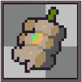
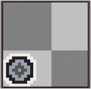
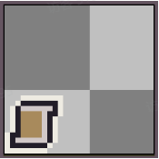
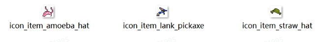

# 04 道具

Source: <https://ka7deoo0opr.feishu.cn/wiki/CDfmwzDwHi4GJgksMfZcC2mqnTe>

Source modified label: 5月15日修改

## 一、格式要求

#### Embedded sheet `sj4RCd`

[TSV](sheets/01-01-sj4rcd.tsv) · [rendered screenshot](sheets/01-01-sj4rcd.png)

```tsv
类型	图片大小（像素）	作图规范
道具图标	28*28	整体居中
```

- 道具图标如下

20%20%20%20%20%

20%



20%


20%


20%


20%


- 角标贴图如下（分别为设备角标、蓝图角标、配方角标、美味食物角标）

25%25%25%25%

25%



25%


25%



25%


- 特定类型设备理论上建议添加符合该类型的角标以符合游戏内道具规范（角标文件获取参见03 备用贴图）

## 二、命名对照表

- 见04 ID对照表（道具）。

## 三、参考案例

- 物品颜色调整。



- 示例路径（官方示例模组，获取方式见查看示例模组）

【创意工坊文件根目录】\Content\01 美化模组示例\04 道具

## Links

- [03 备用贴图](https://ka7deoo0opr.feishu.cn/wiki/NKSJwBudUi9q89kN9GXcpQKwnRe)
- [04 ID对照表（道具）](https://ka7deoo0opr.feishu.cn/wiki/QaKDwjPdvi2GtEk7GKPcQEoenyf)
- [查看示例模组](https://ka7deoo0opr.feishu.cn/wiki/GmfKwSHv0i5E9EkaupNcjRdIn4d)
