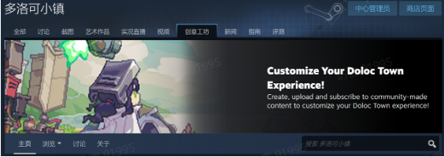
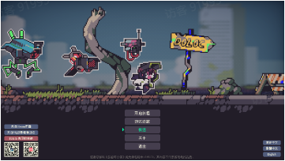
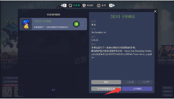
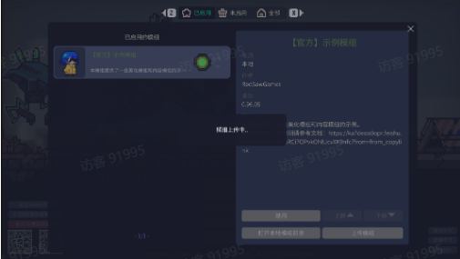
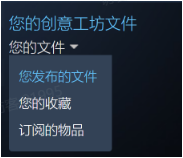
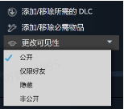
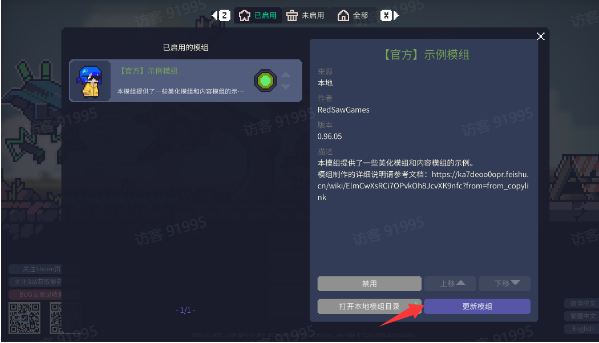
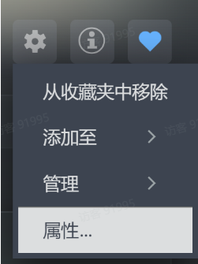
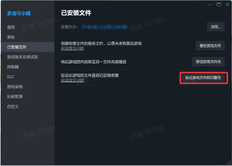

# 在创意工坊上传你的模组

Source: <https://ka7deoo0opr.feishu.cn/wiki/CEJyw2PSpiVtx9kdWCocGxdon1f>

Source modified label: 6月11日修改

#### 1.上传模组前请确保

- 您已登录Steam账号。

- Steam处于在线状态，且可以正常打开创意工坊界面。



#### 2.通过游戏上传模组

- 在游戏首页点击模组按钮打开模组菜单，找到本地创建的模组。

50%50%

50%



50%



- 点击上传模组按钮，确认后会开始上传模组到Steam创意工坊，等待提示框消失完成上传。

- 在上传模组前，请先于本地试玩该模组，以确保模组配置正确，且画面表现符合您的预期~！



#### 3.发布模组

- 在Steam创意工坊里找到自己上传的模组，并将可见性改为公开，其他玩家便可以订阅你的模组了

26%74%

26%



74%



#### 4.更新模组

- 成功上传模组后，本地模组目录下会新增workshop.json文件，其中会记录模组对应的创意工坊物品的id，请保证不要手动更改此id

_代码块_

```c
{
  "workshop_id": xxxxxx
}
```

- 生成workshop.json后，如后续模组有更新，再在游戏中上传模组，会将改动更新到创意工坊的对应模组



- ◦如果希望将当前模组作为一个全新的创意工坊物品上传，请先删除 workshop.json 文件后再进行上传。

- ◦如果因更换设备等原因导致本地模组数据遗失，可以先通过创意工坊订阅获取模组数据，再将其复制到本地模组目录中，即可继续上传并更新原有的创意工坊物品。

- 玩家通过订阅获取的模组会自动更新。

- ◦如遇未自动更新的情况，可以通过验证游戏完整性的方式强制进行更新（需要先关闭游戏）。

35%65%

35%



65%


