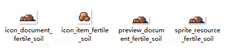

# 04 新增资源

Source: <https://ka7deoo0opr.feishu.cn/wiki/DSwGwUzfki0gkPk1k6dcio6bnpb>

Source modified label: 5月20日修改

## 一、整体说明

- 资源模组由【4个】json文件组成，分别是：

- ◦资源信息resource_tbresource.json

- ◦资源生成信息（决定资源在哪些场景生成）mod_tbmodresourcespawnextension.json

- ◦掉落物道具信息item_tbitemspawn.json

- ◦掉落库信息（决定资源掉落什么道具）item_tbitemspawn.json

- Content文件夹内必须包含上述【4个】文件

- ◦（若掉落物并非新增物品，则无需包含item_tbitemspawn.json）

- 配置示例中，标黄的字段为【需要修改的字段】。

- 资源掉落物的加工方式、资源图鉴等【配套设施】需要通过【其他模组】实现。详见08 综合案例三（新增资源）。

## 二、配置示例及数据结构说明

### 1.resource_tbresource.json

- 添加单阶段资源 沃土堆（fertile_soil）的相关信息。

_资源信息-配置示例_

```json
[
  {
    "id": "fertile_soil", //资源ID
    "default_unlock": true, //是否默认解锁
    "resource_type": 2, //资源类型，详见对照表
    "size": {
      "x": 3, //占地格子数：宽
      "y": 2  //占地格子数：高
    },
    "pixel_offset": {
      "x": 1, //最大偏移像素：左
      "y": 1 //最大偏移像素：右
    },
    "spawn_months": [], //出现月份（为空表示没有限制）
    "level_datas": [
      {
        "max_health": 10, //阶段生命值
        "growth_value": {
          "x": 0, //阶段成长值：最小值
          "y": 0 //阶段成长值：最大值
        },
        "drop_spawn_entry": {
          "spawn_lut": "fertile_soil_drop", //掉落库ID（决定掉落的道具）
          "count_range": {
            "min_count": 2, //掉落数量范围：最小值
            "max_count": 3 //掉落数量范围：最大值
          }
        },
        "tech_points": [
          {
            "type": 1, //增加科技点类型（0自然，1操作，2科技，3养殖）
            "count": 1 //增加科技点数值
          }
        ],
        "bullet_level_constraint": 0, //采集所需等级：无人机插件
        "tool_constraints": [
          {
            "tool_type": 1, //采集所需工具（0斧头,1镐子，2镰刀）
            "tool_level": 0 //采集所需工具等级（0老旧，1铜，2铁，3钢，4钛）
          }
        ],
        "skins": [
          {
            "url": "sprite_resource_fertile_soil" //场景贴图
          }
        ],
        "sub_prefabs": [
          {
            "url": "" //预制体，仅红树有用，无需填写
          }
        ]
      }
    ],
    "fit_slot_datas": [], //树脂数据，无需填写
    "contained_slot_datas": [], //树脂数据，无需填写
    "resin_collector_output": "" //树脂数据，无需填写
  }
]
```

- 资源类型见06 ID对照表（资源&植被）。

### 2.mod_tbmodresourcespawnextension.json

- 在小林地（doloc_town_forest）有概率生成沃土堆（fertile_soil）。

_配方组信息-配置示例_

```json
[
  {
    "id": "doloc_town_forest", //资源生成表ID，详见对照表
    "extra_resources": [
      {
        "spawn_weight": 100, //生成权重
        "min_count": 1, //生成下限
        "max_count": 0, //生成上限（0则无上限）
        "resource_id": "fertile_soil" //生成资源ID
      }
    ]
  }
]
```

- 资源生成表见06 ID对照表（资源&植被）。

### 3.item_tbitem.json

- 添加掉落物沃土块（fertile_soil）的相关道具信息。

_道具信息-配置示例_

```json
[
  {
    "id": "fertile_soil", //道具ID
    "sub_type": "material_nature", //子道具类型，material_nature为自然素材
    "salable": true, //是否允许出售
    "disposable": true, //是否允许丢失
    "consumable": false, //是否为消耗品
    "cookable": false, //是否允许烹饪
    "electric_energy": 0, //提供发电量(0则不发电)
    "viewable": true, //是否显示在图鉴
    "source": ["gather"], //获取途径，"gather"为“采集”
    "selling_price": 100, //售出价格（-1则根据配方自动计算）
    "buying_price": 500, //购买价格
    "overlay": 99, //堆叠上限
    "ui_sprite_asset": {
      "url": "icon_item_fertile_soil" //道具图标，格式为：icon_item_道具ID
    },
    "title": {
      "key": "item_fertile_soil", //道具标题ID，格式为：item_道具ID
      "text": "沃土块" //道具标题文本
    },
    "description_basic": {
      "key": "item_fertile_soil_desc", //道具描述ID，格式为：item_道具ID_desc
      "text": "肥沃的土壤，可以用来堆肥。" //道具描述文本
    },
    "function": {
      "$type": "ItemFunction" //功能类型
    }
  }
]
```

### 4.item_tbitemspawn.json

- 采集资源沃土堆，会根据掉落库fertile_soil_drop，掉落道具沃土块（fertile_soil）。

_追加掉落库信息-配置示例_

```json
[
  {
    "id": "fertile_soil_drop", //掉落库ID，详见对照表
    "spawn_datas": [
      {
        "spawn_weight": 100,  //生成权重
        "min_count": 1, //生成下限
        "max_count": 0, //生成上限（0则无上限）
        "item_name": "fertile_soil" //生成道具ID
      }
    ]
  }
]
```

## 三、图片格式要求

#### Embedded sheet `nfiox4`

[TSV](sheets/01-01-nfiox4.tsv) · [rendered screenshot](sheets/01-01-nfiox4.png)

```tsv
类型	图片大小（像素）	作图规范
道具图标	28*28	整体居中
场景贴图	不限制	四周留1像素
图鉴（图标）	36*27	不限制
图鉴（详情）	不限制	四周留2像素
```

## 四、图片命名对照表

#### Embedded sheet `9F0Q1r`

[TSV](sheets/02-01-9f0q1r.tsv) · [rendered screenshot](sheets/02-01-9f0q1r.png)

```tsv
类型	资源ID	命名格式
道具图标	[资源ID]	icon_item_[资源ID]
场景贴图	[资源ID]	sprite_resource_[资源ID]_[帧数]（若有）
图鉴（图标）	[资源ID]	icon_document_[资源ID]
图鉴（详情）	[资源ID]	preview_document_[资源ID]
```

## 五、参考示例

## 四、参考示例

- 新增资源沃土堆（fertile_soil）、掉落物沃土块（fertile_soil）及其图鉴，并在堆肥设备中增加相应配方。



- 示例路径（官方示例模组，获取方式见查看示例模组）

【创意工坊文件根目录】\Content\03 进阶内容模组示例\04 新增资源

## Links

- [08 综合案例三（新增资源）](https://ka7deoo0opr.feishu.cn/wiki/U75Lwhq4qi4prxkti3zcffplnhf)
- [06 ID对照表（资源&植被）](https://ka7deoo0opr.feishu.cn/wiki/UTmLwGzpAijYjvkhvE9czGyenud)
- [查看示例模组](https://ka7deoo0opr.feishu.cn/wiki/GmfKwSHv0i5E9EkaupNcjRdIn4d)
