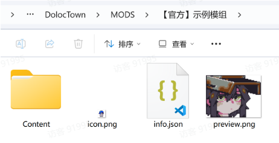
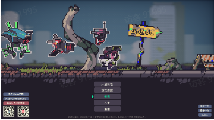
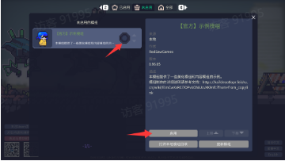

# 创建你的模组

Source: <https://ka7deoo0opr.feishu.cn/wiki/Df5cwl6u2irIogkazI5crevfnWf>

Source modified label: 5月15日修改

## 一、创建本地模组

- 模组文件的根路径为C:\Users\【你的用户名】\AppData\LocalLow\RedSawGames\DolocTown\MODS（和存档目录同级），在根路径下创建你的模组文件夹。

- ◦也可以直接复制粘贴%USERPROFILE%\AppData\LocalLow\RedSawGames\DolocTown\MODS，就能打开对应路径。



- 一个模组为一个文件夹，文件夹下必须包含以下【3个】文件和【1个】文件夹：

- ◦preview.png模组在Steam创意工坊中的预览图，分辨率无要求。

- ◦icon.png模组在游戏中的模组界面显示的图标，建议分辨率32*32。

- ◦info.json标识模组的基本信息，存在info.json的文件夹才会被识别为模组。

_info.json_

```json
{
  "name": "示例模组",    // 模组名（没有指定翻译文本时会显示的默认名字）
  "author": "xxx",    // 作者名
  "version": "1.0.0",    // 版本号
  "description": "包含了一些示例模组。",    // 模组描述（没有指定翻译文本时会显示的默认描述）
  "tags": [    // 模组标签
    "Mod",
    "..."
  ],
  "localized_name": {
    "schinese": "",    // 模组名的中文翻译（默认名为中文时可以留空）
    "tchinese": "範例模組",    // 模组名的繁体中文翻译
    "english": "Example Mod"    // 模组名的英文翻译
  },
  "localized_description": {
    "schinese": "",    // 模组简介的中文翻译（默认简介为中文时可以留空）
    "tchinese": "包含了一些範例模組。",    // 模组简介的繁体中文翻译
    "english": "Includes some example mods."    // 模组简介的英文翻译
  }
}
```

- ◦Content文件夹，放置模组所需的所有配置文件和贴图资源，该文件夹下的资源文件全都会被识别，可以按自己的习惯任意创建子目录（也就是说，一次性制作的多件物品，可以放在一个MOD下）。

- ◦注意：_IGNORE文件夹下的文件不会被加载到模组，可以用于存放临时文件。但正式使用时请避开此命名。

- ◦在将模组放置于您电脑里的正确位置后，即可在您的游戏中体验该模组！

- ◦模组标题与描述的翻译文本会在游戏内切换语言时自动显示，同时创意工坊页面也会同步展示对应语言内容，因此建议尽可能完善多语言翻译，以便将模组推广给更多国家和地区的玩家。

## 二、在游戏内启用本地模组

- 在游戏首页点击模组按钮打开模组菜单，切换到未启用或全部标签页，可以看到新创建的模组。

50%50%

50%



50%



- 点击模组标题后的启用按钮，就可以在游戏里体验创建的模组内容啦~
