# 01 主角（本体&帽子&工具）

Source: <https://ka7deoo0opr.feishu.cn/wiki/FHmFwDuySip8M6krNnxcyR91nXg>

Source modified label: 5月21日修改

## 一、主角贴图格式要求

#### Embedded sheet `fgrfZG`

[TSV](sheets/01-01-fgrfzg.tsv) · [rendered screenshot](sheets/01-01-fgrfzg.png)

```tsv
类型	图片大小（像素）	作图规范	备注
头像	75*58	四边都顶到	仅在刚进入游戏输入玩家名时使用一次
帧动画	64*64	底部空16像素，水平居中	主角头发、身体、帽子、工具，四者分离
```

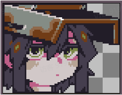

25%25%25%25%

25%

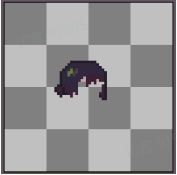

25%

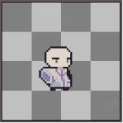

25%

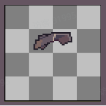

25%

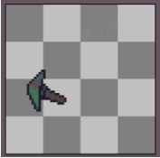

## 二、命名对照表

### 1.头像

#### Embedded sheet `Jfe3RE`

[TSV](sheets/02-01-jfe3re.tsv) · [rendered screenshot](sheets/02-01-jfe3re.png)

```tsv
图片命名
icon_character_player
```

### 2.帧动画

- 见01 ID对照表（主角本体&帽子&工具）

## 三、参考示例

### 1.主角调整

- 主角头像颜色调整。

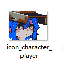

- 主角头发动画颜色调整。

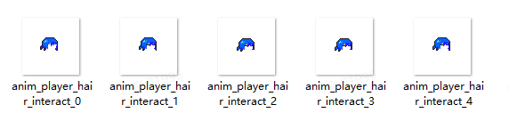

- 主角身体动画颜色调整。

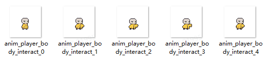

- 示例路径（官方示例模组，获取方式见查看示例模组）

- 【创意工坊文件根目录】\Content\01 美化模组示例\01 主角\01 本体

### 2.帽子调整

- 静态帽子动画头顶变形虫（amoeba_hat）颜色调整。

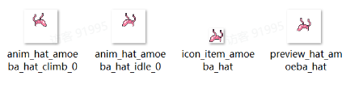

- 动态帽子草帽（straw_hat）颜色调整（部分动画）。

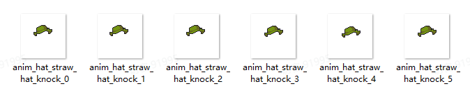

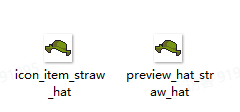

- 示例路径（官方示例模组，获取方式见查看示例模组）

【创意工坊文件根目录】\Content\01 美化模组示例\01 主角\02 帽子

### 3.工具调整

- 工具特别的矿镐（lank_pickaxe）颜色调整。

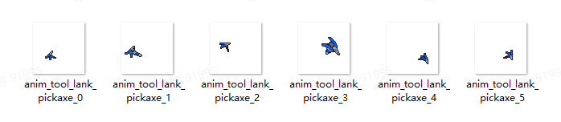

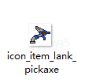

- 示例路径（官方示例模组，获取方式见查看示例模组）

【创意工坊文件根目录】\Content\01 美化模组示例\01 主角\03 工具

### 4.主角整体动画（适用于特殊情况）

- 重要说明：

- ◦只有在主角整体动画【完整】（共144帧）的情况下，才会启用主角整体动画。此时主角头发动画、主角身体动画【均不生效】。

- ◦若主角整体动画【不完整】（不足144帧），则仍然启用主角头发动画、主角身体动画。

- ◦主角整体动画模组适用于不方便拆分头发与身体的自定义角色，通常情况下建议使用头发动画模组与身体动画模组。

- ◦注：示例模组中没有启用整体动画模组（模组置于_IGNORE文件夹下）。

- 主角整体动画颜色调整。

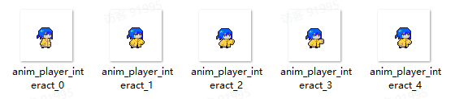

- 示例路径（官方示例模组，获取方式见查看示例模组）

【创意工坊文件根目录】\Content\01 美化模组示例\01 主角\01 本体\03 整体动画\_IGNORE

## Links

- [01 ID对照表（主角本体&帽子&工具）](https://ka7deoo0opr.feishu.cn/wiki/WkvJwLK5pie03HkM0wzcPp6dnBg)
- [查看示例模组](https://ka7deoo0opr.feishu.cn/wiki/GmfKwSHv0i5E9EkaupNcjRdIn4d)
