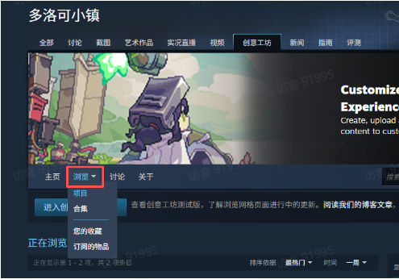
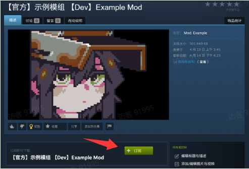
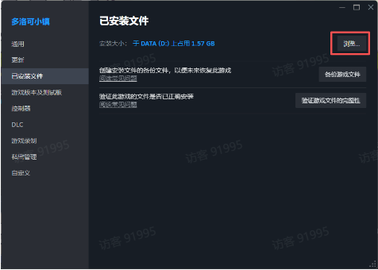
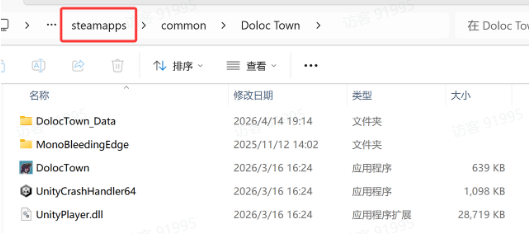
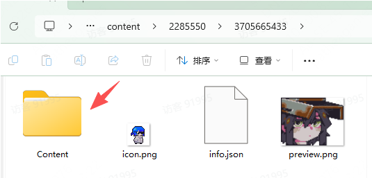
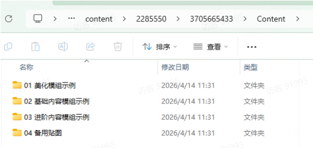
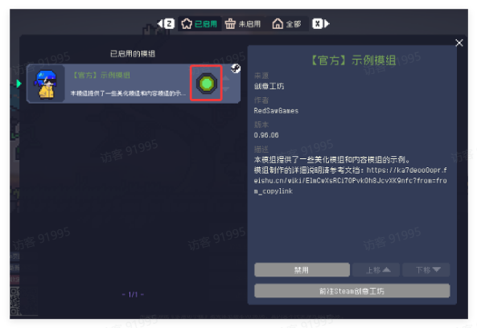
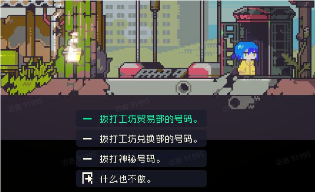

# 查看示例模组

Source: <https://ka7deoo0opr.feishu.cn/wiki/GmfKwSHv0i5E9EkaupNcjRdIn4d>

Source modified label: 6月11日修改

制作组准备的示例模组中提供了各类模组案例的参考，请务必订阅，非常重要！

## 一、订阅示例模组

- 点击下方链接进入多洛可小镇创意工坊页面

https://steamcommunity.com/app/2285550/workshop/

- 在创意工坊页面选择 ‘浏览 - 项目’ 即可查看制作组准备的案例模组与其他玩家上传的模组

## 二、找到示例模组文件位置

- 在模组列表里，找到制作组准备的 ‘示例模组’，或通过下方链接直接打开

https://steamcommunity.com/sharedfiles/filedetails/?id=3705665433&searchtext=

- 点击订阅即可

- 订阅后，Steam将自动下载该模组。随后，需要在电脑里找到您下载的该订阅模组：

- ◦打开Steam安装目录（例如：C:\Program Files (x86)\Steam\steamapps）。您可以通过右键多洛可小镇后台 ‘属性’ （同Steam分支切换页面）的 ‘已安装文件’ 栏里，找到游戏的安装目录

- 在上方路径栏中，点击steamapps。随后依次进入以下文件夹：workshop\content\2285550

- 里面存放了在创意工坊中订阅的模组文件，其中示例模组包含各类模组的示例，供玩家参考学习。

- 建议玩家记住或保存该路径方便阅读后续文档时查看。

- 如想在游戏里体验创意工坊里订阅的模组，请进入游戏的 ‘模组’ 界面，选择指定模组并点击 ‘启用’ 即可。

- 需要注意的是，根据模组类型的不同，不同模组的获取方式也略有差异。部分模组加载存档即可直接生效(例如主角换皮)，有的模组则需要配置一个获取途径，例如电话亭中新增的两个商店里购买/兑换获取，亦或是游戏前几乎所有其他渠道。（详情请查看后续文档）

## Links

- [https://steamcommunity.com/app/2285550/workshop/](https://steamcommunity.com/app/2285550/workshop/)
- [https://steamcommunity.com/sharedfiles/filedetails/?id=3705665433&searchtext=](https://steamcommunity.com/sharedfiles/filedetails/?id=3705665433&searchtext=)
