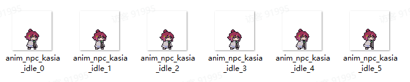
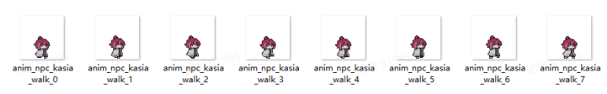
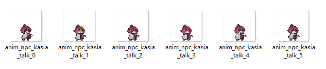
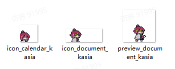

# 02 NPC

Source: <https://ka7deoo0opr.feishu.cn/wiki/HUAbwaN2hiWLsAkSwrJczQmun9e>

Source modified label: 5月15日修改

## 一、格式要求

#### Embedded sheet `IL84De`

[TSV](sheets/01-01-il84de.tsv) · [rendered screenshot](sheets/01-01-il84de.png)

```tsv
类型	图片大小（像素）	作图规范
帧动画	64*64	底部空1像素，水平居中
图标（日历）	35*35	垂直居下，水平居左
图标（图鉴）	73*27	垂直居中，左侧空若干像素
详情图（图鉴）	64*64	底部空1像素，水平居中
```

34%33%33%

34%


33%


33%


## 二、命名对照表

- 见02 ID对照表（NPC）。

## 三、参考示例

- 卡莎（kasia）衣服颜色调整。









- 示例路径（官方示例模组，获取方式见查看示例模组）

【创意工坊文件根目录】\Content\01 美化模组示例\02 NPC

## Links

- [02 ID对照表（NPC）](https://ka7deoo0opr.feishu.cn/wiki/LlZgw36I2iOtX0kOkSGcfWTyn8c)
- [查看示例模组](https://ka7deoo0opr.feishu.cn/wiki/GmfKwSHv0i5E9EkaupNcjRdIn4d)
