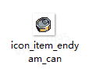
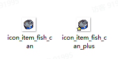

# 03 新增料理

Source: <https://ka7deoo0opr.feishu.cn/wiki/KaKyw74DnibQhmkjPlMcJgZXnBf>

Source modified label: 6月21日修改

## 一、整体说明

- 固定配方料理（如烤末芋）模组由【4个】json文件组成，分别是：

- ◦料理道具信息item_tbitem.json

- ◦料理食用效果item_tbeatingeffect.json

- ◦固定配方信息recipe_tbrecipe.json

- ◦将配方加入对应炊具mod_tbmodrecipegroupextension.json

- 自由烹饪料理（如末日杂拌）模组由【5个】json文件组成，分别是：

- ◦料理道具信息item_tbitem.json

- ◦料理食用效果item_tbeatingeffect.json

- ◦定义食材类（用于自由烹饪）recipe_tbingredientgroup.json

- ◦自由烹饪食谱recipe_tbdish.json

- ◦将食谱加入对应炊具mod_tbmoddishgroupextension.json

- Content文件夹内必须包含上述【4或5个】文件。

- 配置示例中，标黄的字段为【需要修改的字段】。

- 添加料理的道具信息后，还可通过【新增配方】来实现【固定配方料理】，详见04 新增配方。

## 二、配置示例及数据结构说明

### 1.新增固定配方料理

#### 1.1item_tbitem.json

- 新增道具：末芋罐头。

_道具信息-配置示例_

```json
[
  {
    "id": "endyam_can", //道具ID
    "sub_type": "product_farm", //子道具类型，product_farm为农业制品
    "salable": true, //是否允许出售
    "disposable": true, //是否允许丢失
    "consumable": false, //是否为消耗品
    "cookable": false, //是否允许烹饪
    "electric_energy": 0, //提供发电量(0则不发电)
    "viewable": true, //是否显示在图鉴
    "source": [
      "cook"  //获取途径（显示在图鉴）
    ],
    "selling_price": 100, //售出价格
    "buying_price": 200, //购买价格
    "overlay": 999, //堆叠上限
    "ui_sprite_asset": {
      "url": "icon_item_endyam_can" //道具图标，格式为：icon_item_道具ID
    },
    "title": {
      "key": "item_endyam_can", //道具标题ID，格式为：item_道具ID
      "text": "末芋罐头" //道具标题文本
    },
    "description_basic": {
      "key": "item_endyam_can_desc", //道具描述ID，格式为：item_道具ID_desc
      "text": "能有效充饥、长久保存。但口感真的不怎么样。" //道具描述文本
    },
    "function": {
      "$type": "ItemFunctionFood", //功能类型，ItemFunctionFood为食物道具
      "eating_effect": "endyam_can"  //食用效果ID
    }
  }
]
```

#### 1.2item_tbeatingeffect.json

- 新增末芋罐头的食用效果。

_食用效果信息-配置示例_

```json
[
  {
    "id": "endyam_can",
    "sound_event": "PLAY_CHARACTER_EAT", //音效事件ID，不动
    "output_items": [], //使用后生成道具，一般留空
    "effects": [
      {
        "buff": "energy_increase_fixed", //BUFF ID
        "scale": 80 //BUFF数值（若有）
      },
      {
        "buff": "health_increase_fixed", //BUFF ID
        "scale": 80 //BUFF数值（若有）
      }
    ]
  }
]
```

- BUFF ID见11 ID对照表（料理）。

#### 1.3recipe_tbrecipe.json

- 新增固定配方食谱：1*末芋罐头 = 1*末芋 + 1* 罐头 。

_固定配方食谱信息-配置示例_

```json
[
  {
    "id": "endyam_can", //配方ID，一般等同道具ID
    "default_unlock": true, //是否默认解锁
    "title": {
      "key": "", //配方标题（为空则根据输出道具自动生成）
      "text": "" //配方文本（为空则根据输出道具自动生成）
    },
    "cost_time": 2, //制作时间（单位为TU，即游戏内5min）
    "output_item": {
      "item_name": "endyam_can", //输出道具的道具ID
      "min_count": 1, //最小输出数量
      "max_count": 1 //最大输出数量
    },
    "input_items": [
      {
        "item_name": "endyam", //消耗道具的道具ID
        "item_count": 1 //消耗道具数量
      },
      {
        "item_name": "can", //消耗道具的道具ID
        "item_count": 1 //消耗道具数量
      }
    ],
    "recipe_sub_type": "cook", //配方小类，见对照表
    "tech_point": 5, //完成配方增加的科技点数
    "show_in_handbook": true //配方是否显示在图鉴
  }
]
```

#### 1.4mod_tbmodrecipegroupextension.json

- 在烹煮锅、大烹煮锅新增上述固定食谱配方。

_配方组信息-配置示例_

```json
[
  {
    "id": "pot", //配方组ID，同设备ID
    "extra_recipes": [
      "endyam_can" //固定配方ID
    ]
  },
  {
    "id": "large_pot", //配方组ID，同设备ID
    "extra_recipes": [
      "endyam_can" //固定配方ID
    ]
  }
]
```

炊具的配方组ID见08 ID对照表（配方）

### 2.新增自由烹饪料理

#### 2.1item_tbitem.json

- 新增道具：鱼罐头、美味鱼罐头。

_道具信息-配置示例_

```json
[
 //以下为新增道具 鱼罐头
  {
    "id": "fish_can", //道具ID
    "sub_type": "product_farm", //子道具类型，product_farm为农业制品
    "salable": true, //是否允许出售
    "disposable": true, //是否允许丢失
    "consumable": false, //是否为消耗品
    "cookable": false, //是否允许烹饪
    "electric_energy": 0, //提供发电量(0则不发电)
    "viewable": true, //是否显示在图鉴
    "source": [
      "processing"  //获取途径（显示在图鉴）
    ],
    "selling_price": 100, //售出价格
    "buying_price": 200, //购买价格
    "overlay": 999, //堆叠上限
    "ui_sprite_asset": {
      "url": "icon_item_fish_can" //道具图标，格式为：icon_item_道具ID
    },
    "title": {
      "key": "item_fish_can", //道具标题ID，格式为：item_道具ID
      "text": "鱼罐头" //道具标题文本
    },
    "description_basic": {
      "key": "item_fish_can_desc", //道具描述ID，格式为：item_道具ID_desc
      "text": "将鱼肉调味后封存于金属罐中，风味稳定，开罐食用。" //道具描述文本
    },
    "function": {
      "$type": "ItemFunctionFood", //功能类型，ItemFunctionFood为食物道具
      "eating_effect": "fish_can"  //食用效果ID
    }
  },
  //以下为新增道具 美味鱼罐头
    {
    "id": "fish_can_plus", //道具ID
    "sub_type": "product_farm", //子道具类型，product_farm为农业制品
    "salable": true, //是否允许出售
    "disposable": true, //是否允许丢失
    "consumable": false, //是否为消耗品
    "cookable": false, //是否允许烹饪
    "electric_energy": 0, //提供发电量(0则不发电)
    "viewable": true, //是否显示在图鉴
    "source": [
      "processing"  //获取途径（显示在图鉴）
    ],
    "selling_price": 300, //售出价格
    "buying_price": 600, //购买价格
    "overlay": 999, //堆叠上限
    "ui_sprite_asset": {
      "url": "icon_item_fish_can_plus" //道具图标，格式为：icon_item_道具ID
    },
    "title": {
      "key": "item_fish_can_plus", //道具标题ID，格式为：item_道具ID
      "text": "美味鱼罐头" //道具标题文本
    },
    "description_basic": {
      "key": "item_fish_can_plus_desc", //道具描述ID，格式为：item_道具ID_desc
      "text": "将鱼肉精心调味后封存于金属罐中，风味优良，开罐食用。" //道具描述文本
    },
    "function": {
      "$type": "ItemFunctionFood" , //功能类型，ItemFunction为无功能道具
      "eating_effect": "fish_can"  //食用效果ID
    }
  }
]
```

#### 2.2item_tbeatingeffect.json

- 新增鱼罐头、美味鱼罐头的食用效果。

_食用效果信息-配置示例_

```json
[
  //以下为鱼罐头的食用效果
  {
    "id": "fish_can",
    "sound_event": "PLAY_CHARACTER_EAT",
    "output_items": [], //使用后生成道具，一般留空
    "effects": [
      {
        "buff": "energy_increase_fixed", //BUFF ID
        "scale": 120 //BUFF数值（若有）
      },
      {
        "buff": "health_increase_fixed", //BUFF ID
        "scale": 100 //BUFF数值（若有）
      }
    ]
  },
  //以下为美味鱼罐头的食用效果
  {
    "id": "fish_can_plus",
    "sound_event": "PLAY_CHARACTER_EAT",
    "output_items": [], //使用后生成道具，一般留空
    "effects": [
      {
        "buff": "energy_increase_fixed", //BUFF ID
        "scale": 240 //BUFF数值（若有）
      },
      {
        "buff": "health_increase_fixed", //BUFF ID
        "scale": 200 //BUFF数值（若有）
      }
    ]
  }
]
```

- BUFF ID见11 ID对照表（料理）。

#### 2.3recipe_tbingredientgroup.json

- 定义新的食材类：罐头鱼类、纯罐头类。

_食材类信息-配置示例_

```json
[
 //以下为添加食材类：罐头鱼类
  {
    "id": "canned_fish_class", //食材类ID
    "title": {
      "key": "ingredient_canned_fish_class_title", //食材类标题ID，格式为：ingredient_[食材类ID]_title
      "text": "罐头鱼类"  //食材类标题文本
    },
    "icon": {
      "url": "icon_item_fish_can" //食材类图标，同道具图标
    },
    "items": [
      "fish0",  //具体食材的道具ID
      "fish1",
      "sardine",
      "codfish",
      "eel",
      "sturgeon",
      "seabass",
      "crimson_cod",
      "blackback_sardine",
      "monarch_tuna"
    ]
  },
  //以下为添加食材类：纯罐头类
  {
    "id": "can_class", //食材类ID
    "title": {
      "key": "",
      "text": ""
    },
    "icon": {
      "url": ""
    },
    "items": [
      "can"  //具体食材的道具ID
    ]
  }
]
```

#### 2.4recipe_tbdish.json

- 新增自由烹饪食谱：1*鱼罐头/美味鱼罐头 = 1*罐头鱼类 + 1* 纯罐头类 （+ 1*罐头鱼类/ 纯罐头类)（+ 1*罐头鱼类/ 纯罐头类)。

_自由烹饪食谱信息-配置示例_

```json
[
  {
    "id": "fish_can", //食谱配方ID
    "title": {
      "key": "",
      "text": ""
    },
    "unlockable": true, //是否默认解锁
    "cost_time": 2, //耗时（288=一天）
    "output_item_by_thresholds": [
      {
        "price_threshold": 0, //原材料价格阈值（填0不动）
        "ranged_item": {
          "item_name": "fish_can", //产出道具ID
          "min_count": 1, //最小产出数量
          "max_count": 1 //最大产出数量
        }
      },
      {
        "price_threshold": 250, //原材料价格阈值（超过这个值则产出美味版）
        "ranged_item": {
          "item_name": "fish_can_plus", //产出道具ID
          "min_count": 1, //最小产出数量
          "max_count": 1 //最大产出数量
        }
      }
    ],
    "tech_point": 2, //增加科技点数
    //以下为具体配方
    "input_class": [
      {
        "array": [
          "canned_fish_class" // 食材类ID
        ]
      },
      {
        "array": [
          "can_class" // 食材类ID
        ]
      },
      {
        "array": [
          "canned_fish_class", // 食材类ID
          "can_class",
          "none"
        ]
      },
      {
        "array": [
          "canned_fish_class", // 食材类ID
          "can_class",
          "none"
        ]
      }
    ]
  }
]
```

#### 2.5mod_tbmoddishgroupextension.json

- 在烹煮锅、大烹煮锅新增上述食谱配方。

_配方组信息-配置示例_

```json
[
  {
    "id": "pot", //配方组ID，同设备ID
    "extra_dishes": [
      "fish_can" //食谱配方ID
    ]
  },
  {
    "id": "large_pot", //配方组ID，同设备ID
    "extra_dishes": [
      "fish_can" //食谱配方ID
    ]
  }
]
```

- 炊具的配方组ID见08 ID对照表（配方）。

## 三、图片格式要求

#### Embedded sheet `bTdjQR`

[TSV](sheets/01-01-btdjqr.tsv) · [rendered screenshot](sheets/01-01-btdjqr.png)

```tsv
类型	图片大小（像素）	作图规范
道具图标	28*28	整体居中
```

## 四、图片命名对照表

#### Embedded sheet `jpw0Jc`

[TSV](sheets/02-01-jpw0jc.tsv) · [rendered screenshot](sheets/02-01-jpw0jc.png)

```tsv
名称	命名格式
[道具ID]	icon_item_[道具ID]
```

## 五、参考示例

- 新增固定配方料理末芋罐头（endyam_can）



- 新增自由烹饪料理鱼罐头（fish_can）、美味鱼罐头（fish_can_plus）



- 示例路径（官方示例模组，获取方式见查看示例模组）

【创意工坊文件根目录】\Content\03 进阶内容模组示例\03 新增料理

## Links

- [04 新增配方](https://ka7deoo0opr.feishu.cn/wiki/VxeWw7ZDjiqFcTk0yLxcnB53n9b)
- [11 ID对照表（料理）](https://ka7deoo0opr.feishu.cn/wiki/MZXHwVGgsieTCdkyhpycIEDnnqb)
- [08 ID对照表（配方）](https://ka7deoo0opr.feishu.cn/wiki/Vm9YwaBVMiZtvbkf5kIcASronye)
- [查看示例模组](https://ka7deoo0opr.feishu.cn/wiki/GmfKwSHv0i5E9EkaupNcjRdIn4d)
