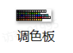
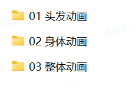
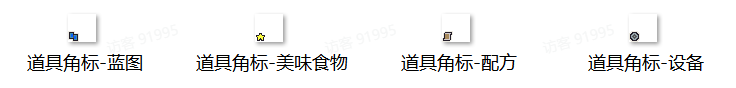

# 03 备用贴图

Source: <https://ka7deoo0opr.feishu.cn/wiki/NKSJwBudUi9q89kN9GXcpQKwnRe>

Source modified label: 4月22日修改

## 一、调色板

- 示例路径（官方示例模组，获取方式见查看示例模组）

【创意工坊文件根目录】\Content\04 其他内容示例\03 备用贴图\01 调色板\_IGNORE

- 注意：_IGNORE文件夹下的文件不会被加载到模组，正式使用时请避开此命名。

## 二、主角动画

- 主角动画中包含了游戏主角的头发动画、身体动画、整体动画的所有动画帧，可以作为参考模板进行绘制。

- 示例路径（官方示例模组，获取方式见查看示例模组）

【创意工坊文件根目录】\Content\04 其他内容示例\03 备用贴图\02 主角动画\_IGNORE

- 注意：_IGNORE文件夹下的文件不会被加载到模组，正式使用时请避开此命名。

## 三、道具角标

- 示例路径（官方示例模组，获取方式见查看示例模组）

【创意工坊文件根目录】\Content\04 其他内容示例\03 备用贴图\01 道具角标\_IGNORE

- 注意：_IGNORE文件夹下的文件不会被加载到模组，正式使用时请避开此命名。

## Links

- [查看示例模组](https://ka7deoo0opr.feishu.cn/wiki/GmfKwSHv0i5E9EkaupNcjRdIn4d)
