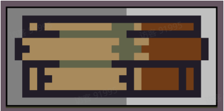
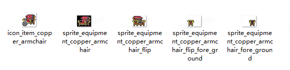
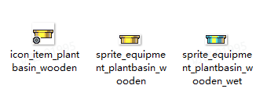

# 05 设备

Source: <https://ka7deoo0opr.feishu.cn/wiki/OAMZwIqkLi7xw3k7JcIcvxAQnHg>

Source modified label: 5月15日修改

## 一、格式要求

#### Embedded sheet `BR0xk3`

[TSV](sheets/01-01-br0xk3.tsv) · [rendered screenshot](sheets/01-01-br0xk3.png)

```tsv
类型	图片大小（像素）	作图规范
所有贴图	不限制	四周留1像素
```

50%50%

50%



50%


注：本页面的设备图片均为游戏世界的场景贴图，如需替换设备对应的道具UI图标，请参考04 道具

## 二、命名对照表

- 见05 ID对照表（设备）。

## 三、参考示例

- 铜制扶手椅（copper_armchair）颜色调整。



- 木制种植盆（plantbasin_wooden）改为黄金材质。



- 示例路径（官方示例模组，获取方式见查看示例模组）

【创意工坊文件根目录】\Content\01 美化模组示例\05 设备

## Links

- [04 道具](https://ka7deoo0opr.feishu.cn/wiki/CDfmwzDwHi4GJgksMfZcC2mqnTe)
- [05 ID对照表（设备）](https://ka7deoo0opr.feishu.cn/wiki/DSGAwje93icwXVkY8WvcpxCWnXg)
- [查看示例模组](https://ka7deoo0opr.feishu.cn/wiki/GmfKwSHv0i5E9EkaupNcjRdIn4d)
