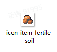

# 01 新增道具

Source: <https://ka7deoo0opr.feishu.cn/wiki/OFS1w4gFSiDkHRkXX1Pcu4ihnNh>

Source modified label: 5月21日修改

## 一、整体说明

- 道具模组由【1个】json文件组成，即：道具信息item_tbitem.json。

- Content文件夹内必须包含上述【1个】文件。

- 配置示例中，标黄的字段为【需要修改的字段】。

- 新增道具的【获取途径】需要通过【其他内容模组】实现。详见06 综合案例一（新增道具）、07 综合案例二（新增帽子）、08 综合案例三（新增设备）。

- 官方参考模板中，提供了各不同类型道具的模板，详见02 道具数据模板。（部分内容比较复杂还是请先看完文档示例。）

## 二、配置示例及数据结构说明

### item_tbitem.json

- 新增道具：沃土块。

_装饰设备道具信息-配置示例_

```json
[
  {
    "id": "fertile_soil", //道具ID
    "sub_type": "material_nature", //子道具类型，material_nature为自然素材
    "salable": true, //是否允许出售
    "disposable": true, //是否允许丢失
    "consumable": false, //是否为消耗品
    "cookable": false, //是否允许烹饪
    "electric_energy": 0, //提供发电量(0则不发电)
    "viewable": true, //是否显示在图鉴
    "source": ["gather"], //获取途径（显示在图鉴），"gather"为“采集”
    "selling_price": 100, //售出价格
    "buying_price": 500, //购买价格
    "overlay": 99, //堆叠上限
    "ui_sprite_asset": {
      "url": "icon_item_fertile_soil" //道具图标，格式为：icon_item_道具ID
    },
    "title": {
      "key": "item_fertile_soil", //道具标题ID，格式为：item_道具ID
      "text": "沃土块" //道具标题文本
    },
    "description_basic": {
      "key": "item_fertile_soil_desc", //道具描述ID，格式为：item_道具ID_desc
      "text": "肥沃的土壤，可以用来堆肥。" //道具描述文本
    },
    "function": {
      "$type": "ItemFunction" //功能类型
    }
  }
]
```

- 子道具类型、获取途径、功能类型见04 ID对照表（道具）。

## 三、图片格式要求

#### Embedded sheet `FlWpuD`

[TSV](sheets/01-01-flwpud.tsv) · [rendered screenshot](sheets/01-01-flwpud.png)

```tsv
类型	图片大小（像素）	作图规范
道具图标	28*28	整体居中
```

## 四、图片命名对照表

#### Embedded sheet `5cap8y`

[TSV](sheets/02-01-5cap8y.tsv) · [rendered screenshot](sheets/02-01-5cap8y.png)

```tsv
名称	命名格式
[道具ID]	icon_item_[道具ID]
```

## 五、参考示例

- 新增道具沃土块（fertile_soil）



- 示例路径（官方示例模组，获取方式见查看示例模组）

【创意工坊文件根目录】\Content\02 基础内容模组示例\01 新增道具

## Links

- [06 综合案例一（新增道具）](https://ka7deoo0opr.feishu.cn/wiki/KWqewbBLEiRw1Pkcn6lcZpQ7nXg)
- [07 综合案例二（新增帽子）](https://ka7deoo0opr.feishu.cn/wiki/WnCwwkXA4ixLjFkx2SIcTyyIned)
- [08 综合案例三（新增设备）](https://ka7deoo0opr.feishu.cn/wiki/P57twsINsitUu6kWCDEc4vz6nNc)
- [02 道具数据模板](https://ka7deoo0opr.feishu.cn/wiki/Rv1swL7JEiLHSZkaNk7cFyyXnIh)
- [04 ID对照表（道具）](https://ka7deoo0opr.feishu.cn/wiki/QaKDwjPdvi2GtEk7GKPcQEoenyf)
- [查看示例模组](https://ka7deoo0opr.feishu.cn/wiki/GmfKwSHv0i5E9EkaupNcjRdIn4d)
