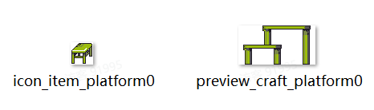
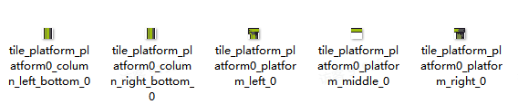
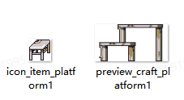
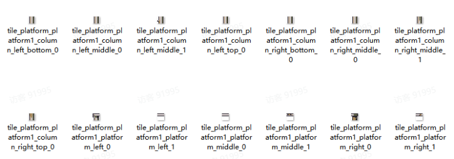

# 10 综合案例五（新增平台）

Source: <https://ka7deoo0opr.feishu.cn/wiki/OdcywZdsuiio3MkdpLdcJretnte>

Source modified label: 5月22日修改

## 一、整体说明

- 通过以下【4个】json文件的配合，实现新增并获取平台道具/配方的全流程：

- ◦道具信息item_tbitem.json

- ◦平台信息platform_tbplatform.json

- ◦配方信息recipe_tbrecipe.json

- ◦配方对应的平台mod_tbmodrecipegroupextension.json

- 游戏内操作指南：

- ◦自己制作：

- ▪去手工工作台制作纤维平台（简易纹理平台）、岩木平台（随机纹理平台）。

- 配置示例中，标黄的字段为【需要修改的字段】。

## 二、配置示例及数据结构说明

### 1.简易纹理平台

#### 1.1item_tbitem.json

- 新增道具：纤维平台（platform0）。

_道具信息-配置示例_

```json
[
  {
    "id": "platform0", //道具ID
    "sub_type": "construction_platform", //子道具类型
    "salable": true, //是否允许出售
    "disposable": true, //是否允许丢失
    "consumable": true, //是否为消耗品
    "cookable": false, //是否允许烹饪
    "electric_energy": 0, //提供发电量(0则不发电)
    "viewable": false, //是否显示在图鉴
    "source": [], //获取途径（显示在图鉴）
    "selling_price": 2, //售出价格
    "buying_price": 10, //购买价格
    "overlay": 999, //堆叠上限
    "ui_sprite_asset": {
      "url": "icon_item_platform0" //道具图标，格式为：icon_item_道具ID
    },
    "title": {
      "key": "item_platform0", //道具标题ID，格式为：item_道具ID
      "text": "纤维平台" //道具标题文本
    },
    "description_basic": {
      "key": "item_platform0_desc", //道具描述ID，格式为：item_道具ID_desc
      "text": "用纤维搭建的平台，样式简单，可以在手工工作台制作。" //道具描述文本
    },
    "function": {
      "$type": "ItemFunctionPlatform" //功能类型，ItemFunctionPlatform为平台道具
    }
  }
]
```

#### 1.2 platform_tbplatform.json

- 录入平台信息：简易纹理平台（platform0）。

_平台信息-配置示例_

```json
[
  {
    "id": "platform0", //平台ID，同道具ID
    "scene_sprite_asset": {
      "url": "preview_craft_platform0" //平台详情图，格式为preview_craft_[平台ID]
    },
    "platform_suface": {
      "left_sock": {
        "url": "tile_platform_platform0_platform_left_0" //平台表面左侧瓦片贴图，格式为tile_platform_[平台ID]_platform_left_0
      },
      "left_sequence": [], //平台表面左侧衔接瓦片贴图组（可选）
      "fill_tiles": [
        {
          "sprite_asset": {
            "url": "tile_platform_platform0_platform_middle_0" //平台表面中间部分随机瓦片贴图1，格式为tile_platform_[平台ID]_platform_middle_0
          },
          "weight": 100 //该贴图出现权重
        }
      ],
      "right_sequence": [], //平台表面右侧衔接瓦片贴图组（可选）
      "right_sock": {
        "url": "tile_platform_platform0_platform_right_0" //平台表面右侧瓦片贴图，格式为tile_platform_[平台ID]_platform_right_0
      }
    },
    "platform_left_column": {
      "fixed_sequence": [], //平台左柱体顶部瓦片贴图组（可选）
      "fill_tiles": [], //平台左柱体中间部分随机瓦片贴图组（可选）
      "column_bottom_tile": {
        "url": "tile_platform_platform0_column_left_bottom_0"//平台左柱体底部瓦片贴图，格式为tile_platform_[平台ID]_column_left_bottom_0
      }
    },
    "platform_right_column": {
      "fixed_sequence": [], //平台右柱体顶部瓦片贴图组（可选）
      "fill_tiles": [], //平台右柱体中间部分随机瓦片贴图组（可选）
      "column_bottom_tile": {
        "url": "tile_platform_platform0_column_right_bottom_0" //平台右柱体底部瓦片贴图，格式为tile_platform_[平台ID]_column_right_bottom_0
      }
    }
  }
]
```

- 一个平台最少需要5块瓦片（左转角、中部填充块、右转角、左腿支架和右腿支架）才能搭建，在这个基础上添加其他瓦片可以组成更丰富的平台样式。详见【随机纹理平台】。

#### 1.3recipe_tbrecipe.json

录入配方信息：2*纤维平台= 1*纤维。

_配方信息-配置示例_

```json
[
  {
    "id": "platform0", //配方ID，一般等同道具ID
    "default_unlock": true, //是否默认解锁
    "title": {
      "key": "", //配方标题（为空则根据输出道具自动生成）
      "text": "" //配方文本（为空则根据输出道具自动生成）
    },
    "cost_time": 0, //制作时间（单位为TU，即游戏内5min）
    "output_item": {
      "item_name": "platform0", //输出道具的道具ID
      "min_count": 2, //最小输出数量
      "max_count": 2 //最大输出数量
    },
    "input_items": [
      {
        "item_name": "weeds", //消耗道具的道具ID
        "item_count": 1 //消耗道具数量
      }
    ],
    "recipe_sub_type": "none", //配方小类（none，seed, ......）
    "tech_point": 1, //完成配方增加的科技点数
    "show_in_handbook": true //配方是否显示在图鉴
  }
]
```

#### 1.4mod_tbmodrecipegroupextension.json

- 在手工工作台（manual_workbench）新增【纤维平台】的平台制作配方。

_配方组信息-配置示例_

```json
[
  {
    "id": "manual_workbench", //配方组ID，同设备ID
    "extra_recipes": [
      "platform0"//配方ID（多个配方则用","隔开）
    ]
  }
]
```

### 2.随机纹理平台

#### 2.1item_tbitem.json

- 新增道具：岩木平台（platform1）。

_道具信息-配置示例_

```json
[
  {
    "id": "platform1", //道具ID
    "sub_type": "construction_platform", //子道具类型
    "salable": true, //是否允许出售
    "disposable": true, //是否允许丢失
    "consumable": true, //是否为消耗品
    "cookable": false, //是否允许烹饪
    "electric_energy": 0, //提供发电量(0则不发电)
    "viewable": false, //是否显示在图鉴
    "source": [], //获取途径（显示在图鉴）
    "selling_price": 2, //售出价格
    "buying_price": 10, //购买价格
    "overlay": 999, //堆叠上限
    "ui_sprite_asset": {
      "url": "icon_item_platform1" //道具图标，格式为：icon_item_道具ID
    },
    "title": {
      "key": "item_platform1", //道具标题ID，格式为：item_道具ID
      "text": "岩木平台" //道具标题文本
    },
    "description_basic": {
      "key": "item_platform1_desc", //道具描述ID，格式为：item_道具ID_desc
      "text": "用岩木搭建的平台，结实耐用，可以在手工工作台制作。" //道具描述文本
    },
    "function": {
      "$type": "ItemFunctionPlatform" //功能类型，ItemFunctionPlatform为平台道具
    }
  }
]
```

#### 2.2platform_tbplatform.json

- 录入平台信息：岩木平台（platform1）。

_平台信息-配置示例_

```json
[
  {
    "id": "platform1", //平台ID，同道具ID
    "scene_sprite_asset": {
      "url": "preview_craft_platform1" //平台详情图，格式为preview_craft_[平台ID]
    },
    "platform_suface": {
      "left_sock": {
        "url": "tile_platform_platform1_platform_left_0" //平台表面左侧瓦片贴图，格式为tile_platform_[平台ID]_platform_left_0
      },
      "left_sequence": [
        {
          "url": "tile_platform_platform1_platform_left_1" //平台表面左侧衔接瓦片贴图，格式为tile_platform_[平台ID]_platform_left_1
        }
      ],
      "fill_tiles": [
        {
          "sprite_asset": {
            "url": "tile_platform_platform1_platform_middle_0" //平台表面中间部分随机瓦片贴图1，格式为tile_platform_[平台ID]_platform_middle_0
          },
          "weight": 80 //该贴图出现权重
        },
        {
          "sprite_asset": {
            "url": "tile_platform_platform1_platform_middle_1" //平台表面中间部分随机瓦片贴图2，格式为tile_platform_[平台ID]_platform_middle_1
          },
          "weight": 20 //该贴图出现权重
        }
      ],
      "right_sequence": [
        {
          "url": "tile_platform_platform1_platform_right_1" //平台表面右侧衔接瓦片贴图，格式为tile_platform_[平台ID]_platform_right_1
        }
      ],
      "right_sock": {
        "url": "tile_platform_platform1_platform_right_0" //平台表面右侧瓦片贴图，格式为tile_platform_[平台ID]_platform_right_0
      }
    },
    "platform_left_column": {
      "fixed_sequence": [
        {
          "url": "tile_platform_platform1_column_left_top_0" //平台左柱体顶部瓦片贴图，格式为tile_platform_[平台ID]_column_left_top_0
        }
      ],
      "fill_tiles": [
        {
          "sprite_asset": {
            "url": "tile_platform_platform1_column_left_middle_0" //平台左柱体中间部分随机瓦片贴图1，格式为tile_platform_[平台ID]_column_left_middle_0
          },
          "weight": 70 //该贴图出现权重
        },
        {
          "sprite_asset": {
            "url": "tile_platform_platform1_column_left_middle_1" //平台左柱体中间部分随机瓦片贴图2，格式为tile_platform_[平台ID]_column_left_middle_1
          },
          "weight": 30 //该贴图出现权重
        }
      ],
      "column_bottom_tile": {
        "url": "tile_platform_platform1_column_left_bottom_0" //平台左柱体底部瓦片贴图，格式为tile_platform_[平台ID]_column_left_bottom_0
      }
    },
    "platform_right_column": {
      "fixed_sequence": [
        {
          "url": "tile_platform_platform1_column_right_top_0" //平台右柱体顶部瓦片贴图，格式为tile_platform_[平台ID]_column_right_top_0
        }
      ],
      "fill_tiles": [
        {
          "sprite_asset": {
            "url": "tile_platform_platform1_column_right_middle_0" //平台右柱体中间部分随机瓦片贴图1，格式为tile_platform_[平台ID]_column_right_middle_0
          },
          "weight": 70 //该贴图出现权重
        },
        {
          "sprite_asset": {
            "url": "tile_platform_platform1_column_right_middle_1" //平台右柱体中间部分随机瓦片贴图2，格式为tile_platform_[平台ID]_column_right_middle_1
          },
          "weight": 30 //该贴图出现权重
        }
      ],
      "column_bottom_tile": {
        "url": "tile_platform_platform1_column_right_bottom_0" //平台右柱体底部瓦片贴图，格式为tile_platform_[平台ID]_column_right_bottom_0
      }
    }
  }
]
```

- 随机纹理平台在简易纹理平台的基础上添加了平台左右侧衔接瓦片、中间拉伸部分的随机瓦片组（可按概率生成），左右柱腿顶部固定瓦片组和中间拉伸部分的随机瓦片组，对比简易纹理平台外观上视觉效果更丰富。

#### 2.3recipe_tbrecipe.json

录入配方信息：10*岩木平台 = 1*岩木。

_配方信息-配置示例_

```json
[
  {
    "id": "platform1", //配方ID，一般等同道具ID
    "default_unlock": true, //是否默认解锁
    "title": {
      "key": "", //配方标题（为空则根据输出道具自动生成）
      "text": "" //配方文本（为空则根据输出道具自动生成）
    },
    "cost_time": 0, //制作时间（单位为TU，即游戏内5min）
    "output_item": {
      "item_name": "platform1", //输出道具的道具ID
      "min_count": 10, //最小输出数量
      "max_count": 10 //最大输出数量
    },
    "input_items": [
      {
        "item_name": "wood_stone", //消耗道具的道具ID
        "item_count": 1 //消耗道具数量
      }
    ],
    "recipe_sub_type": "none", //配方小类（none，seed, ......）
    "tech_point": 1, //完成配方增加的科技点数
    "show_in_handbook": true //配方是否显示在图鉴
  }
]
```

#### 2.4mod_tbmodrecipegroupextension.json

- 在手工工作台（manual_workbench）新增【岩木平台】的平台制作配方。

_配方组信息-配置示例_

```json
[
  {
    "id": "manual_workbench", //配方组ID，同设备ID
    "extra_recipes": [
      "platform1" //配方ID（多个配方则用","隔开）
    ]
  }
]
```

## 三、图片格式要求

#### Embedded sheet `kpkGbf`

[TSV](sheets/01-01-kpkgbf.tsv) · [rendered screenshot](sheets/01-01-kpkgbf.png)

```tsv
类型	图片大小（像素）	作图规范
详情图	不限制
图标（道具）	28*28	整体居中
瓦片贴图	12*12	不可超出
```

## 四、图片命名对照表

- 简易平台：以纤维平台（platform0）为例

#### Embedded sheet `GrTYne`

[TSV](sheets/02-01-grtyne.tsv) · [rendered screenshot](sheets/02-01-grtyne.png)

```tsv
名称	命名格式
道具ID	platform0
道具图标	icon_item_platform0
详情图	preview_craft_platform0
平台左侧瓦片	tile_platform_platform0_platform_left_0
平台中部随机瓦片	tile_platform_platform0_platform_middle_[0~1]
平台右侧瓦片	tile_platform_platform0_platform_right_0
左柱体底部瓦片	tile_platform_platform0_column_left_bottom_0
右柱体底部瓦片	tile_platform_platform0_column_right_bottom_0
```

- 带随机纹理平台：以岩木平台（platform1）为例

#### Embedded sheet `Gorl4q`

[TSV](sheets/03-01-gorl4q.tsv) · [rendered screenshot](sheets/03-01-gorl4q.png)

```tsv
名称	命名格式
道具ID	platform1
道具图标	icon_item_platform1
详情图	preview_craft_platform1
平台左侧瓦片	tile_platform_platform1_platform_left_0
平台中部随机瓦片	tile_platform_platform1_platform_middle_[0~1]
平台右侧瓦片	tile_platform_platform1_platform_right_0
左柱体底部瓦片	tile_platform_platform1_column_left_bottom_0
右柱体底部瓦片	tile_platform_platform1_column_right_bottom_0
平台左侧衔接瓦片（可选）	tile_platform_platform1_platform_left_1
平台右侧衔接瓦片（可选）	tile_platform_platform1_platform_right_1
左柱体顶部衔接瓦片（可选）	tile_platform_platform1_column_left_top_0
左柱体中部随机瓦片（可选）	tile_platform_platform1_column_left_middle_[0~1]
右柱体顶部衔接瓦片（可选）	tile_platform_platform1_column_right_top_0
右柱体中部随机瓦片（可选）	tile_platform_platform1_column_right_middle_[0~1]
```

详见13 ID对照表（平台）。

## 五、参考示例

- 新增简易纹理平台：纤维平台（platform0），可直接在手工工作台制作。





- 新增随机纹理平台：岩木平台（platform1），可直接在手工工作台制作。





- 示例路径（官方示例模组，获取方式见查看示例模组）

【创意工坊文件根目录】\Content\02 基础内容模组示例\10 综合案例五（新增平台）

## Links

- [13 ID对照表（平台）](https://ka7deoo0opr.feishu.cn/wiki/Qcxww5EmSiasxfkup2rcGQpXndc)
- [查看示例模组](https://ka7deoo0opr.feishu.cn/wiki/GmfKwSHv0i5E9EkaupNcjRdIn4d)
