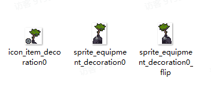

# 08 综合案例三（新增设备）

Source: <https://ka7deoo0opr.feishu.cn/wiki/P57twsINsitUu6kWCDEc4vz6nNc>

Source modified label: 5月21日修改

## 一、整体说明

- 通过以下【5个】json文件的配合，实现新增并获取设备道具/配方的全流程：

- ◦道具信息item_tbitem.json

- ◦设备信息equipment_tbequipment.json

- ◦配方信息recipe_tbrecipe.json

- ◦配方对应的设备mod_tbmodrecipegroupextension.json

- ◦一般商店信息mod_tbmodstoreextension.json

- 游戏内操作指南：

- ◦直接购买新增设备：

- ▪去电话亭，选择工坊贸易部，购买垃圾盆栽。

- ◦自己制作：

- ▪去设备工作台制作垃圾盆栽。

- 配置示例中，标黄的字段为【需要修改的字段】。

## 二、配置示例及数据结构说明

### item_tbitem.json

- 新增道具：垃圾盆栽

_道具信息-配置示例（添加单个道具）_

```json
[
  {
    "id": "decoration0", //道具ID
    "sub_type": "equipment_ornament", //子道具类型，不修改
    "salable": true, //是否允许出售
    "disposable": true, //是否允许丢失
    "consumable": false, //是否为消耗品
    "cookable": false, //是否允许烹饪
    "electric_energy": 0, //提供发电量(0则不发电)
    "viewable": true, //是否显示在图鉴
    "source": ["processing"], //获取途径（显示在图鉴），processing为加工制造
    "selling_price": -1, //售出价格（设备类型道具，填“-1”则根据配方自动计算）
    "buying_price": 250, //购买价格
    "overlay": 99, //堆叠上限
    "ui_sprite_asset": {
      "url": "icon_item_decoration0" //道具图标，格式为：icon_item_道具ID
    },
    "title": {
      "key": "item_decoration0", //道具标题ID，格式为：item_道具ID
      "text": "垃圾盆栽" //道具标题文本
    },
    "description_basic": {
      "key": "item_decoration0_desc", //道具描述ID，格式为：item_道具ID_desc
      "text": "用垃圾袋临时装了起来的树苗，没法继续生长，但能作为装饰。" //道具描述文本
    },
    "function": {
      "$type": "ItemFunctionEquipment" //功能类型，ItemFunctionEquipment为设备道具
    }
  }
]
```

### equipment_tbequipment.json

- 录入设备信息：垃圾盆栽

_设备信息-配置示例_

```json
[
  {
    "id": "decoration0", //设备ID，同道具ID
    "menu_type": 2, //设备工作台里的菜单类型(0农业，1工业，生活，3养殖)
    "scene_asset": {
      "url": "sprite_equipment_decoration0"  //设备场景贴图，格式为：sprite_equipment_[设备ID]
    },
    "flip_asset": {
      "url": "sprite_equipment_decoration0_flip" //设备场景贴图（翻转），格式为：sprite_equipment_[设备ID]_flip
    },
    "animator_asset": {
      "url": "" //仅用于风能发电机，无特殊情况为空
    },
    "env_type": 0, //环境适配类型（0通用，1地面）
    "fit_type": 0, //地形适配类型（0通用，1室内，2室外）
    "cover_size": {
      "x": 2, //占地格子数（宽）
      "y": 3 //占地格子数（高）
    },
    "base_equipment": "", //前置设备，无特殊情况为空
    "display_lock": true, //未解锁时是否显示(设备工作台)
    "show_complete_info_lock": false, //未解锁时是否显示完整信息(设备工作台)
    "function": {
      "$type": "EquipmentFuncDecorator" ////设备类型（EquipmentFuncDecorator为装饰设备）
    },
    "processors": [], //天气数据，留空
    "fit_slot_datas": [],  //贴纸数据，留空
    "contained_slot_datas": [] //贴纸宿主数据，留空
  }
]
```

### recipe_tbrecipe.json

录入配方信息：1*垃圾盆栽（decoration0） = 1*树种（seed_tree） + 1*垃圾（rubbish）+ 1*粘土（soil）。

_配方信息-配置示例_

```json
[
  {
    "id": "decoration0", //配方ID，一般等同道具ID
    "default_unlock": true, //是否默认解锁
    "title": {
      "key": "", //配方标题（为空则根据输出道具自动生成）
      "text": "" //配方文本（为空则根据输出道具自动生成）
    },
    "cost_time": 0, //制作时间（单位为TU，即游戏内5min）
    "output_item": {
      "item_name": "decoration0", //输出道具的道具ID
      "min_count": 1, //最小输出数量
      "max_count": 1 //最大输出数量
    },
    "input_items": [
      {
        "item_name": "seed_tree", //消耗道具的道具ID
        "item_count": 1 //消耗道具数量
      },
      {
        "item_name": "rubbish", //消耗道具的道具ID
        "item_count": 1 //消耗道具数量
      },
      {
        "item_name": "soil",//消耗道具的道具ID
        "item_count": 1 //消耗道具数量
      }
    ],
    "recipe_sub_type": "none", //配方小类（none，seed, ......）
    "tech_point": 1, //完成配方增加的科技点数
    "show_in_handbook": true //配方是否显示在图鉴
  }
]
```

### mod_tbmodrecipegroupextension.json

- 在设备工作台（equipment_workbench）新增【垃圾盆栽】的设备制作配方（decoration0)。

_配方组信息-配置示例_

```json
[
  {
    "id": "equipment_workbench", //配方组ID，同设备ID
    "extra_recipes": [
      "decoration0" //配方ID（多个配方则用","隔开）
    ]
  }
]
```

### mod_tbmodstoreextension.json

- 商店电话亭工坊贸易部（phone_booth_shop）上架道具：垃圾盆栽。

_一般商店商品信息-配置示例_

```json
[
  {
    "id": "phone_booth_shop", //商店ID
    "extra_items": [
      {
      //以下为上架道具 垃圾盆栽
        "item_name": "decoration0",
        "storage": 0, //商品全局存量，即整局游戏最多能卖多少个（0则无存量上限）
        "default_unlock": true, //是否默认解锁
        "season_spawn_data": [ //以下分别为四个月份的商品属性
          {
            "count_range": {
              "min_count": 99, //单次出现最小数量：一月
              "max_count": 99 //单次出现最大数量：一月
            },
            "spawn_weight": 0 //商品刷新权重：一月（0则固定刷新）
          },
          {
            "count_range": {
              "min_count": 99 , //单次出现最小数量数量：二月
              "max_count": 99  //单次出现最大数量：二月
            },
            "spawn_weight": 0 //商品刷新权重：二月（0则固定刷新）
          },
          {
            "count_range": {
              "min_count": 99 , //单次出现最小数量数量：三月
              "max_count": 99  //单次出现最大数量：三月
            },
            "spawn_weight": 0 //商品刷新权重：三月（0则固定刷新）
          },
          {
            "count_range": {
              "min_count": 99 , //单次出现最小数量数量：四月
              "max_count": 99  //单次出现最大数量：四月
            },
            "spawn_weight": 0 //商品刷新权重：四月（0则固定刷新）
          }
        ]
       }
     ]
   }
]
```

## 三、图片格式要求

#### Embedded sheet `6gP4fO`

[TSV](sheets/01-01-6gp4fo.tsv) · [rendered screenshot](sheets/01-01-6gp4fo.png)

```tsv
类型	图片大小（像素）	作图规范
场景贴图	不限制	四周留1像素
图标（道具）	28*28	整体居中
```

## 四、图片命名对照表

#### Embedded sheet `ZgcNgu`

[TSV](sheets/02-01-zgcngu.tsv) · [rendered screenshot](sheets/02-01-zgcngu.png)

```tsv
设备ID	场景贴图-命名格式	场景贴图（翻转）-命名格式
decoration0	sprite_equipment_decoration0	sprite_equipment_decoration0_flip
```

#### Embedded sheet `0fJGmh`

[TSV](sheets/03-01-0fjgmh.tsv) · [rendered screenshot](sheets/03-01-0fjgmh.png)

```tsv
道具ID	命名格式
decoration0	icon_item_decoration0
```

## 五、参考示例

- 新增设备：垃圾盆栽（decoration0），并上架兑换商店工坊贸易部（phone_booth_shop）。可以在商店直接购买，也可以在设备工作台（equipment_workbench）制作。



- 示例路径（官方示例模组，获取方式见查看示例模组）

【创意工坊文件根目录】\Content\02 基础内容模组示例\08 综合案例三（新增设备）

## Links

- [查看示例模组](https://ka7deoo0opr.feishu.cn/wiki/GmfKwSHv0i5E9EkaupNcjRdIn4d)
