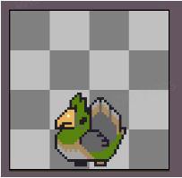
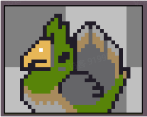
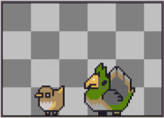
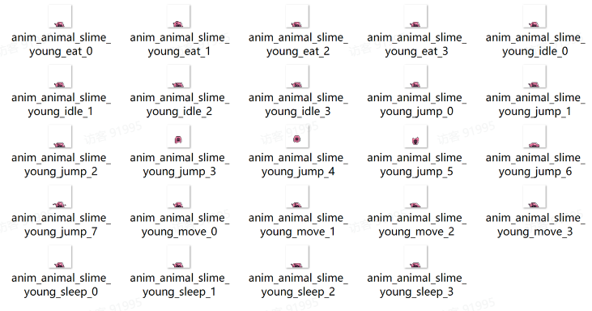
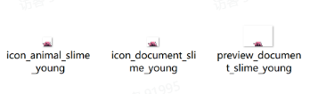

# 03 小动物

Source: <https://ka7deoo0opr.feishu.cn/wiki/POkcwjhF3iPzmikWRZ2cn8n9ncf>

Source modified label: 5月15日修改

## 一、格式要求

#### Embedded sheet `pSwISs`

[TSV](sheets/01-01-pswiss.tsv) · [rendered screenshot](sheets/01-01-pswiss.png)

```tsv
类型	图片大小（像素）	作图规范
帧动画	64*64	底部空1像素，水平居中
图标（图鉴）	36*28	垂直居下，水平居中
详情图（图鉴）	90*64	垂直居下，水平居中
```

28%34%38%

28%



34%



38%



## 二、命名对照表

- 见03 ID对照表（小动物）。

## 三、参考示例

- 变形蜜虫（slime）颜色调整。





- 示例路径（官方示例模组，获取方式见查看示例模组）

【创意工坊文件根目录】\Content\01 美化模组示例\03 小动物

## Links

- [03 ID对照表（小动物）](https://ka7deoo0opr.feishu.cn/wiki/UdOwwqfOLiFcFMkW5rrchKVUnpd)
- [查看示例模组](https://ka7deoo0opr.feishu.cn/wiki/GmfKwSHv0i5E9EkaupNcjRdIn4d)
