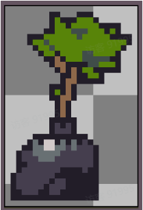
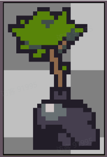
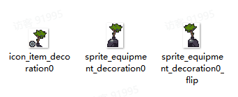

# 03 新增装饰设备

Source: <https://ka7deoo0opr.feishu.cn/wiki/PSUjwr1GuiRixsk95HlcYTVQnPd>

Source modified label: 4月29日修改

## 一、整体说明

- 设备模组由【2个】json文件组成，分别是：

- ◦道具信息item_tbitem.json

- ◦设备信息equipment_tbequipment.json

- Content文件夹内必须包含上述【2个】文件。

- 配置示例中，标黄的字段为【需要修改的字段】

- 新增设备的【获取途径】需要通过【其他内容模组】实现。详见08 综合案例三（新增设备）。

## 二、配置示例及数据结构说明

##### item_tbitem.json

- 新增道具：垃圾盆栽。

_道具信息-配置示例_

```json
[
  {
    "id": "decoration0", //道具ID
    "sub_type": "equipment_ornament", //子道具类型，equipment_ornament为设备道具
    "salable": true, //是否允许出售
    "disposable": true, //是否允许丢失
    "consumable": false, //是否为消耗品
    "cookable": false, //是否允许烹饪
    "electric_energy": 0, //提供发电量(0则不发电)
    "viewable": true, //是否显示在图鉴
    "source": ["processing"], //获取途径（显示在图鉴），processing为加工制造
    "selling_price": -1, //售出价格（设备道具填“-1”则根据配方自动计算）
    "buying_price": 250, //购买价格
    "overlay": 99, //堆叠上限
    "ui_sprite_asset": {
      "url": "icon_item_decoration0" //道具图标，格式为：icon_item_道具ID
    },
    "title": {
      "key": "item_decoration0", //道具标题ID，格式为：item_道具ID
      "text": "垃圾盆栽" //道具标题文本
    },
    "description_basic": {
      "key": "item_decoration0_desc", //道具描述ID，格式为：item_道具ID_desc
      "text": "用垃圾袋临时装了起来的树苗，没法继续生长，但能作为装饰。" //道具描述文本
    },
    "function": {
      "$type": "ItemFunctionEquipment" //功能类型，ItemFunctionEquipment为设备道具
    }
  }
]
```

##### equipment_tbequipment.json

- 新增装饰设备：垃圾盆栽。

_设备信息-配置示例_

```json
[
  {
    "id": "decoration0", //设备ID，同道具ID
    "menu_type": 2, //设备工作台里的菜单类型(0农业，1工业，2生活，3养殖)
    "scene_asset": {
      "url": "sprite_equipment_decoration0"  //设备场景贴图，格式为：sprite_equipment_[设备ID]
    },
    "flip_asset": {
      "url": "sprite_equipment_decoration0_flip" //设备场景贴图（翻转），格式为：sprite_equipment_[设备ID]_flip
    },
    "animator_asset": {
      "url": "" //仅用于风能发电机，无特殊情况为空
    },
    "env_type": 0, //环境适配类型（0通用，1地面）
    "fit_type": 0, //地形适配类型（0通用，1室内，2室外）
    "cover_size": {
      "x": 2, //占地格子数（宽）
      "y": 3 //占地格子数（高）
    },
    "base_equipment": "", //前置设备，无特殊情况为空
    "display_lock": true, //未解锁时是否显示(设备工作台)
    "show_complete_info_lock": false, //未解锁时是否显示完整信息(设备工作台)
    "function": {
      "$type": "EquipmentFuncDecorator" //设备类型，EquipmentFuncDecorator为装饰设备
    },
    "processors": [], //天气数据，留空
    "fit_slot_datas": [],  //贴纸数据，留空
    "contained_slot_datas": [] //贴纸宿主数据，留空
  }
]
```

## 三、图片格式要求

#### Embedded sheet `6rXr8v`

[TSV](sheets/01-01-6rxr8v.tsv) · [rendered screenshot](sheets/01-01-6rxr8v.png)

```tsv
类型	图片大小（像素）	作图规范
场景贴图	不限制	四周留1像素
图标（道具）	28*28	整体居中
```

29%29%42%

29%



29%



42%


## 四、图片命名对照表

#### Embedded sheet `dDA4lC`

[TSV](sheets/02-01-dda4lc.tsv) · [rendered screenshot](sheets/02-01-dda4lc.png)

```tsv
设备类型	设备ID	场景贴图-命名格式	场景贴图（翻转）-命名格式
装饰设备	[设备ID]	sprite_equipment_[设备ID]	sprite_equipment_[设备ID]_flip
```

## 五、参考示例

- 新增设备垃圾盆栽（decoration0）



- 示例路径（官方示例模组，获取方式见查看示例模组）

【创意工坊文件根目录】\Content\02 基础内容模组示例\03 新增设备

## Links

- [08 综合案例三（新增设备）](https://ka7deoo0opr.feishu.cn/wiki/P57twsINsitUu6kWCDEc4vz6nNc)
- [查看示例模组](https://ka7deoo0opr.feishu.cn/wiki/GmfKwSHv0i5E9EkaupNcjRdIn4d)
