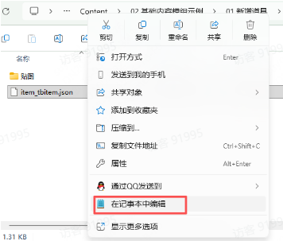
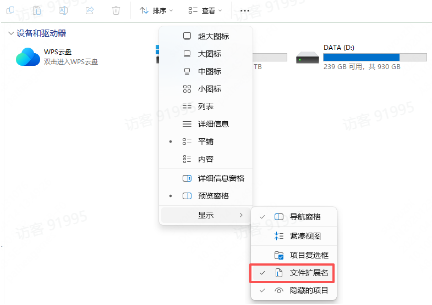
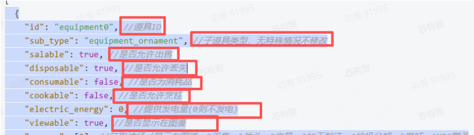

# 02 基础内容模组

Source: <https://ka7deoo0opr.feishu.cn/wiki/PwfowuR9Ti1OJGkH6j8cypQ6n6D>

Source modified label: 5月15日修改

## 一、基础说明

- 包括新增道具 & 道具获取途径配置。

- 基础内置模组需要修改json文件（模板文件可以通过制作组准备的示例模组获取）。

- 为了便于编辑与排查问题，推荐使用Notepad--或VSCode等文本编辑工具，它们能够提供json语法高亮、错误提示等功能。

- ◦如果只是简单编辑，也可以直接使用系统自带的记事本进行修改（如下图所示，右键单击json文件即可打开）



- 如需自行创建全新的json文件，需在开启系统文件拓展名显示的情况下（如下图），创建一个txt文件，随后将后缀从 .txt 修改为 .json即可



## 二、 Json文件格式说明

- 一个 JSON 节点就是一条数据，用 大括号 `{}` 包起来

- 一个配置表里可以有多条数据，多条数据用 中括号 `[]` 包起来

- 节点之间用 英文逗号 , 分隔

- 以下的所有介绍里，灰色的备注均为注释，如需复制使用，请删除所有备注（建议通过备份+调整示例文档里的json文件以节省时间）

- 您需要为新创建的物品配置一个ID（参见下方的道具ID），请确保此ID的唯一性。如您同时启用了多个拥有相同ID的物品，将会导致物品无法正常显示。



- 最后一个节点后面不要加逗号

_配置数据示例_

```json
[
  {
    // 节点1
  },
  {
    // 节点2
  },
  {
    // 节点3
  }
]
```

- 可简单理解为：

- ◦{} = 一条数据

- ◦[] = 多条数据组成的列表

- json配置表中可通过多个节点来一次性增加多条数据。节点间需要添加英文逗号，最后一个节点后不加逗号。

_道具信息-配置示例（添加多个道具）_

```json
[
  {
    "id": "equipment0", //道具ID
    "sub_type": "equipment_ornament", //子道具类型，无特殊情况不修改
    "salable": true, //是否允许出售
    "disposable": true, //是否允许丢失
    "consumable": false, //是否为消耗品
    "cookable": false, //是否允许烹饪
    "electric_energy": 0, //提供发电量(0则不发电)
    "viewable": true, //是否显示在图鉴
    "source": ["processing"], //获取途径（显示在图鉴）
    "selling_price": -1, //售出价格（-1则根据配方自动计算）
    "buying_price": 250, //购买价格
    "overlay": 99, //堆叠上限
    "ui_sprite_asset": {
      "url": "icon_item_equipment0" //道具图标，格式为：icon_item_道具ID
    },
    "title": {
      "key": "item_equipment0", //道具标题ID，格式为：item_道具ID
      "text": "垃圾盆栽" //道具标题文本
    },
    "description_basic": {
      "key": "item_equipment0_desc", //道具描述ID，格式为：item_道具ID_desc
      "text": "用垃圾袋临时装了起来的树苗，没法继续生长，但能作为装饰。" //道具描述文本
    },
    "function": {
      "$type": "ItemFunctionEquipment" //设备类型，无特殊情况不修改
    }
  },
    {
      "id": "hat0", //道具ID
      "sub_type": "kit_hat", //子道具类型，无特殊情况不修改
      "salable": true, //是否允许出售
      "disposable": true, //是否允许丢失
      "consumable": false, //是否为消耗品
      "cookable": false, //是否允许烹饪
      "electric_energy": 0, //提供发电量(0则不发电)
      "viewable": false, //是否显示在图鉴
      "source": ["processing"], //获取途径（显示在图鉴）
      "selling_price": 250,  //售出价格（-1则根据配方自动计算）
      "buying_price": 500, //购买价格
      "overlay": 1, //堆叠上限
      "ui_sprite_asset": {
        "url": "icon_item_hat0" //道具图标，格式为：icon_item_道具ID
      },
      "title": {
        "key": "item_hat0", //道具标题ID，格式为：item_道具ID
        "text": "帕伊雅的头饰" //道具标题文本
      },
      "description_basic": {
        "key": "item_hat0_desc", //道具描述ID，格式为：item_道具ID_desc
        "text": "可爱的小花发卡，帕伊雅同款。" //道具描述文本
      },
      "function": {
        "$type": "ItemFunctionHat", //道具类型，无特殊情况不修改
        "hat_id": "hat0"//帽子ID，同道具ID
      }
    }
]
```

## 三、详细说明

- 01 新增道具

- 02 新增帽子

- 03 新增装饰设备

- 04 新增配方

- 05 新增商店道具

- 06 综合案例一（新增道具）

- 07 综合案例二（新增帽子）

- 08 综合案例三（新增设备）

- 09 综合案例四（新增墙纸）

- 10 综合案例五（新增平台）

## Links

- [Notepad--](https://gitee.com/cxasm/notepad--/releases/tag/v3.7.2)
- [VSCode](https://code.visualstudio.com/Download)
- [01 新增道具](https://ka7deoo0opr.feishu.cn/wiki/OFS1w4gFSiDkHRkXX1Pcu4ihnNh)
- [02 新增帽子](https://ka7deoo0opr.feishu.cn/wiki/PxaIwKgsPiua7okPqgdcoCOZnkF)
- [03 新增装饰设备](https://ka7deoo0opr.feishu.cn/wiki/PSUjwr1GuiRixsk95HlcYTVQnPd)
- [04 新增配方](https://ka7deoo0opr.feishu.cn/wiki/VxeWw7ZDjiqFcTk0yLxcnB53n9b)
- [05 新增商店道具](https://ka7deoo0opr.feishu.cn/wiki/CKj3wewhLiTuCkk2GrqceORunUg)
- [06 综合案例一（新增道具）](https://ka7deoo0opr.feishu.cn/wiki/KWqewbBLEiRw1Pkcn6lcZpQ7nXg)
- [07 综合案例二（新增帽子）](https://ka7deoo0opr.feishu.cn/wiki/WnCwwkXA4ixLjFkx2SIcTyyIned)
- [08 综合案例三（新增设备）](https://ka7deoo0opr.feishu.cn/wiki/P57twsINsitUu6kWCDEc4vz6nNc)
- [09 综合案例四（新增墙纸）](https://ka7deoo0opr.feishu.cn/wiki/YHhawESrpidQRikIjWJczOLLnrh)
- [10 综合案例五（新增平台）](https://ka7deoo0opr.feishu.cn/wiki/OdcywZdsuiio3MkdpLdcJretnte)
