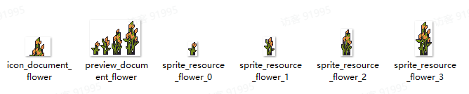

# 06 资源

Source: <https://ka7deoo0opr.feishu.cn/wiki/R8V7wQUQuiEdq8kaDRzcT1vXn5c>

Source modified label: 5月15日修改

## 一、格式要求

#### Embedded sheet `QPxkRY`

[TSV](sheets/01-01-qpxkry.tsv) · [rendered screenshot](sheets/01-01-qpxkry.png)

```tsv
类型	图片大小（像素）	作图规范
场景贴图	不限制	四周留1像素
图鉴（图标）	36*27	不限制
图鉴（详情）	不限制	四周留2像素
```

50%50%

50%


50%


33%67%

33%


67%


## 二、命名对照表

- 见06 ID对照表（资源&植被）。

## 三、参考示例

- 野花（flower）颜色调整。



- 示例路径（官方示例模组，获取方式见查看示例模组）

【创意工坊文件根目录】\示例模组\Content\01 美化模组示例\06 资源

## Links

- [06 ID对照表（资源&植被）](https://ka7deoo0opr.feishu.cn/wiki/UTmLwGzpAijYjvkhvE9czGyenud)
- [查看示例模组](https://ka7deoo0opr.feishu.cn/wiki/GmfKwSHv0i5E9EkaupNcjRdIn4d)
