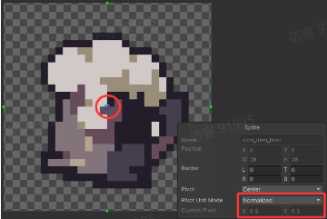
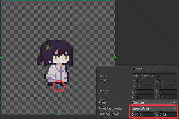
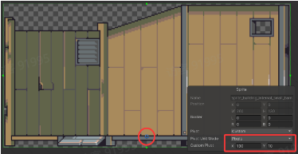
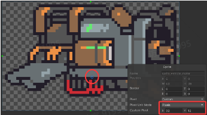

# 05 贴图锚点说明

Source: <https://ka7deoo0opr.feishu.cn/wiki/Rdp1with9ih1frk7Pl8cbFD9nDc>

Source modified label: 5月15日修改

## 1.贴图锚点

### 锚点的概念与作用

- 锚点（Pivot）可以理解为贴图用于对齐位置的参考点。

- 当游戏需要在某个坐标 A 显示贴图时，并不是直接把贴图左下角放到 A，而是会将“贴图的锚点”对准坐标 A。

- 因此，修改锚点的位置，本质上就是在调整“贴图相对于目标坐标的对齐方式”。

### 锚点的表示方式

- 锚点通常有归一化坐标和像素偏移两种表示方式。

- 归一化坐标：范围一般为 0~1

- ◦(0,0)：左下角

- ◦(0.5,0.5)：中心

- ◦(0.5,0)：底部中心

- ◦(1,1)：右上角

50%50%

50%



50%



- 像素偏移

- ◦ 表示锚点距离贴图左下角的实际像素位置。

52%48%

52%



48%



## 2.预设锚点

- 通常情况下，文件名前缀为 sprite_ 或 anim_ 的图片，其锚点会自动设置为底部中心向上偏移 2 像素的位置；其他前缀的图片，其锚点默认为中心点（0.5, 0.5）。

- 注意：以特定前缀命名图片时，会自动为图片设置不同的锚点。如果在制作模组时发现图片显示的位置与预期不符，请优先检查图片的命名是否符合规范。

#### Embedded sheet `Y0K8MC`

[TSV](sheets/01-01-y0k8mc.tsv) · [rendered screenshot](sheets/01-01-y0k8mc.png)

```tsv
特殊前缀	备注	归一化锚点位置（x, y）
anim_hat_	帽子动画	(0.5, 0.25)
sprite_hat_	帽子场景贴图	(0.5, 0.25)
anim_player_	主角本体动画	(0.5, 0.25)
anim_tool_	主角工具动画	(0.5, 0.25)
sprite_building_internal_	建筑室内场景贴图	(0.5, 0)
```

## 3.手动指定锚点

- 如果预设的锚点无法满足需求，可以通过手动配置的方式为图片指定锚点。

### 使用方法

- 在图片所在的模组目录中，创建一个与图片文件同名的 .json 文件。

- 例如想要修改图片anim_vehicle_motor_idle.png的锚点，则需要创建anim_vehicle_motor_idle.json文件，文件内容如下：

_图片meta文件示例_

```c
{
  "pivot": {
    "x": 33,  // 锚点距离水平方向最左侧的像素值
    "y": 11   // 锚点距离垂直方向最下侧的像素值
  },
  "pixels_per_unit": 8  //游戏中每单位对应的像素数（影响物体在世界中的缩放，默认为8）
}
```
