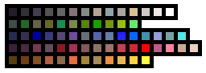
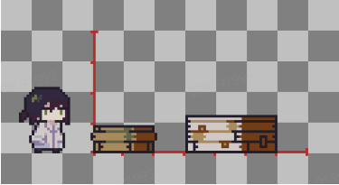

# 01 美化模组（替换现有贴图）

Source: <https://ka7deoo0opr.feishu.cn/wiki/SNOywxdl5iccH8kO413czWBKnwe>

Source modified label: 5月15日修改

## 一、如何自定义贴图

- 本模组支持自动贴图替换。你只需要将修改后的图片放入指定文件夹，游戏就会自动读取。

- 替换规则：文件名必须完全一致

- ◦按照给定格式命名图片，替换哪一帧就放哪一帧。

- ◦缺帧不影响运行，缺失的部分会自动使用游戏原有贴图补齐。

- ◦例如，想修改完整的【待机-眨眼】动画（共3帧），就把图片命名为 anim_player_idle_0.png、anim_player_idle_1.png、anim_player_idle_2.png 放进目录即可。

## 二、常见问题

Q：帧数是从 0 开始还是从 1 开始？A：从 0 开始。请确保你的第一帧命名为 _0.png。

Q：我只想改跑步的第 3 帧，其他帧不改可以吗？A：完全可以。只放 anim_player_run_2.png 这一个文件就行，第 1、2、4 帧游戏会自动使用默认贴图。

## 三、绘制建议

- 颜色：可以使用当前游戏内的调色板以保证色彩风格统一，其中颜色的排序没有固定关系，请自由组合。当然你也可以自由选择其他合适的颜色！

- ◦示例贴图位置：03 备用贴图

- 像素尺寸：不同应用场景的贴图有不同的尺寸规范，在文档的对应示例中都会有详细说明。值得注意的是，游戏中的一格建造瓦片对应的贴图像素尺寸为12px*12px，按照比例画出心仪大小的物品吧！

- 图片对齐与缩放：通常情况下按文档提供的规范为图片命名即可，如果有特殊的对齐或缩放需求，请参考05 贴图锚点说明。

## 四、详细说明

- 01 主角（本体&帽子&工具）

- 02 NPC

- 03 小动物

- 04 道具

- 05 设备

- 06 资源

- 07 建筑

- 08 平台

- 09 载具

## Links

- [03 备用贴图](https://ka7deoo0opr.feishu.cn/wiki/NKSJwBudUi9q89kN9GXcpQKwnRe)
- [05 贴图锚点说明](https://ka7deoo0opr.feishu.cn/wiki/Rdp1with9ih1frk7Pl8cbFD9nDc)
- [01 主角（本体&帽子&工具）](https://ka7deoo0opr.feishu.cn/wiki/FHmFwDuySip8M6krNnxcyR91nXg)
- [02 NPC](https://ka7deoo0opr.feishu.cn/wiki/HUAbwaN2hiWLsAkSwrJczQmun9e)
- [03 小动物](https://ka7deoo0opr.feishu.cn/wiki/POkcwjhF3iPzmikWRZ2cn8n9ncf)
- [04 道具](https://ka7deoo0opr.feishu.cn/wiki/CDfmwzDwHi4GJgksMfZcC2mqnTe)
- [05 设备](https://ka7deoo0opr.feishu.cn/wiki/OAMZwIqkLi7xw3k7JcIcvxAQnHg)
- [06 资源](https://ka7deoo0opr.feishu.cn/wiki/R8V7wQUQuiEdq8kaDRzcT1vXn5c)
- [07 建筑](https://ka7deoo0opr.feishu.cn/wiki/SqhhwDgKAi2NLhkYRgwcdWrdnff)
- [08 平台](https://ka7deoo0opr.feishu.cn/wiki/V8l8wVIUaitF7rkIBpQcSVLPnWe)
- [09 载具](https://ka7deoo0opr.feishu.cn/wiki/ApFewNFGeie7OYkImngcrxyQn2b)
