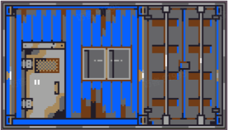
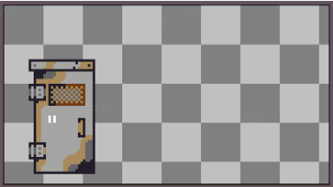
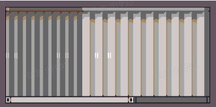
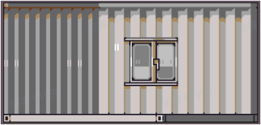
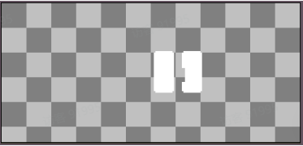
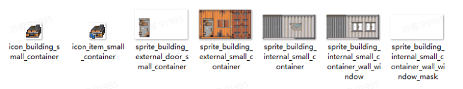

# 07 建筑

Source: <https://ka7deoo0opr.feishu.cn/wiki/SqhhwDgKAi2NLhkYRgwcdWrdnff>

Source modified label: 5月15日修改

## 一、格式要求

#### Embedded sheet `wP5BWC`

[TSV](sheets/01-01-wp5bwc.tsv) · [rendered screenshot](sheets/01-01-wp5bwc.png)

```tsv
类型	图片大小（像素）	作图规范	备注
场景贴图	不限制	四周留1px空白像素
门的贴图	和场景贴图大小一致		仅用于接触时显示描边
建筑图标	28*28
建筑蓝图图标	28*28
内部贴图	不限制	周围不留空白像素
窗户蒙版	和内部贴图大小一致		用于显示窗外景色
```

50%50%

50%



50%



25%25%50%

25%


25%


50%



50%50%

50%



50%



## 二、命名对照表

- 见07 ID对照表（建筑）。

## 三、参考案例

- 小型集装箱（small_container）颜色调整。



- 示例路径（官方示例模组，获取方式见查看示例模组）

【创意工坊文件根目录】\示例模组\Content\01 美化模组示例\07 建筑

## Links

- [07 ID对照表（建筑）](https://ka7deoo0opr.feishu.cn/wiki/OGwfwegFXiaZNKkjr3GclYglndf)
- [查看示例模组](https://ka7deoo0opr.feishu.cn/wiki/GmfKwSHv0i5E9EkaupNcjRdIn4d)
