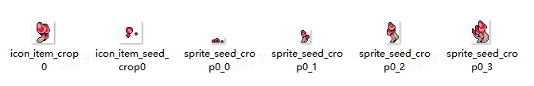

# 06 综合案例一（新增作物）

Source: <https://ka7deoo0opr.feishu.cn/wiki/V3mywFHTtiE7kfk9RUVcrrednLb>

Source modified label: 5月22日修改

## 一、整体说明

- 在01 新增作物（种子+果实）的基础上新增：

- ◦商店获取mod_tbmodstoreextension.json

- ◦作物基因信息plant_tbcropgenematrix.json

- ◦相关配方：

- ▪种子压缩机、基因读取器、植物分析仪（果实、母本）recipe_tbrecipe.json

- ▪把配方加入配方组mod_tbmodrecipegroupextension.json

- ◦档案馆提交archives_tbplantdocument.json

- ◦添加进食材组mod_tbmodingredientgroupextension.json

- ◦鱼缸喂食fishing_tbfishfeed.json

- ◦畜牧饱食度animal_tbfeed.json

- ◦畜牧贡献值animal_tbhusbandryenergy.json

- 配置示例中，标黄的字段为【需要修改的字段】。

## 二、配置示例及数据结构说明

### 1.item_tbitem.json

- 新增道具：艳丽红菌种子、艳丽红菌。

- 见01 新增作物（种子+果实）。

### 2.plant_tbseed.json

- 新增作物：艳丽红菌。

- 见01 新增作物（种子+果实）。

### 3.mod_tbmodstoreextension.json

- 种子商店（villain_shop）、全季种子商店（seasonseed_villain_shop）上架道具：艳丽红菌种子（seed_crop0）。

_道具信息-配置示例_

```json
[
//以下为在种子商店上架种子
  {
    "id": "villain_shop", //商店ID
    "extra_items": [
      {
        "item_name": "seed_crop0", //商品ID
        "storage": 0, //商品全局存量，即整局游戏最多能卖多少个（0则无存量上限）
        "default_unlock": true, //是否默认解锁
        "season_spawn_data": [ //以下分别为四个月份的商品属性
          {
            "count_range": {
              "min_count": 0, //单次出现最小数量：一月
              "max_count": 0 //单次出现最大数量：一月
            },
            "spawn_weight": 0 //商品刷新权重：一月（0则固定刷新）
          },
          {
            "count_range": {
              "min_count": 999, //单次出现最小数量数量：二月
              "max_count": 999 //单次出现最大数量：二月
            },
            "spawn_weight": 0 //商品刷新权重：二月（0则固定刷新）
          },
          {
            "count_range": {
              "min_count": 0, //单次出现最小数量数量：三月
              "max_count": 0 //单次出现最大数量：三月
            },
            "spawn_weight": 0 //商品刷新权重：三月（0则固定刷新）
          },
          {
            "count_range": {
              "min_count": 0, //单次出现最小数量数量：四月
              "max_count": 0 //单次出现最大数量：四月
            },
            "spawn_weight": 0 //商品刷新权重：四月（0则固定刷新）
          }
        ]
      }
    ]
  },
  //以下为在全季种子商店上架种子
    {
    "id": "seasonseed_villain_shop", //商店ID
    "extra_items": [
      {
        "item_name": "seed_crop0", //商品ID
        "storage": 0, //商品全局存量，即整局游戏最多能卖多少个（0则无存量上限）
        "default_unlock": true, //是否默认解锁
        "season_spawn_data": [ //以下分别为四个月份的商品属性
          {
            "count_range": {
              "min_count": 999, //单次出现最小数量：一月
              "max_count": 999 //单次出现最大数量：一月
            },
            "spawn_weight": 0 //商品刷新权重：一月（0则固定刷新）
          },
          {
            "count_range": {
              "min_count": 999, //单次出现最小数量数量：二月
              "max_count": 999 //单次出现最大数量：二月
            },
            "spawn_weight": 0 //商品刷新权重：二月（0则固定刷新）
          },
          {
            "count_range": {
              "min_count": 999, //单次出现最小数量数量：三月
              "max_count": 999 //单次出现最大数量：三月
            },
            "spawn_weight": 0 //商品刷新权重：三月（0则固定刷新）
          },
          {
            "count_range": {
              "min_count": 999, //单次出现最小数量数量：四月
              "max_count": 999 //单次出现最大数量：四月
            },
            "spawn_weight": 0 //商品刷新权重：四月（0则固定刷新）
          }
        ]
      }
    ]
  }

]
```

### 4.plant_tbcropgenematrix.json

- 新增基因信息：艳丽红菌。

_作物基因信息-配置示例_

```json
[
    {
    "id": "seed_crop0", //种子ID
    "gene_map": [
      [
        "anti_acid_rain", //角化
        0 //权重
      ],
      [
        "conifer_leaf", //针叶
        0 //权重
      ],
      [
        "time_gift", //时间馈赠
        0 //权重
      ],
      [
        "robust_health", //体质增强
        0 //权重
      ],
      [
        "spore_spray", //孢子喷射
        15 //权重
      ],
      [
        "charge", //充能
        2 //权重
      ],
      [
        "immortal_jellyfish", //灯塔水母
        3 //权重
      ],
      [
        "fractal_crop", //分形作物
        3 //权重
      ],
      [
        "wind_sow", //风媒传播
        2 //权重
      ],
      [
        "hope", //希望
        0 //权重
      ],
      [
        "florescence_extend", //花期延长
        3 //权重
      ],
      [
        "symbiotic_supply", //共生滋养
        2 //权重
      ],
      [
        "fertility_enhance", //肥力提升
        3 //权重
      ],
      [
        "bonsai", //盆景
        2 //权重
      ],
      [
        "aerial_root", //气生根
        1 //权重
      ],
      [
        "oxygen", //富氧化
        1 //权重
      ],
      [
        "grow_unchecked", //野蛮生长
        1 //权重
      ],
      [
        "sprinkler", //雨露均沾
        0 //权重
      ],
      [
        "hanabi", //昙华
        0 //权重
      ],
      [
        "parasite", //寄生体
        1 //权重
      ],
      [
        "firefly", //萤火虫
        0 //权重
      ]
    ]
  }
]
```

### 5.recipe_tbrecipe.json

- 新增配方：种子压缩、基因提取、植物分析。

_配方信息-配置示例_

```json
[
//以下为添加种子压缩配方
  {
    "id": "seed_crop0", //配方ID
    "default_unlock": true, //是否默认解锁
    "title": {
      "key": "", //配方标题（为空则根据输出道具自动生成）
      "text": "" //配方文本（为空则根据输出道具自动生成）
    },
    "cost_time": 24, //制作时间（单位为TU，即游戏内5min）
    "output_item": {
      "item_name": "seed_crop0", //输出道具的道具ID
      "min_count": 1, //最小输出数量
      "max_count": 3 //最大输出数量
    },
    "input_items": [
      {
        "item_name": "crop0", //消耗道具的道具ID
        "item_count": 1 //消耗道具数量
      }
    ],
    "recipe_sub_type": "seed", //配方小类（none，seed, ......）
    "tech_point": 1, //完成配方增加的科技点数
    "show_in_handbook": true //配方是否显示在图鉴
  },
  //以下为添加基因提取配方
  {
    "id": "gene_seed_crop0", //配方ID
    "default_unlock": true, //是否默认解锁
    "title": {
      "key": "", //配方标题（为空则根据输出道具自动生成）
      "text": "" //配方文本（为空则根据输出道具自动生成）
    },
    "cost_time": 48, //制作时间（单位为TU，即游戏内5min）
    "output_item": {
      "item_name": "gene_capsule", //输出道具的道具ID
      "min_count": 1, //最小输出数量
      "max_count": 1 //最大输出数量
    },
    "input_items": [
      {
        "item_name": "seed_crop0", //消耗道具的道具ID
        "item_count": 1 //消耗道具数量
      }
    ],
    "recipe_sub_type": "seed", //配方小类（none，seed, ......）
    "tech_point": 1, //完成配方增加的科技点数
    "show_in_handbook": false//配方是否显示在图鉴
  },
    //以下为添加植物分析配方
  {
    "id": "crop0", //配方ID
    "default_unlock": true, //是否默认解锁
    "title": {
      "key": "", //配方标题（为空则根据输出道具自动生成）
      "text": "" //配方文本（为空则根据输出道具自动生成）
    },
    "cost_time": 2, //制作时间（单位为TU，即游戏内5min）
    "output_item": {
      "item_name": "plant_research_report", //输出道具的道具ID
      "min_count": 1, //最小输出数量
      "max_count": 1 //最大输出数量
    },
    "input_items": [
      {
        "item_name": "crop0", //消耗道具的道具ID
        "item_count": 1 //消耗道具数量
      }
    ],
    "recipe_sub_type": "seed", //配方小类（none，seed, ......）
    "tech_point": 0, //完成配方增加的科技点数
    "show_in_handbook": false//配方是否显示在图鉴
  }
]
```

### 6.mod_tbmodrecipegroupextension.json

- 种子压缩机（seed_compacting_machine）、基因读取器（gene_extractor）、植物分析仪（plant_data_analyzer）分别新增对应配方。

_配方组信息-配置示例_

```json
[
  {
    "id": "seed_compacting_machine", //配方所属的设备ID
    "extra_recipes": [
      "seed_crop0" //配方ID（多个配方则用","隔开）
    ]
  },
  {
    "id": "gene_extractor", //配方所属的设备ID
    "extra_recipes": [
      "gene_seed_crop0" //配方ID（多个配方则用","隔开）
    ]
  },
    {
    "id": "plant_data_analyzer", //配方所属的设备ID
    "extra_recipes": [
      "crop0" //配方ID（多个配方则用","隔开）
    ]
  }
]
```

### 7.archives_tbplantdocument.json

1. 档案馆增加艳丽红菌的植物档案。

_档案信息-配置示例_

```json
[
    {
    "id": "crop0", //作物ID
    "title": {
      "key": "plant_document_crop0", //档案标题ID，格式为plant_document_[作物ID]
      "text": "植物档案：艳丽红菌" //档案标题文本
    },
    "author": {
      "key": "plant_document_crop0_desc", //档案简述ID，格式为plant_document_[作物ID]_desc
      "text": "[艳丽红菌的简短描述]"  //档案简述文本
    },
    "content": {
      "key": "plant_document_crop0_content", //档案详情ID，格式为plant_document_[作物ID]_desc
      "text": "[艳丽红菌的详细介绍]"   //档案简述文本
    },
    "reward": 200 //提交作物的奖励（螺母）
  }
]
```

### 8.mod_tbmodingredientgroupextension.json

- 添加艳丽红菌进食材组。

_食材信息-配置示例_

```json
[
  {
    "id": "vegetable_class", //食材组ID
    "extra_items": [
      "crop0" //道具ID
    ]
  },
  {
    "id": "mushroom_class", //食材组ID
    "extra_items": [
      "crop0" //道具ID
    ]
  },
  {
    "id": "meat_vegetable_class", //食材组ID
    "extra_items": [
      "crop0" //道具ID
    ]
  }
]
```

- 食材组ID见11 ID对照表（料理）。

### 9.fishing_tbfishfeed.json

- 添加艳丽红菌的鱼缸喂食饱食度。

_渔业喂食信息-配置示例_

```json
[
  {
    "id": "crop0", //道具ID
    "energy": 100 //饱食度
  }
]
```

### 10.animal_tbfeed.json

- 添加艳丽红菌的畜牧喂食饱食度（饲料槽）。

_畜牧喂食信息-配置示例_

```json
[
  {
    "id": "crop0", //道具ID
    "energy": 25//饱食度
  }
]
```

### 11.animal_tbhusbandryenergy.json

- 添加艳丽红菌的放牧饱食度/贡献值（作物）。

_放牧喂食信息-配置示例_

```json
[
  {
    "id": "seed_crop0", //种子ID
    "energy": 5, //饱食度
    "contribution": 1 //特殊作物贡献值
  }
]
```

## 三、参考示例



- 示例路径（官方示例模组，获取方式见查看示例模组）

【创意工坊文件根目录】\Content\03 进阶内容模组示例\06 综合案例一（新增作物）

## Links

- [01 新增作物（种子+果实）](https://ka7deoo0opr.feishu.cn/wiki/LO6uwLfSXilCHLkAymLclh1jncd)
- [11 ID对照表（料理）](https://ka7deoo0opr.feishu.cn/wiki/MZXHwVGgsieTCdkyhpycIEDnnqb)
- [查看示例模组](https://ka7deoo0opr.feishu.cn/wiki/GmfKwSHv0i5E9EkaupNcjRdIn4d)
