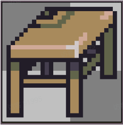
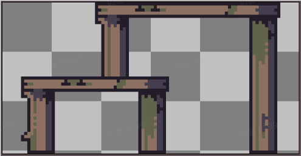
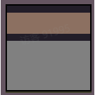
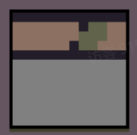
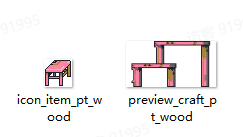
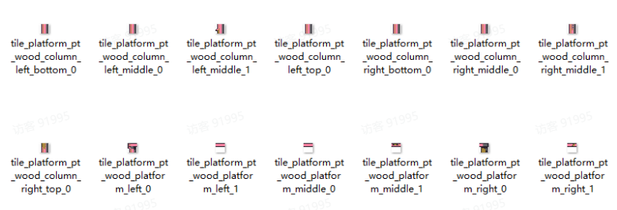

# 08 平台

Source: <https://ka7deoo0opr.feishu.cn/wiki/V8l8wVIUaitF7rkIBpQcSVLPnWe>

Source modified label: 5月15日修改

## 一、格式要求

#### Embedded sheet `jQTYer`

[TSV](sheets/01-01-jqtyer.tsv) · [rendered screenshot](sheets/01-01-jqtyer.png)

```tsv
类型	图片大小（像素）	作图规范
平台图标	28*28	整体居中
详情图（制作台）	不限制
瓦片贴图	12*12	不可超出
```

34%66%

34%



66%



20%20%20%20%20%

20%


20%


20%



20%



20%


## 二、命名对照表

- 见13 ID对照表（平台）。

## 三、参考案例

- 木制平台（pt_wood）颜色调整。





- 示例路径（官方示例模组，获取方式见查看示例模组）

【创意工坊文件根目录】\示例模组\Content\01 美化模组示例\08 平台

## Links

- [13 ID对照表（平台）](https://ka7deoo0opr.feishu.cn/wiki/Qcxww5EmSiasxfkup2rcGQpXndc)
- [查看示例模组](https://ka7deoo0opr.feishu.cn/wiki/GmfKwSHv0i5E9EkaupNcjRdIn4d)
