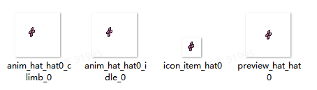
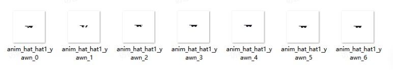
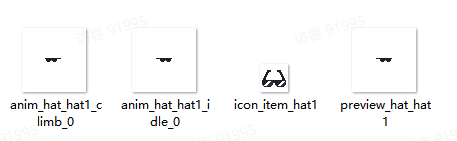
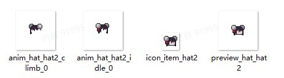

# 07 综合案例二（新增帽子）

Source: <https://ka7deoo0opr.feishu.cn/wiki/WnCwwkXA4ixLjFkx2SIcTyyIned>

Source modified label: 5月21日修改

## 一、整体说明

- 通过以下【3个】json文件的配合，实现新增并获取帽子道具的全流程：

- ◦道具信息item_tbitem.json

- ◦帽子信息player_tbhat.json

- ◦兑换商店信息mod_tbmodexchangestoreextension.json

- 游戏内操作指南：

- ◦去电话亭，选择工坊兑换部，兑换帕伊雅的头饰/墨镜/丸子造型。

- 配置示例中，标黄的字段为【需要修改的字段】。

## 二、配置示例及数据结构说明

### item_tbitem.json

- 新增道具：帕伊雅的头饰、墨镜、丸子造型。

_道具信息-配置示例（添加单个道具）_

```json
[
    //以下为新增道具：帕伊雅的头饰
    {
      "id": "hat0", //道具ID
      "sub_type": "kit_hat", //子道具类型，无特殊情况不修改
      "salable": true, //是否允许出售
      "disposable": true, //是否允许丢失
      "consumable": false, //是否为消耗品
      "cookable": false, //是否允许烹饪
      "electric_energy": 0, //提供发电量(0则不发电)
      "viewable": false, //是否显示在图鉴
      "source": [], //获取途径（显示在图鉴）
      "selling_price": 250,  //售出价格
      "buying_price": 500, //购买价格
      "overlay": 1, //堆叠上限
      "ui_sprite_asset": {
        "url": "icon_item_hat0" //道具图标，格式为：icon_item_道具ID
      },
      "title": {
        "key": "item_hat0", //道具标题ID，格式为：item_道具ID
        "text": "帕伊雅的头饰" //道具标题文本
      },
      "description_basic": {
        "key": "item_hat0_desc", //道具描述ID，格式为：item_道具ID_desc
        "text": "可爱的小花发卡，帕伊雅同款。" //道具描述文本
      },
      "function": {
        "$type": "ItemFunctionHat", //功能类型，ItemFunctionHat为帽子道具
        "hat_id": "hat0"//帽子ID，同道具ID
      }
    },
    //以下为新增道具：墨镜
    {
      "id": "hat1", //道具ID
      "sub_type": "kit_hat", //子道具类型，无特殊情况不修改
      "salable": true, //是否允许出售
      "disposable": true, //是否允许丢失
      "consumable": false, //是否为消耗品
      "cookable": false, //是否允许烹饪
      "electric_energy": 0, //提供发电量(0则不发电)
      "viewable": false, //是否显示在图鉴
      "source": [], //获取途径（显示在图鉴）
      "selling_price": 250,  //售出价格
      "buying_price": 500, //购买价格
      "overlay": 1, //堆叠上限
      "ui_sprite_asset": {
        "url": "icon_item_hat1" //道具图标，格式为：icon_item_道具ID
      },
      "title": {
        "key": "item_hat1", //道具标题ID，格式为：item_道具ID
        "text": "墨镜" //道具标题文本
      },
      "description_basic": {
        "key": "item_hat1_desc", //道具描述ID，格式为：item_道具ID_desc
        "text": "扮得酷酷的！" //道具描述文本
      },
      "function": {
        "$type": "ItemFunctionHat", //功能类型，ItemFunctionHat为帽子道具
        "hat_id": "hat1"//帽子ID，同道具ID
      }
    },
    //以下为新增道具：丸子造型
    {
      "id": "hat2", //道具ID
      "sub_type": "kit_hat", //子道具类型，无特殊情况不修改
      "salable": true, //是否允许出售
      "disposable": true, //是否允许丢失
      "consumable": false, //是否为消耗品
      "cookable": false, //是否允许烹饪
      "electric_energy": 0, //提供发电量(0则不发电)
      "viewable": false, //是否显示在图鉴
      "source": [], //获取途径（显示在图鉴）
      "selling_price": 250,  //售出价格
      "buying_price": 500, //购买价格
      "overlay": 1, //堆叠上限
      "ui_sprite_asset": {
        "url": "icon_item_hat2" //道具图标，格式为：icon_item_道具ID
      },
      "title": {
        "key": "item_hat2", //道具标题ID，格式为：item_道具ID
        "text": "丸子造型" //道具标题文本
      },
      "description_basic": {
        "key": "item_hat2_desc", //道具描述ID，格式为：item_道具ID_desc
        "text": "把头发扎好缀上流苏的喜庆造型，不能捏！" //道具描述文本
      },
      "function": {
        "$type": "ItemFunctionHat", //功能类型，ItemFunctionHat为帽子道具
        "hat_id": "hat2"//帽子ID，同道具ID
      }
    }
]
```

### player_tbhat.json

录入帽子信息：帕伊雅的头饰、墨镜、丸子造型。

_帽子信息-配置示例_

```json
[
    //以下为新增帽子：帕伊雅的头饰
    {
      "id": "hat0", //帽子ID，同道具ID
      "skill": "",  //技能ID，无特殊情况为空
      "defense": 0, //提供防御力
      "idle_sprite": {
        "url": "anim_hat_hat0_idle_0" //帽子贴图-正面，格式为：anim_hat_[帽子ID]_idle_0
      },
      "climb_sprite": {
        "url": "anim_hat_hat0_climb_0" //帽子贴图-翻转，格式为：anim_hat_[帽子ID]_climb_0
      },
      "preview": {
        "url": "preview_hat_hat0" //帽子贴图-展示台，格式为：preview_hat_[帽子ID]
      },
      "animator": {
        "url": "" //帽子动画机，留空
      },
      "material": {
        "url": "" //帽子材质，留空
      },
      "prefab": {
        "url": "" //帽子预制体，留空
      },
    "hide_hair": false // 是否需要隐藏原本的发型(false: 不需要，true: 需要)
    },

    //以下为新增帽子：墨镜
    {
        "id": "hat1",
        "skill": "",
        "defense": 0,
        "idle_sprite": {
          "url": "anim_hat_hat1_idle_0" //帽子贴图-正面，格式为：anim_hat_[帽子ID]_idle_0
        },
        "climb_sprite": {
          "url": "anim_hat_hat1_climb_0" //帽子贴图-翻转，格式为：anim_hat_[帽子ID]_climb_0
        },
        "preview": {
          "url": "preview_hat_hat1" //帽子贴图-展示台，格式为：preview_hat_[帽子ID]
        },
        "animator": {
          "url": "" //帽子动画机，留空
        },
        "material": {
          "url": "" //帽子材质，留空
        },
        "prefab": {
          "url": "" //帽子预制体，留空
        },
        "hide_hair": false // 是否需要隐藏原本的发型(false: 不需要，true: 需要)
    },

    //以下为新增帽子：丸子造型
    {
      "id": "hat2", //帽子ID，同道具ID
      "skill": "",  //技能ID，无特殊情况为空
      "defense": 0, //提供防御力
      "idle_sprite": {
        "url": "anim_hat_hat2_idle_0" //帽子贴图-正面，格式为：anim_hat_[帽子ID]_idle_0
      },
      "climb_sprite": {
        "url": "anim_hat_hat2_climb_0" //帽子贴图-翻转，格式为：anim_hat_[帽子ID]_climb_0
      },
      "preview": {
        "url": "preview_hat_hat2" //帽子贴图-展示台，格式为：preview_hat_[帽子ID]
      },
      "animator": {
        "url": "" //帽子动画机，留空
      },
      "material": {
        "url": "" //帽子材质，留空
      },
      "prefab": {
        "url": "" //帽子预制体，留空
      },
      "hide_hair": true // 是否需要隐藏原本的发型(false: 不需要，true: 需要)
    }
]
```

### mod_tbmodexchangestoreextension.json

- 兑换商店工坊兑换部（phone_booth_exchange_shop）上架道具：帕伊雅的头饰（hat0）、墨镜（hat1）、丸子造型（hat2）。

_配方信息-配置示例_

```json
[
  {
    "id": "phone_booth_exchange_shop", //兑换商店ID
    "extra_items": [
    //以下为上架帽子：帕伊雅的头饰
      {
        "ranged_item": {
          "item_name": "hat0", //商品ID
          "min_count": 1, //最小输出数量
          "max_count": 1 //最大输出数量
        },
        "storage": 0, //商品全局存量，即整局游戏最多能卖多少个（0则无存量上限）
        "gold_cost": 100, //消耗金币数量（-1则根据道具售价自动填写）
        "item_costs": [
          {
            "item_name": "weeds", //消耗道具ID
            "item_count": 10 //消耗道具数量
          },
          {
            "item_name": "monster_drop_chomper", //消耗道具ID
            "item_count": 1 //消耗道具数量
          }
        ],
        "pre_condition_item_name": "", //前置商品ID
        "pre_condition_item_count": 0, //前置商品数量
        "tech_point": 1, //增加科技点点数
        "default_unlock": true //是否默认解锁
      },
      //以下为上架帽子：墨镜
      {
        "ranged_item": {
          "item_name": "hat1", //商品ID
          "min_count": 1, //最小输出数量
          "max_count": 1 //最大输出数量
        },
        "storage": 0, //商品全局存量，即整局游戏最多能卖多少个（0则无存量上限）
        "gold_cost": -1, //消耗金币数量（-1则根据道具售价自动填写）
        "item_costs": [], //消耗道具
        "pre_condition_item_name": "", //前置商品ID
        "pre_condition_item_count": 0, //前置商品数量
        "tech_point": 1, //增加科技点点数
        "default_unlock": true //是否默认解锁
      },
      //以下为上架帽子：丸子造型
      {
        "ranged_item": {
          "item_name": "hat2", //商品ID
          "min_count": 1, //最小输出数量
          "max_count": 1 //最大输出数量
        },
        "storage": 0, //商品全局存量，即整局游戏最多能卖多少个（0则无存量上限）
        "gold_cost": -1, //消耗金币数量（-1则根据道具售价自动填写）
        "item_costs": [], //消耗道具
        "pre_condition_item_name": "", //前置商品ID
        "pre_condition_item_count": 0, //前置商品数量
        "tech_point": 1, //增加科技点点数
        "default_unlock": true //是否默认解锁
      }
    ]
  }
]
```

## 三、图片格式要求

#### Embedded sheet `YiF9Kb`

[TSV](sheets/01-01-yif9kb.tsv) · [rendered screenshot](sheets/01-01-yif9kb.png)

```tsv
类型	图片大小（像素）	作图规范
帧动画	64*64	同对应主角帧动画
图标（道具）	28*28	整体居中
场景贴图（展示台）	64*64	整体居中
```

## 四、图片命名对照表

#### Embedded sheet `IzRIs9`

[TSV](sheets/02-01-izris9.tsv) · [rendered screenshot](sheets/02-01-izris9.png)

```tsv
名称	帽子ID	命名格式
帕依雅的头饰
帧动画（角色默认）	hat0	anim_hat_hat0_idle_0
帧动画（角色攀爬）	hat0	anim_hat_hat0_climb_0
图标（道具）	hat0	icon_item_hat0
场景贴图（展示台）	hat0	preview_hat_hat0
墨镜
帧动画（角色默认）	hat1	anim_hat_hat1_idle_0
帧动画（角色攀爬）	hat1	anim_hat_hat1_climb_0
图标（道具）	hat1	icon_item_hat1
场景贴图（展示台）	hat1	preview_hat_hat1
丸子造型
帧动画（角色默认）	hat2	anim_hat_hat2_idle_0
帧动画（角色攀爬）	hat2	anim_hat_hat2_climb_0
图标（道具）	hat2	icon_item_hat2
场景贴图（展示台）	hat2	preview_hat_hat2
```

#### Embedded sheet `IT0ukI`

[TSV](sheets/03-01-it0uki.tsv) · [rendered screenshot](sheets/03-01-it0uki.png)

```tsv
动作	动作ID	帧数	帽子ID	命名格式
待机-哈欠	yawn	7	hat1	anim_hat_hat1_yawn_[0~6]
```

## 五、参考示例

- 新增静态帽子帕伊雅的头饰（hat0），并上架兑换商店工坊兑换部（phone_booth_exchange_shop）。



- 新增动态帽子墨镜（hat1），并上架兑换商店工坊兑换部（phone_booth_exchange_shop）。





- 新增造型帽子丸子造型（hat2），并上架兑换商店工坊兑换部（phone_booth_exchange_shop）。



- 示例路径（官方示例模组，获取方式见查看示例模组）

【创意工坊文件根目录】\Content\02 基础内容模组示例\07 综合案例二（新增帽子）

## Links

- [查看示例模组](https://ka7deoo0opr.feishu.cn/wiki/GmfKwSHv0i5E9EkaupNcjRdIn4d)
