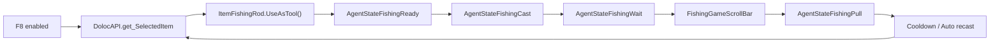

# Doloc Town Modding API Notes

这份笔记整理自 `AutoFishingMod`、`ActionSpeedMod` 和 `OneActionCompleteMod` 当前实际访问或验证过的 Doloc Town 游戏类型、函数、属性和私有字段，供其他 BepInEx/Harmony Mod 作者参考。

当前参考项目来源：

```text
private-predecessor-workspace/src/mods/AutoFishingMod
private-predecessor-workspace/ActionSpeedMod
private-predecessor-workspace/OneActionCompleteMod
```

游戏程序集：

```text
<Doloc Town install>/DolocTown_Data/Managed/Assembly-CSharp.dll
```

## 基本结论

- Doloc Town 没有看到面向第三方 Mod 的稳定公开 SDK，本项目主要通过 BepInEx 5、Harmony 和反射访问 `Assembly-CSharp.dll`。
- `DolocAPI` 是最有用的静态入口，能拿到输入、当前选中物品、存档句柄、全局参数、体力、鱼类解锁状态等。
- 钓鱼自动化最有效的方式不是直接伪造键盘，而是 Patch `DolocUserInput` 的输入属性，让游戏自己的钓鱼状态机继续执行。
- 动作加速更稳妥的方式是只临时修改 `Animator.speed`，离开对应状态后恢复，不直接改资源血量、食物效果或掉落。
- 一键完成资源时应让原版一次命中先执行，再按资源剩余血量调用原版 `_Fell(ResourceFellData)` 补足，尽量保留掉落、统计、工具等级和体力流程。
- 钓鱼流程由 `AgentStateFishingReady -> AgentStateFishingCast -> AgentStateFishingWait -> FishingGameScrollBar -> AgentStateFishingPull` 组成。
- 很多关键数据是 private field，游戏更新后字段名可能变化，生产 Mod 应做好空值判断和日志降级。

## 当前自动钓鱼流程



## DolocAPI 静态入口

这些入口通过 `AccessTools.TypeByName("DolocAPI")` 找到，再用反射调用。

| 成员 | 返回/参数 | 当前用途 |
| --- | --- | --- |
| `get_UserInput()` | `DolocTown.DolocUserInput` | 读取游戏内移动、跳跃、冲刺、菜单、取消输入，用于手动操作时关闭自动钓鱼。 |
| `get_SelectedItem()` | `DolocTown.Item` | 获取当前快捷栏选中物品，用于判断是否手持鱼竿，并调用 `UseAsTool()` 开始钓鱼。 |
| `get_archiveHandle()` | `DolocTown.GameData.ArchiveDataHandle` | 获取当前存档句柄，用于鱼类信息菜单读取日期、时间、天气。 |
| `get_GlobalParameter()` | `DolocTown.Config.Settings.GlobalParameter` | 读取全局钓鱼参数、体力消耗、瓶装水白名单等，如 `FishingRollInterval`、`PullTiming`、`ToolEnergyCost`、`WaterItems`。 |
| `get_IsAgentInWater()` | `bool` | 判断角色是否在水中，可用于手持塑料瓶自动装水。 |
| `HasEnoughEnergyForUsingTool()` | `bool` | 判断当前体力是否足够支付一次工具动作。 |
| `CostToolEnergy()` | `bool` | 按原游戏逻辑扣一次工具体力；体力不足时会返回 `false`。 |
| `ChangeEnergy(float value)` | `void` | 直接修改体力。一键完成按完整命中次数补扣体力时可用负数，并让低体力最低扣到 0。 |
| `QueryItemProto(string name, out ItemInfo proto)` | `bool` | 通过物品名查询物品配置。workshop 分支中燃料能量改从 `ItemInfo.ElectricEnergy` 读取。旧版 `QueryFuelItemProto` 在当前分支已不可用。 |
| `ShowMessageBoxSmall(string msg, float duration)` | `void` | 轻量提示。当前用于 Mod 开关状态提示等。 |

可选但当前项目没有实现的相关入口：

| 成员 | 用途判断 |
| --- | --- |
| `CheckFishUnlocked(string fishId)` | 可判断鱼类是否解锁；当前只在打开 F9 鱼类页或点击 `刷新` 的快照刷新中调用，不在每次 IMGUI 绘制时调用。 |
| `get_CurrentWater()` | 可能用于识别当前水体，但 1.4.0 未实现当前水域鱼池。 |
| `RollFish(string poolName, int toolLv)` | 可按鱼池名和工具等级抽鱼；当前自动钓鱼走状态机自己的 `AgentStateFishing.RollFish()`，不直接调用此入口。 |
| `RollFishByRarity(...)` | 可能用于按稀有度抽鱼；当前项目未使用。 |

## 输入系统 DolocUserInput

### 用 Harmony 注入的输入属性

本项目使用 Harmony Postfix 修改这些 getter 的返回值。原则是：如果游戏原本已经返回 `true`，不覆盖；如果原本是 `false` 且自动钓鱼需要输入，则改成 `true`。

| Patch 目标 | 当前用途 |
| --- | --- |
| `DolocTown.DolocUserInput.get_NormalUseTool` | 自动开始使用当前鱼竿。 |
| `DolocTown.DolocUserInput.get_NormalUseToolInProgress` | 在起钓阶段维持工具输入。 |
| `DolocTown.DolocUserInput.get_NormalFishing` | 咬钩时收杆；小游戏中点击黄色 Bonus 条。 |
| `DolocTown.DolocUserInput.get_NormalFishingInProgress` | 咬钩/收杆期间维持钓鱼输入。 |
| `DolocTown.FishingGameScrollBar.get_IsFishingKeyPushed` | 小游戏中按住绿色 Stable 条、点击黄色 Bonus 条。 |

### 只读取的输入属性

这些属性用于检测玩家是否手动干预。检测到后自动钓鱼会关闭。

| 属性 | 用途 |
| --- | --- |
| `NormalIsMovePressed` | 移动键。 |
| `NormalJump` | 跳跃。 |
| `NormalDash` | 冲刺。 |
| `GlobalToggleMenu` | 打开菜单。 |
| `GlobalIsCancelPressed` | 取消/返回。 |

### 右键长按注意事项

`DolocUserInput.GlobalRightClickInProgress` 是游戏层面的“右键动作进行中”状态，不适合作为“真实鼠标右键正在按住”的唯一判断。实测在连续喝瓶装水这类自动动作里，用它会出现只要手持水就持续触发的风险。

需要实现“按住右键才连续执行”时，优先读原始鼠标输入：

```csharp
bool rightClickHeld = Input.GetMouseButton(1) || (GetAsyncKeyState(0x02) & 0x8000) != 0;
```

再叠加物品白名单判断，例如瓶装水连续饮用应同时满足：

- 当前选中物品实现 `DolocTown.IEatable`。
- 当前物品 `name` 存在于 `DolocAPI.GlobalParameter.WaterItems`。
- 如果 `WaterItems` 读取失败，直接禁用连续饮用，避免误吃其他食物。

性能建议：这些 getter 高频读取时最好缓存 `MethodInfo`。当前项目用 `Dictionary<string, MethodInfo>` 缓存布尔属性 getter，避免每帧反复反射查找。

## 当前选中物品与鱼竿

| 类型/成员 | 当前用途 |
| --- | --- |
| `DolocTown.ItemFishingRod` | 判断当前选中物品是否是鱼竿。 |
| `ItemFishingRod._function` | private field，类型为 `DolocTown.Config.Item.ItemFunctionFishingRod`，用于读取鱼竿功能配置。 |
| `Item.proto` | 如果 `_function` 读取失败，尝试从 `proto.Function` 兜底。 |
| `Item.title` / `Item.name` | 读取当前物品显示名，用于 F9 信息菜单显示鱼竿名称，并作为鱼竿等级推断兜底。 |
| `ItemProto.Function` | 物品功能配置兜底入口。 |
| `ItemFunctionFishingRod.Level` | 鱼竿等级。当前用于 F9 鱼类信息页顶部显示手持鱼竿等级。 |
| `UseAsTool()` | 在选中物品类型层级中反射查找并调用，用于让鱼竿按原游戏流程开始使用。 |
| `UseAsItem()` | 反射调用当前选中物品的物品使用流程。连续饮用瓶装水时调用此方法。 |
| `Item.CostSelf(out Item next, bool ...)` | 消耗当前堆叠中的一个物品。燃料机/饲料槽自动填充时要先消耗物品，再补机器状态。 |
| `DolocTown.IEatable` | 可食用/可饮用接口。连续喝水只应在当前物品实现该接口且命中水类白名单时触发。 |
| `DolocTown.ItemBottle` | 塑料瓶/瓶装水相关类型。`OnUseAsTool` 可触发装水，`OnUseAsItem` 可触发饮用。 |

当前等级推断：

| 等级 | 文本 |
| --- | --- |
| `1` | 简易鱼竿及以上 |
| `2` | 老旧鱼竿及以上 |
| `3` | 竹鱼竿及以上 |
| `4+` | 碳纤维等更高等级鱼竿 |

注意：鱼竿等级应优先使用 `ItemFunctionFishingRod.Level`，文本推断只适合作为兜底。

## 钓鱼状态机 Patch 点

| 类型/方法 | Patch 时机 | 当前用途 |
| --- | --- | --- |
| `AgentStateFishingReady.OnEnter()` | Postfix | 进入抛竿蓄力状态；切换内部 phase；可加速角色/鱼竿 Animator。 |
| `AgentStateFishingReady.OnPlay()` | Postfix | 读取蓄力进度，达到配置进度后释放抛竿。 |
| `AgentStateFishingCast.OnEnter()` | Postfix | 进入抛竿飞行状态；可加速动画。 |
| `FishRodRenderer.CastHook()` | Postfix | 钩子真正抛出后，修改钩子速度和重力来加速飞行。 |
| `AgentStateFishingWait.OnEnter()` | Prefix + Postfix | Prefix 恢复动画速度；Postfix 进入等待咬钩状态，可实现秒咬钩。 |
| `FishingGameScrollBar.StartGame(...)` | Postfix | 进入钓鱼小游戏；记录小游戏实例；可跳过小游戏。 |
| `FishingGameScrollBar.StopGame()` | Postfix | 清理小游戏缓存。 |
| `AgentStateFishingPull.OnEnter()` | Prefix + Postfix | Prefix 恢复动画速度；Postfix 进入收杆状态，可缩短收杆时长。 |
| `AgentStateFishingPull.OnExit()` | Postfix | 收杆结束后恢复动画速度，并调度下一次自动抛竿。 |

## 抛竿阶段 AgentStateFishingReady

| 成员 | 类型 | 当前用途 |
| --- | --- | --- |
| `_castTimer` | `RedSaw.CastTimer` | private field。读取其 `Progress` 属性，判断抛竿蓄力进度。 |
| `_castTimer.Progress` | `float` | 当达到 `CastReleaseProgress` 后停止维持 `NormalUseToolInProgress`，让游戏进入抛竿。 |

当前默认 `CastReleaseProgress = 0`，等于跳过蓄力。

## 等待咬钩 AgentStateFishingWait

| 成员 | 类型 | 当前用途 |
| --- | --- | --- |
| `_waitForFishBite` | `bool` | 判断是否还在等待咬钩。 |
| `_fishOnHookDuration` | `float` | 判断鱼是否已经上钩；大于 0 时触发收杆输入。 |
| `_tuCounter` | `RedSaw.RSTimer` | 旧版 `FastMode` 用它调咬钩 roll 间隔。 |
| `_hasRolled` | `bool` | 秒咬钩时标记已经 RollFish。 |
| `_hookProbability` | `float` | 秒咬钩时设为 `1f`。 |
| `AgentStateFishing.RollFish()` | `bool` | 秒咬钩时先调用原状态机抽鱼，保留当前鱼池和原收获流程。 |

秒咬钩实现要点：

1. 在 `AgentStateFishingWait.OnEnter` 后调用 `RollFish()`。
2. 将 `_hasRolled = true`。
3. 将 `_hookProbability = 1f`。
4. 将 `_waitForFishBite = false`。
5. 将 `_fishOnHookDuration` 设为至少 `PullTiming` 或一个小正数。

这样后续仍然走游戏原本 hook、小游戏、收杆和结算流程。

## 小游戏 FishingGameScrollBar

| 成员 | 类型 | 当前用途 |
| --- | --- | --- |
| `currentNote` | `DolocTown.FishingNoteData` | 当前判定条。 |
| `currentTime` | `float` | 小游戏当前时间轴。 |
| `currentGameStatus` | `FishingGameController.GameStatus` | 跳过小游戏时设置为成功状态。 |
| `fishStamina` | `int` | 跳过小游戏时作为成功分数参考。 |
| `currentScore` | `float` | 跳过小游戏时设为 `fishStamina` 或更高。 |
| `RefreshProgress()` | `void` | 修改分数/状态后刷新小游戏进度。 |
| `get_IsFishingKeyPushed` | `bool` | Patch 该属性来完成小游戏输入。 |

`FishingNoteData` 当前用到：

| 成员 | 用途 |
| --- | --- |
| `noteType` | 区分 `Stable` 绿色长条和 `Bonus` 黄色短条。 |
| `startTime` / `endTime` | 判断当前是否在可按区间。 |
| `index` | 避免黄色 Bonus 条重复点击。 |

小游戏自动输入逻辑：

- `FishingNoteType.Stable`：在 `[startTime + reactionDelay, endTime]` 区间内维持按下。
- `FishingNoteType.Bonus`：每个 note index 只触发一帧点击。

跳过小游戏实现：

1. 在 `FishingGameScrollBar.StartGame` 后运行。
2. 读取 `fishStamina`。
3. 设置 `currentScore = max(1, fishStamina)`。
4. 将 `currentGameStatus` 设置为成功枚举值。
5. 调用 `RefreshProgress()`。

## 收杆 AgentStateFishingPull

| 成员 | 类型 | 当前用途 |
| --- | --- | --- |
| `_pullDuration` | `float` | private field。快速动画开启时除以倍率，缩短收杆时间。 |
| `OnEnter()` | `void` | 进入收杆状态时应用动画加速和 `_pullDuration` 缩短。 |
| `OnExit()` | `void` | 恢复动画速度，调度下一轮自动抛竿。 |

## 动画与鱼钩物理

| 类型/成员 | 当前用途 |
| --- | --- |
| `AgentStateBase.body` | private field。当前状态对应的 `BodyController`。通过 `AccessTools.TypeByName("AgentStateBase")` 找字段。 |
| `BodyController.animator` | private field，角色 Animator。快速动画时临时修改 `speed`。 |
| `BodyController.fishRodRenderer` | private field，鱼竿渲染器。 |
| `FishRodRenderer._animator` | private field，鱼竿 Animator。快速动画时临时修改 `speed`。 |
| `FishRodRenderer._hook` | private field，当前鱼钩对象。 |
| `FishRodHook.Velocity` | `Vector2`，抛钩后按倍率放大速度。 |
| `FishRodHook.GetComponent<Rigidbody2D>()` | 获取鱼钩刚体。 |
| `Rigidbody2D.gravityScale` | 抛钩后按 `multiplier * multiplier` 放大，尽量保持轨迹形状但缩短飞行时间。 |

重要：任何 Animator speed 和 gravityScale 修改都要缓存原值，并在进入等待、进入收杆、收杆结束、禁用自动钓鱼或状态重置时恢复。否则速度可能残留到走路或其他动作。

## 当前时间、天气、鱼类信息菜单

鱼类信息菜单通过存档句柄读取运行时环境快照，再用内置 Wiki 数据筛选当前月份鱼类。为避免 IMGUI 掉帧，1.4.0 只在打开菜单或点击 `刷新` 时刷新快照，不在每次绘制时持续轮询。

| 类型/成员 | 当前用途 |
| --- | --- |
| `DolocAPI.get_archiveHandle()` | 获取 `ArchiveDataHandle`。 |
| `ArchiveDataHandle.DateNow` | 当前日期时间。 |
| `ArchiveDataHandle.CurrentWeatherType` | 当前天气枚举。 |
| `DateInfo.MonthShown` | 当前显示月份，优先使用。 |
| `DateInfo.Month` | 月份兜底。 |
| `DateInfo.DayShown` / `DateInfo.Day` | 当前日期。 |
| `DateInfo.Hour` | 当前小时。 |
| `DateInfo.Minute` | 当前分钟。 |
| `WeatherType` | 当前项目用 `ToString()` 得到 `RAIN`、`THUNDERSTORM`、`ACID_RAIN`、`SCORCH_SUN` 等键，仅用于顶部快照显示。 |
| `DolocAPI.CheckFishUnlocked(string fishId)` | 快照刷新时判断非默认阶段鱼是否已经解锁，用于显示 `[未解锁: ...]`。 |

已确认的天气枚举字符串：

| 键 | 中文 |
| --- | --- |
| `SUNNY` | 晴天 |
| `CLOUDY` | 多云 |
| `RAIN` | 雨天 |
| `THUNDERSTORM` | 雷雨 |
| `WINDY` | 大风 |
| `ACID_RAIN` | 酸雨 |
| `SCORCH_SUN` | 烈日 |
| `NONE` | 无 |

当前 1.4.0 没有实现当前水域识别或鱼池概率。未来可继续研究：

- `DolocAPI.get_CurrentWater()`
- `DolocTown.InteractiveWater`
- `DolocTown.FishingPool`
- `DolocTown.Config.Fishing.FishingPoolInfo`
- `DolocTown.Config.Fishing.TbFishingPools`

## 全局参数 GlobalParameter

| 参数名 | 当前用途 |
| --- | --- |
| `FishingRollInterval` | 旧版 FastMode 用于调整等待咬钩 roll 间隔。 |
| `PullTiming` | 秒咬钩时作为 `_fishOnHookDuration` 的参考值。 |

读取方式：

```csharp
object parameter = GetDolocStaticProperty("GlobalParameter", "get_GlobalParameter");
float value = ReadPropertyFloat(parameter, "FishingRollInterval", 1f);
```

## 工具与通用动作加速

### AgentStateTool

工具动作加速可以 Patch `DolocTown.AgentStateTool.OnEnter/OnExit`。只改动画速度时，命中次数、工具伤害、体力消耗、掉落都仍由原游戏处理。

| 成员 | 类型 | 用途 |
| --- | --- | --- |
| `AgentStateTool.tool` | `DolocTown.ItemTool` | 当前工具。 |
| `ItemTool.ToolType` | `DolocTown.Config.Item.ToolType` | 区分 `AXE`、`PICKAXE`、`SICKLE` 等。 |
| `AgentStateBase.body` | private field | 从状态对象取 `BodyController`。 |
| `BodyController.animator` | private field | 角色 Animator。 |
| `BodyController.ToolRenderer` | `DolocTown.ToolRenderer` | 当前工具渲染器。 |
| `ToolRenderer.animator` | private field | 工具 Animator。 |
| `ToolRenderer._collider` | private field | `ToolCollider` 实例。 |
| `ToolCollider._animator` | private field | 工具碰撞器 Animator。 |

实测工具动画倍率 `5x` 会提高碰撞窗口丢帧概率，尤其和一键完成 Mod 共存时可能打不到铜矿；建议工具和其他动作倍率统一限制到 `4x`。

### AgentStateInteract

很多非工具动作都通过 `BodyController._Interact(callback, "interact")` 进入 `DolocTown.AgentStateInteract`。可先在具体对象的 `OnInteract` 或物品使用入口里记录“下一次 interact 属于哪类动作”，再 Patch `AgentStateInteract.OnEnter/OnExit` 加速并恢复角色 Animator。

| 成员 | 类型 | 用途 |
| --- | --- | --- |
| `BodyController._Interact(Action callback, string animName = "interact")` | `void` | 进入交互状态并在动画时机执行 callback。 |
| `AgentStateInteract.currentName` | private `string` | 当前交互动画名，装水/采摘/加料通常是 `"interact"`。 |
| `AgentStateInteract.OnEnter()` | 方法 | 应用角色 Animator 倍率。 |
| `AgentStateInteract.OnExit()` | 方法 | 恢复 Animator。 |

建议 pending 标记设置短超时，例如 `0.75s`。如果具体 `OnInteract` 因条件不满足没有进入 `_Interact`，pending 会自动过期，不污染下一次交互。

## 采摘与收获入口

这些入口已确认会在可收获时进入 `_Interact(..., "interact")`，适合归为“采摘/收获动作加速”。

| 类型/方法 | 判断条件 | 回调行为 |
| --- | --- | --- |
| `PlantBasin.OnInteract()` | `CouldHarvest == true` | 回调里 `Harvest(false, true)`。 |
| `PlantBasinGrass.OnInteract()` | private `crops` 中存在 `ForageGrass.IsMature` | 回调里遍历成熟草料并 `Harvest(...)`。 |
| `VegetationBerryThicket.OnInteract()` | `currentLevel >= maxLevel` | 蓝莓类野外采集，回调生成掉落并再生。 |
| `VegetationGrowLuminous.OnInteract()` | `currentLevel >= maxLevel` | 磷虫草等发光生长型野外采集。 |
| `VegetationCrop.OnInteract()` | `currentLevel >= maxLevel` | 一次性野外作物采集，回调生成掉落并移除。 |
| `ResinCollector.OnInteract()` | private `currentValue > 0` | 树脂收集器采集。`currentValue <= 0` 时仍会进入交互动画，但只弹表情，不应标记加速。 |

野外植被成熟判断可用反射读取 `currentLevel` 和 `maxLevel`。读不到时应保守跳过，不要把普通交互误标为采摘。

## 瓶子装水与连续喝水

| 类型/方法 | 用途 |
| --- | --- |
| `ItemBottle.OnUseAsTool()` | 手持塑料瓶作为工具使用，通常用于在水中装水。 |
| `ItemBottle.OnUseAsItem()` | 瓶装水作为物品使用，触发饮用。 |
| `DolocAPI.get_IsAgentInWater()` | 自动装水前判断角色是否在水里。 |
| `DolocAPI.GlobalParameter.WaterItems` | 水类饮品白名单。 |

自动装水可以在 `Update()` 中判断“自动装水开关开启 + 角色在水中 + 当前选中物品是 `ItemBottle`”，再按冷却间隔调用当前物品 `UseAsTool()`。连续喝水可以调用 `UseAsItem()`，但必须使用右键真实按住状态和 `WaterItems` 白名单共同限制。

## 资源一键完成

### ToolCollider.HandleTools

工具资源命中最终会进入 private `DolocTown.ToolCollider.HandleTools(Collider2D other)`。一键完成建议使用 Prefix 捕获命中前状态，Postfix 等原版一次命中成功后再补足剩余血量。

| 成员 | 类型 | 用途 |
| --- | --- | --- |
| `ToolCollider.currentTool` | private `ItemTool` | 当前工具。 |
| `ToolCollider._hitbox` | private `Collider2D` | 当前工具命中盒，可用中心点算 hitPoint。 |
| `ToolCollider.chopCounter` | private `int` | 部分资源会限制一次动作内可结算次数。 |
| `ToolCollider.shouldCostEnergy` | private `bool` | 当前命中是否应消耗体力。 |
| `other.GetComponent<IFellable>()` | `DolocTown.IFellable` | 资源可被工具击打的接口。 |
| `IFellable.ShouldCostEnergy` | `bool` | 是否要扣工具体力。 |
| `IFellable.ShouldCostChopCounter` | `bool` | 是否消耗 `chopCounter`。 |
| `DungeonResourceRenderer.DungeonResource` | `DolocTown.DungeonResource` | 命中的实际资源对象。 |
| `DungeonResource.currentHealth` | `int` | 命中前后血量。 |
| `ResourceFellData(DungeonResource, ItemTool, Vector2)` | 构造函数 | 按原游戏规则计算工具等级、伤害、掉落覆盖等。 |
| `DungeonResource._Fell(ResourceFellData)` | 方法 | 用原版逻辑处理剩余伤害、掉落、统计和特效。 |

可靠流程：

1. Prefix 读取 `currentTool`、`IFellable`、`DungeonResource`、命中前 `currentHealth`。
2. 构造 `new ResourceFellData(resource, tool, hitPoint)`，检查 `Valid`。
3. 若需要遵守工具等级，检查 `fellData.levelMatch`。
4. Postfix 判断原版一次命中是否成功，例如资源血量下降或 `chopCounter` 下降。
5. 按命中前血量和单次有效伤害计算完整命中次数，补扣剩余体力。
6. 若资源还有剩余血量，构造 `new ResourceFellData(true, toolLevel, remainingHealth, hitPoint, false, false, overrideSpawnLut)` 并调用 `_Fell(...)`。

矿石的有效伤害要额外考虑：

```csharp
damage += DolocAPI.AgentEquipmentParams.fellCoundAdditionOre;
```

体力结算建议和游戏体验保持一致：低体力允许完成当前动作，但补扣时最低扣到 0。可用 `DolocAPI.ChangeEnergy(-remainingCost)`，不要为了低体力单独阻断一键完成。

### 已确认资源类型

| 类型 | 分类 | 一键完成建议 |
| --- | --- | --- |
| `DungeonResourceTree` | 树 | 斧头一键完成。 |
| `DungeonResourceTreeTrunk` | 树桩/树干 | 斧头一键完成。 |
| `DungeonResourceOre` | 矿石 | 镐子一键完成，矿石伤害有额外加成。 |
| `DungeonResourceWeeds` | 草/杂草 | 镰刀一键完成。 |
| `DungeonResourceWeedsSmall` | 小草 | 继承 `DungeonResourceWeeds`，同上。 |
| `DungeonResourceBuildingsGarbage` | 建筑垃圾 | 镐子垃圾一键完成。 |
| `DungeonResourceModelMechanicalGarbage` | 机械垃圾 | 镐子垃圾一键完成。 |
| `DungeonResourceModelPaperBox` | 纸箱类资源 | 不走镐子。`OnFell()` 直接返回 `false`，`OnInteract()` 里直接掉落并完成，保留原版 E 键交互即可。 |

`DungeonResourceModelPaperBox.OnInteract()` 已确认会调用 `GenerateDropItems(true, null)`、`OnCompleteFell()`、`GlobalCount(0)`，因此没有必要纳入镐子一键完成。

## 燃料机与饲料槽

### PowerGeneratorFuel

`DolocTown.PowerGeneratorFuel.OnInteract()` 处理“手持燃料直接添加”的流程。它会先校验当前选中物品和燃料机容量，然后进入 `_Interact(callback, "interact")`。

| 成员 | 类型 | 用途 |
| --- | --- | --- |
| `PowerGeneratorFuel.generatorFuel` | private `ElectronicComponentGeneratorFuel` | 实际燃料组件。 |
| `PowerGeneratorFuel.hasMoreFuel` | private `bool` | 控制渲染状态。 |
| `PowerGeneratorFuel.IsSuitableFuel(Item item)` | 方法 | workshop 分支确认的燃料判断入口，会检查 `ItemInfo.ElectricEnergy > 0` 并排除粪便。 |
| `PowerGeneratorFuel.AddFuel(ItemInfo itemInfo, bool sendMessage)` | 方法 | 增加燃料、特效和可选使用消息，但不消耗物品。 |
| `ElectronicComponentGeneratorFuel.IsFull` | property | 是否已满。 |
| `ElectronicComponentGeneratorFuel.Fuel` | property | 当前燃料量。 |
| `ElectronicComponentGeneratorFuel.FuelPercent` | property | 渲染进度条用百分比。 |

重要：`AddFuel(itemInfo, true)` 不会消耗物品；自动补满时必须先调用 `Item.CostSelf(out next, false)`，再调用 `AddFuel(...)`。

如果想避免“先加一格、下一帧再补满”的视觉延迟，可 Patch 编译器生成的回调方法：

```text
PowerGeneratorFuel.<>c__DisplayClass*_0.<OnInteract>b__0()
```

在 Prefix 中读取闭包字段：

| 字段 | 类型 | 用途 |
| --- | --- | --- |
| `<>4__this` | `PowerGeneratorFuel` | 当前燃料机。 |
| `item` | `Item` | 原版 OnInteract 捕获的选中燃料。workshop 分支观察到闭包编号从旧版 `DisplayClass12_0` 变为 `DisplayClass14_0`，建议按方法名扫描 nested type，不要写死编号。 |

Prefix 若成功完成整次补满，可返回 `false` 跳过原版回调；失败则返回 `true` 让原版逻辑兜底。

### Feeder

`DolocTown.Feeder.OnInteract()` 处理手持草料/饲料直接添加流程。

| 成员 | 类型 | 用途 |
| --- | --- | --- |
| `Feeder.feederCount` | private `int` | 当前饲料量。 |
| `Feeder.progress` | property/field | 进度，`>= 1f` 视为已满。 |
| `Feeder.CheckCurrentItemCanInteract(out int energy)` | private method | 判断当前选中物品是否可作为饲料，并返回增加量。 |
| `Feeder.UpdateBarRenderer()` | private method | 更新进度条。 |
| `Feeder.UpdateSprite()` | private method | 更新外观。 |

饲料槽自动补满可以在原版一次交互结束后继续循环：

1. 检查当前选中物品仍是同一种饲料。
2. 调用 `CheckCurrentItemCanInteract(out energy)`。
3. `CostSelf(out next, false)` 消耗一个。
4. `feederCount += energy`。
5. 调用 `UpdateBarRenderer()` 和 `UpdateSprite()`。

燃料机和饲料槽的补满逻辑都只应处理“手持资源直接右键/E 添加”的流程。打开机器 UI 后手动放入物品的流程不要在这里处理。

## 推荐 Patch 写法

### 输入注入

```csharp
[HarmonyPatch(typeof(DolocTown.DolocUserInput), "get_NormalFishing")]
internal static class NormalFishingPatch
{
    private static void Postfix(ref bool __result)
    {
        if (!__result && ShouldPressFishing())
        {
            __result = true;
        }
    }
}
```

这种写法不会吞掉玩家原本输入，也不需要模拟系统键盘。

### 私有字段访问

```csharp
private static readonly FieldInfo waitForFishBiteField =
    AccessTools.Field(typeof(DolocTown.AgentStateFishingWait), "_waitForFishBite");
```

建议：

- 静态缓存 `FieldInfo` / `MethodInfo`。
- 所有反射读取都要允许 `null`。
- 更新游戏后先看 `BepInEx\LogOutput.log` 是否出现字段缺失。

### 状态对象转 BodyController

```csharp
private static readonly FieldInfo agentBodyField =
    AccessTools.Field(AccessTools.TypeByName("AgentStateBase"), "body");
```

这个字段很有用，可以从多个 `AgentState*` 状态拿到角色 `BodyController`，再取 Animator、鱼竿渲染器等。

## 当前项目依赖的游戏类型清单

直接或反射访问过：

```text
DolocAPI
DolocTown.DolocUserInput
DolocTown.Item
DolocTown.ItemFishingRod
DolocTown.ItemBottle
DolocTown.ItemTool
DolocTown.IEatable
DolocTown.IFellable
DolocTown.Config.Item.ItemInfo
DolocTown.Config.Item.ItemFunctionFishingRod
DolocTown.Config.Item.ToolType
DolocTown.GameData.ArchiveDataHandle
DolocTown.GameData.DateInfo
DolocTown.GameData.ElectronicComponentGeneratorFuel
DolocTown.Config.Weather.WeatherType
DolocTown.AgentStateFishing
DolocTown.AgentStateFishingReady
DolocTown.AgentStateFishingCast
DolocTown.AgentStateFishingWait
DolocTown.AgentStateFishingPull
DolocTown.AgentStateTool
DolocTown.AgentStateInteract
DolocTown.AgentStateEat
DolocTown.FishingGameScrollBar
DolocTown.FishingGameController.GameStatus
DolocTown.FishingNoteData
DolocTown.FishingNoteType
DolocTown.BodyController
DolocTown.FishRodRenderer
DolocTown.FishRodHook
DolocTown.ToolRenderer
DolocTown.ToolCollider
DolocTown.PlantBasin
DolocTown.PlantBasinGrass
DolocTown.VegetationBerryThicket
DolocTown.VegetationGrowLuminous
DolocTown.VegetationCrop
DolocTown.ResinCollector
DolocTown.Config.Equipment.EquipmentFuncResinCollector
DolocTown.Config.Resource.ResinCollectorOutputInfo
DolocTown.PowerGeneratorFuel
DolocTown.Feeder
DolocTown.Equipment
DolocTown.EquipmentRenderer
DolocTown.DungeonResource
DolocTown.DungeonResourceRenderer
DolocTown.ResourceFellData
DolocTown.DungeonResourceTree
DolocTown.DungeonResourceTreeTrunk
DolocTown.DungeonResourceOre
DolocTown.DungeonResourceWeeds
DolocTown.DungeonResourceWeedsSmall
DolocTown.DungeonResourceBuildingsGarbage
DolocTown.DungeonResourceModelMechanicalGarbage
DolocTown.DungeonResourceModelPaperBox
RedSaw.CastTimer
RedSaw.RSTimer
```

Unity/BepInEx/Harmony 侧：

```text
BepInEx.BaseUnityPlugin
BepInEx.Configuration.ConfigFile
BepInEx.Configuration.ConfigEntry<T>
BepInEx.Logging.ManualLogSource
HarmonyLib.Harmony
HarmonyLib.HarmonyPatch
HarmonyLib.AccessTools
UnityEngine.MonoBehaviour
UnityEngine.GameObject
UnityEngine.Animator
UnityEngine.Collider2D
UnityEngine.Rigidbody2D
UnityEngine.Input
UnityEngine.KeyCode
UnityEngine.IMGUIModule / GUILayout / GUI
UnityEngine.InputSystem.Keyboard
```

## 开发注意事项

- 不要在 `Update()` 里无缓存地反射查找属性或字段。当前项目只在必要处每帧读取值，成员查找都缓存。
- `OnGUI()` 在菜单关闭时应立即 return，否则 IMGUI 会有额外开销。
- 修改游戏私有状态后，尽量让原游戏状态机继续走完流程，不要绕过结算。当前项目的 `InstantBite` 和 `SkipMiniGame` 都保留原鱼池、体力消耗和收获流程。
- 对输入类 Patch，优先 Postfix 并只把 `false` 改成 `true`，这样玩家原输入不会被覆盖。
- 真实鼠标长按建议用 `Input.GetMouseButton(1)` 或 Win32 `GetAsyncKeyState(0x02)`；不要把 `GlobalRightClickInProgress` 当成唯一按住右键信号。
- 对 Animator speed、Rigidbody gravityScale 这类运行时值，必须保存原值并恢复。
- 工具/交互动画倍率建议统一限制到 `4x`。`5x` 在工具碰撞窗口上有丢判定风险。
- IMGUI 菜单如果允许拖动，建议把 `WindowX` / `WindowY` 存到 BepInEx config；每次打开从配置读取，拖动后节流保存。
- Patch 编译器生成的闭包方法时，例如 `PowerGeneratorFuel.<>c__DisplayClass*_0.<OnInteract>b__0()`，建议遍历 nested type 并按方法名查找，不要写死 `DisplayClass` 编号。
- 资源分类不要只看显示名。纸箱类 `DungeonResourceModelPaperBox` 是 E 键交互资源，`OnFell()` 返回 `false`，不应纳入镐子一键完成。
- `CheckFishUnlocked(string fishId)` 当前传入中文鱼名；若英文环境出问题，应改为游戏内部 FishProto id。
- 当前水域和概率不建议只靠 wiki 地点文本实现，应该研究 `FishingPoolInfo.FishNames`、`RarityWeights`、`GarbageProbability` 和实际水体到 poolName 的映射。
